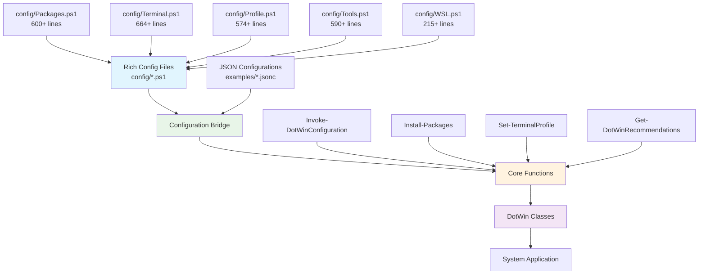

# DotWin - Declarative Windows Configuration Management

[](https://www.powershellgallery.com/packages/DotWin)
[](https://opensource.org/licenses/MIT)
[](https://github.com/dotwin/dotwin)

DotWin is a sophisticated PowerShell module that brings declarative configuration management to Windows systems, inspired by NixOS dotfiles. It enables you to define your entire Windows environment as code, making system setup reproducible, version-controlled, and easily shareable.

## 🚀 Quick Start

```powershell
# Install DotWin
Install-Module DotWin -Scope CurrentUser

# Apply a development workstation configuration
Invoke-DotWinConfiguration -ConfigurationPath "examples/configurations/developer-workstation.jsonc"

# Install packages by category using rich configurations
Install-Packages -Category "Development" -Source "winget"

# Configure Windows Terminal with a theme
Set-TerminalProfile -Theme "SolarizedDark" -IncludeProfiles -IncludeKeybindings

# Get intelligent system recommendations
Get-DotWinRecommendations | Where-Object Priority -eq "High"
```

## 🏗️ Architecture Overview

DotWin features a sophisticated architecture with rich PowerShell configuration files and a comprehensive class hierarchy:



## 📁 Project Structure

```text
DotWin/
├── 📄 DotWin.psd1                    # Module manifest (29 exported functions)
├── 📄 DotWin.psm1                    # Core module loader
├── 📄 Classes.ps1                    # 1,867 lines of class definitions
├── 🗂️ config/                        # Rich PowerShell configuration files
│   ├── 📄 Packages.ps1               # 600+ lines of package definitions
│   ├── 📄 Terminal.ps1               # 664+ lines of terminal themes
│   ├── 📄 Profile.ps1                # 574+ lines of PowerShell profiles
│   ├── 📄 Tools.ps1                  # 590+ lines of system tools
│   └── 📄 WSL.ps1                    # 215+ lines of WSL configurations
├── 🗂️ functions/                     # Core PowerShell functions
│   ├── 📄 Invoke-DotWinConfiguration.ps1
│   ├── 📄 Install-Packages.ps1
│   ├── 📄 Set-TerminalProfile.ps1
│   ├── 📄 Get-DotWinRecommendations.ps1
│   └── 📄 Export-DotWinConfiguration.ps1
├── 🗂️ examples/                      # Example configurations
│   └── 🗂️ configurations/
│       ├── 📄 developer-workstation.jsonc
│       └── 📄 enterprise-baseline.jsonc
└── 🗂️ docs/                          # Documentation
    └── 📄 ArchitecturalAssessment.md  # Detailed architecture analysis
```

## 🎯 Key Features

### 🔧 Rich Configuration System

- **PowerShell-Native**: Rich `.ps1` configuration files with full PowerShell capabilities
- **Category-Based**: Organized configurations by purpose (Development, Productivity, Security)
- **Template System**: Reusable configuration templates and builders
- **Validation**: Built-in configuration validation and testing

### 📦 Package Management

- **Multi-Source**: Support for Winget, Chocolatey, and Scoop
- **Intelligent**: Category-based package selection from rich configurations
- **Parallel**: Optional parallel installation for improved performance
- **Dependency**: Automatic dependency resolution and conflict detection

### 🖥️ Terminal Configuration

- **Theme System**: Rich theme definitions with color schemes and profiles
- **Profile Management**: Automated Windows Terminal profile creation
- **Keybinding**: Custom keybinding configurations
- **Integration**: Seamless integration with PowerShell profiles

### 🤖 Intelligent Recommendations

- **System Profiling**: Deep hardware and software analysis
- **Priority-Based**: Intelligent prioritization of recommendations
- **Auto-Apply**: Optional automatic application of safe recommendations

### 🔄 Configuration Management

- **Declarative**: Define desired state, DotWin handles the implementation
- **Idempotent**: Safe to run multiple times, only applies necessary changes
- **Reversible**: Track changes and provide rollback capabilities
- **Exportable**: Export current system state as reusable configurations

## 📚 Core Functions

### Configuration Management

- **`Invoke-DotWinConfiguration`** - Apply declarative configurations to system
- **`Export-DotWinConfiguration`** - Export current system state as configuration
- **`Test-DotWinConfiguration`** - Validate configurations before application

### Package Management

- **`Install-Packages`** - Install packages with multi-source support
- **`Get-InstalledPackages`** - Inventory installed packages across sources
- **`Update-Packages`** - Update packages with dependency management

### System Configuration

- **`Set-TerminalProfile`** - Configure Windows Terminal with themes and profiles
- **`Set-PowerShellProfile`** - Apply PowerShell profile configurations
- **`Set-SystemOptimizations`** - Apply performance and security optimizations

### Intelligence & Recommendations

- **`Get-DotWinRecommendations`** - Generate intelligent configuration recommendations
- **`Get-DotWinSystemProfile`** - Perform comprehensive system profiling
- **`Get-DotWinSystemStatus`** - Get current system configuration status

## 🎨 Configuration Examples

### Package Installation by Category

```powershell
# Install development tools using rich configuration
Install-Packages -Category "Development" -Source "winget"

# Install specific packages with custom options
$packages = @(
    @{ Id = "Git.Git"; Version = "2.40.0" },
    @{ Id = "Microsoft.VisualStudioCode"; InstallOptions = @{ scope = "machine" } }
)
Install-Packages -PackageList $packages
```

### Terminal Configuration

```powershell
# Apply a complete terminal theme with profiles and keybindings
Set-TerminalProfile -Theme "SolarizedDark" -IncludeProfiles -IncludeKeybindings

# Configure terminal from file
Set-TerminalProfile -ConfigurationPath "my-terminal-config.jsonc" -BackupExisting
```

### System Profiling and Recommendations

```powershell
# Get system profile and recommendations
$profile = Get-DotWinSystemProfile -UseParallel
$recommendations = Get-DotWinRecommendations -SystemProfile $profile -Priority "High"

# Auto-apply safe recommendations
Get-DotWinRecommendations -ApplyRecommendations -WhatIf
```

### Complete System Configuration

```powershell
# Apply a complete development workstation setup
Invoke-DotWinConfiguration -ConfigurationPath "examples/configurations/developer-workstation.jsonc"

# Export current system state for backup
Export-DotWinConfiguration -OutputPath "my-system-backup.jsonc" -IncludeMetadata
```

## 🏛️ Class Architecture

DotWin features a sophisticated class hierarchy with 1,867+ lines of class definitions:

### Core Classes

- **`DotWinConfigurationItem`** - Base class for all configuration items
- **`DotWinExecutionResult`** - Execution results with performance metrics
- **`DotWinConfiguration`** - Configuration container with validation

### Specialized Configuration Classes

- **`DotWinWingetPackage`** - Windows Package Manager integration
- **`DotWinWindowsTerminal`** - Windows Terminal configuration
- **`DotWinPowerShellProfile`** - PowerShell profile management
- **`DotWinWSLConfiguration`** - WSL distribution management

### System Intelligence Classes

- **`DotWinSystemProfiler`** - Comprehensive system profiling
- **`DotWinRecommendationEngine`** - Intelligent recommendations
- **`DotWinProgressContext`** - Advanced progress tracking

## 🔧 Rich Configuration Files

### Package Configurations (`config/Packages.ps1`)

```powershell
# Rich package definitions with categories and metadata
function Get-DevelopmentPackages {
    return @{
        Essential = @(
            @{ Id = "Git.Git"; Description = "Version control system" },
            @{ Id = "Microsoft.VisualStudioCode"; Description = "Code editor" }
        )
        Optional = @(
            @{ Id = "Docker.DockerDesktop"; Description = "Containerization platform" }
        )
    }
}
```

### Terminal Themes (`config/Terminal.ps1`)

```powershell
# Rich theme builders with color schemes
function Get-SolarizedDarkTheme {
    return @{
        name = "Solarized Dark"
        background = "#002b36"
        foreground = "#839496"
        colors = @{
            black = "#073642"
            red = "#dc322f"
            # ... complete color scheme
        }
    }
}
```

## 🚀 Getting Started

### Prerequisites

- Windows 10/11 (version 1903+)
- PowerShell 5.1+ (PowerShell 7+ recommended for parallel processing)
- Administrator privileges for system-level changes

### Installation

```powershell
# Install from PowerShell Gallery
Install-Module DotWin -Scope CurrentUser

# Import the module
Import-Module DotWin

# Verify installation
Get-DotWinSystemStatus
```

### First Configuration

```powershell
# Start with system profiling
$profile = Get-DotWinSystemProfile

# Get recommendations based on your system
$recommendations = Get-DotWinRecommendations -SystemProfile $profile

# Apply a pre-built configuration
Invoke-DotWinConfiguration -ConfigurationPath "examples/configurations/developer-workstation.jsonc"
```

## 📖 Documentation

- **[Architectural Assessment](docs/ArchitecturalAssessment.md)** - Comprehensive analysis of current architecture and implementation roadmap
- **[Architecture Guide](docs/Architecture.md)** - Detailed architecture and design patterns
- **[Getting Started](docs/GettingStarted.md)** - Step-by-step setup and usage guide
- **[Configuration Reference](docs/ConfigurationReference.md)** - Complete configuration options
- **[Function Reference](docs/FunctionReference.md)** - Detailed function documentation
- **[Troubleshooting](docs/Troubleshooting.md)** - Common issues and solutions

## 🛠️ Implementation Roadmap

DotWin is evolving toward a complete "terraform for Windows" solution. See our [Architectural Assessment](docs/ArchitecturalAssessment.md) for detailed analysis and implementation plan.

### Current Status

- ✅ Rich PowerShell configuration system (2,600+ lines)
- ✅ Advanced class architecture (1,867+ lines)
- ✅ Sophisticated progress tracking and plugin system
- ⚠️ Partial integration between components

### Implementation Plan

#### Phase 1: Configuration Bridge Layer (Weeks 1-3)

- **Configuration Bridge Class**: Central integration point for module and user configurations
- **User Configuration Discovery**: Automatic discovery and initialization of user config directories
- **Template Generation**: User configuration templates with inheritance support

#### Phase 2: Function Integration (Weeks 4-7)

- **Enhanced Install-Packages**: Full rich configuration consumption with Extensions and Settings
- **Enhanced Set-TerminalProfile**: Bridge-resolved configurations instead of hardcoded values
- **Enhanced Set-PowerShellProfile**: Rich profile templates with user overrides

#### Phase 3: JSONC Integration (Weeks 8-10)

- **JSONC Parser**: Support for JSON with comments configuration files
- **Configuration Translation**: Bidirectional translation between PowerShell and JSONC formats
- **Schema Validation**: Runtime validation with detailed error reporting

### User Experience Vision

```text
# Example user workflow with completed implementation
~/.my-config/
├── MyApps.ps1              # Rich package definitions using DotWin classes
├── more-apps.jsonc         # JSONC configuration with conflict resolution
├── terminal-settings.ps1   # Windows Terminal configuration
├── host.jsonc             # PowerShell profile configuration
├── my-tools.ps1           # System tools and optimizations
└── wsl-config.ps1         # WSL distribution configurations

# User simply runs:
Import-Module DotWin
Invoke-DotWinConfiguration -ConfigurationPath "~/.my-config"
```

## 🤝 Contributing

We welcome contributions! Please see our [Contributing Guide](CONTRIBUTING.md) for details.

### Development Setup

```powershell
# Clone the repository
git clone https://github.com/dotwin/dotwin.git
cd dotwin

# Import the development module
Import-Module .\DotWin.psd1 -Force

# Run tests
Invoke-Pester
```

## 📄 License

This project is licensed under the MIT License - see the [LICENSE](LICENSE) file for details.

## 🙏 Acknowledgments

- Inspired by NixOS and its declarative configuration approach
- Built on the powerful Windows Package Manager ecosystem
- Thanks to the PowerShell community for their continuous innovation

---

**DotWin** - Making Windows configuration as code a reality. 🚀
