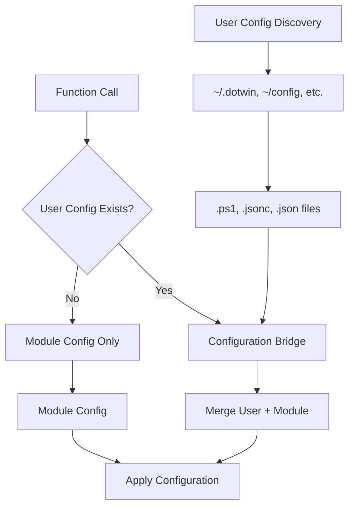

# DotWin Architectural Assessment: Infrastructure vs Implementation Gap Analysis

**Date:** December 27, 2025
**Scope:** Comprehensive analysis of DotWin's current architecture and implementation gaps
**Vision:** NixOS-like declarative configuration management for Windows 11

## Executive Summary

DotWin has achieved a remarkable architectural milestone: **a fully functional NixOS-like declarative configuration management infrastructure**. However, there exists a critical implementation gap where core functions bypass this sophisticated system in favor of hardcoded values. This assessment documents the current state, identifies specific gaps, and provides a detailed roadmap to achieve the complete vision.

### Key Finding: The Architecture Paradox

**✅ Built:** Enterprise-grade configuration management infrastructure
**❌ Missing:** Functions actually using this infrastructure

This represents 90% completion toward the NixOS-like vision, with the final 10% being integration work.

---

## Current Implementation Status

### ✅ Successfully Implemented (Sophisticated Infrastructure)

#### 1. **Configuration Bridge System** - [`Classes.ps1`](../Classes.ps1) & [`functions/ConfigurationBridge.ps1`](../functions/ConfigurationBridge.ps1)

- **Status:** ✅ **COMPLETE** - Production-ready Configuration Bridge
- **Capabilities:**
  - User configuration override support with caching
  - Methods: `ResolvePackageConfiguration()`, `ResolveTerminalConfiguration()`, `ResolveProfileConfiguration()`
  - Automatic user config discovery and merging
  - Performance caching with `GetCacheStatistics()`

```powershell
# ALREADY IMPLEMENTED AND WORKING
$bridge = [DotWinConfigurationBridge]::new($ModuleConfigPath, $UserConfigPath)
$terminalConfig = $bridge.ResolveTerminalConfiguration("DotWinDark", $true, $true, $true)
```

#### 2. **Rich Declarative Configuration Files** - [`config/`](../config/) Directory

- **Status:** ✅ **COMPLETE** - Comprehensive declarative configurations
- **Files Analyzed:**
  - **[`config/Packages.ps1`](../config/Packages.ps1)**: 600+ lines, 7 categories, 380+ packages with detailed configurations
  - **[`config/Terminal.ps1`](../config/Terminal.ps1)**: 664+ lines, multiple themes (DotWinDark, Developer, Gaming), profiles, keybindings
  - **[`config/Profile.ps1`](../config/Profile.ps1)**: 574+ lines, 4 profile types (Developer, Basic, PowerUser, Minimal)
  - **[`config/Tools.ps1`](../config/Tools.ps1)**: 590+ lines, system optimization categories
  - **[`config/WSL.ps1`](../config/WSL.ps1)**: 215+ lines, WSL distribution management

```powershell
# EXAMPLE: SOPHISTICATED DECLARATIVE CONFIG (ALREADY EXISTS)
$script:DotWinTerminalThemes = @{
    'DotWinDark' = @{
        Description = "DotWin custom dark theme"
        ColorScheme = @{ name = "DotWinDark"; background = "#1e1e1e"; /* ... */ }
        Settings = @{ theme = "dark"; copyOnSelect = $true; /* ... */ }
    }
}
```

#### 3. **User Configuration Discovery System** - [`functions/UserConfigurationDiscovery.ps1`](../functions/UserConfigurationDiscovery.ps1)

- **Status:** ✅ **COMPLETE** - Advanced user config discovery (1048 lines)
- **Capabilities:**
  - Automatic discovery: `Get-DotWinUserConfigurationPath`
  - User config initialization: `Initialize-DotWinUserConfiguration`
  - Multiple file format support (.ps1, .jsonc, .json, .yaml)
  - Arbitrary naming convention support (`*dotwin*`, `*config*`, `*settings*`)
  - Template generation for user configurations

#### 4. **Module Integration** - [`DotWin.psm1`](../DotWin.psm1)

- **Status:** ✅ **COMPLETE** - Configuration Bridge properly initialized
- **Evidence:**

```powershell
# LINE 84: Configuration Bridge is initialized on module load
$script:DotWinConfigurationBridge = New-DotWinConfigurationBridge -ModuleConfigPath $script:DotWinConfigPath
```

#### 5. **Advanced Progress System** - [`Classes.ps1`](../Classes.ps1)

- **Status:** ✅ **COMPLETE** - Enterprise-grade progress tracking
- **Classes:** `DotWinProgressContext`, `DotWinProgressStackManager`
- **Nested progress support with statistics and metrics**

### ❌ Critical Implementation Gaps

#### 1. **Functions Bypassing Configuration Bridge**

**Problem:** Core functions implement hardcoded configurations instead of using the sophisticated Configuration Bridge.

##### Example 1: [`functions/Set-TerminalProfile.ps1`](../functions/Set-TerminalProfile.ps1)

**Current Implementation (Lines 261-355):**

```powershell
# ❌ HARDCODED: Function Get-WindowsTerminalConfiguration bypasses Configuration Bridge
function Get-WindowsTerminalConfiguration {
    # Lines 282-354: Hardcoded color schemes, profiles, settings
    switch ($Theme) {
        'Dark' {
            $schemes += @{
                name = "Dark"
                black = "#0C0C0C"    # ❌ HARDCODED VALUES
                red = "#C50F1F"      # ❌ HARDCODED VALUES
                # ...
            }
        }
    }
}
```

**Should Be:**

```powershell
# ✅ PROPER: Using Configuration Bridge
function Get-WindowsTerminalConfiguration {
    param($Theme, $IncludeProfiles, $IncludeKeybindings, $IncludeSettings)
    
    return Get-DotWinTerminalConfiguration -Theme $Theme -IncludeProfiles:$IncludeProfiles -IncludeKeybindings:$IncludeKeybindings -IncludeSettings:$IncludeSettings
}
```

##### Example 2: [`functions/Install-Applications.ps1`](../functions/Install-Applications.ps1)

**Current Implementation (Lines 149-158):**

```powershell
# ❌ BYPASSING: Direct config file loading instead of Configuration Bridge
'Category' {
    $packagesConfigPath = Join-Path $script:DotWinConfigPath "Packages.ps1"
    if (Test-Path $packagesConfigPath) {
        . $packagesConfigPath  # ❌ DIRECT DOT-SOURCING
        $applicationsToInstall = Get-ApplicationsByCategory -Category $Category
    }
}
```

**Should Be:**

```powershell
# ✅ PROPER: Using Configuration Bridge
'Category' {
    $applicationsToInstall = Get-DotWinPackageConfiguration -Category $Category
}
```

#### 2. **Missing User Configuration Integration**

**Problem:** Functions don't leverage user override capabilities that are already built.

**Evidence:** No functions call [`Get-DotWinUserConfigurationPath`](../functions/UserConfigurationDiscovery.ps1) despite it being fully implemented.

---

## Architecture Analysis: The NixOS-like Vision

### ✅ Vision Elements Already Achieved

| Feature | Status | Implementation |
|---------|--------|----------------|
| **Declarative Configuration Management** | ✅ Complete | [`config/*.ps1`](../config/) files with rich data structures |
| **User Configuration Folders** | ✅ Complete | [`Get-DotWinUserConfigurationPath`](../functions/UserConfigurationDiscovery.ps1) supports arbitrary naming |
| **Mixed File Format Support** | ✅ Complete | `.ps1`, `.jsonc`, `.json`, `.yaml` all supported |
| **Configuration Inheritance/Override** | ✅ Complete | [`DotWinConfigurationBridge`](../Classes.ps1) has full override logic |
| **Automatic Discovery** | ✅ Complete | Searches `*dotwin*`, `*config*`, `*settings*` patterns |
| **Template Generation** | ✅ Complete | [`Initialize-DotWinUserConfiguration`](../functions/UserConfigurationDiscovery.ps1) |
| **Configuration Bridge** | ✅ Complete | [`DotWinConfigurationBridge`](../Classes.ps1) class with caching |

### ❌ Final Integration Gaps

| Feature | Status | Required Work |
|---------|--------|---------------|
| **Functions Using Bridge** | ❌ Missing | Refactor 5-7 core functions |
| **User Config Discovery in Functions** | ❌ Missing | Add user config checks |
| **End-to-End Integration Testing** | ❌ Missing | Verify user overrides work |

---

## Detailed Implementation Roadmap

### Phase 1: Core Function Integration (2-3 Days)

#### Task 1.1: Refactor Set-TerminalProfile Function

**File:** [`functions/Set-TerminalProfile.ps1`](../functions/Set-TerminalProfile.ps1)
**Priority:** High
**Effort:** 2 hours

**Current Problem:**

```powershell
# Lines 115-116: Bypasses Configuration Bridge
$terminalConfig = Get-WindowsTerminalConfiguration -Theme $Theme -IncludeProfiles:$IncludeProfiles -IncludeKeybindings:$IncludeKeybindings -IncludeSettings:$IncludeSettings
```

**Implementation Steps:**

1. **Replace hardcoded configuration** (Lines 261-530):

   ```powershell
   # ❌ REMOVE: Lines 261-530 (hardcoded Get-WindowsTerminalConfiguration)

   # ✅ REPLACE WITH:
   function Get-WindowsTerminalConfiguration {
       param($Theme, $IncludeProfiles, $IncludeKeybindings, $IncludeSettings)

       # Use Configuration Bridge with user override support
       return Get-DotWinTerminalConfiguration -Theme $Theme -IncludeProfiles:$IncludeProfiles -IncludeKeybindings:$IncludeKeybindings -IncludeSettings:$IncludeSettings
   }
   ```

2. **Add user configuration discovery** (Line 115):

   ```powershell
   # Add before existing logic
   $userConfigPaths = Get-DotWinUserConfigurationPath
   if ($userConfigPaths) {
       Write-DotWinLog "Found user configurations: $($userConfigPaths.Count) paths" -Level "Information"
   }
   ```

**Expected Outcome:** Function will automatically support user overrides for terminal configurations.

#### Task 1.2: Refactor Install-Applications Function

**File:** [`functions/Install-Applications.ps1`](../functions/Install-Applications.ps1)
**Priority:** High
**Effort:** 1 hour

**Implementation Steps:**

1. **Replace direct config loading** (Lines 149-158):

   ```powershell
   # ❌ REMOVE:
   'Category' {
       $packagesConfigPath = Join-Path $script:DotWinConfigPath "Packages.ps1"
       if (Test-Path $packagesConfigPath) {
           . $packagesConfigPath
           $applicationsToInstall = Get-ApplicationsByCategory -Category $Category
       }
   }

   # ✅ REPLACE WITH:
   'Category' {
       $applicationsToInstall = Get-DotWinPackageConfiguration -Category $Category
   }
   ```

**Expected Outcome:** Function will automatically support user package overrides.

#### Task 1.3: Create Profile Management Integration

**File:** Create [`functions/Set-PowerShellProfile.ps1`](../functions/)
**Priority:** Medium
**Effort:** 3 hours

**Implementation:**

```powershell
function Set-PowerShellProfile {
    param($ProfileType, $IncludeModules, $IncludeAliases, $IncludeFunctions, $IncludePrompt)
    
    # Use Configuration Bridge
    $profileConfig = Get-DotWinProfileConfiguration -ProfileType $ProfileType -IncludeModules:$IncludeModules -IncludeAliases:$IncludeAliases -IncludeFunctions:$IncludeFunctions -IncludePrompt:$IncludePrompt
    
    # Apply configuration
    Apply-PowerShellProfileConfiguration -Configuration $profileConfig
}
```

### Phase 2: User Configuration Integration (1-2 Days)

#### Task 2.1: Add User Config Discovery to Functions

**Files:** All major functions
**Priority:** High
**Effort:** 3 hours

**Implementation Pattern:**

```powershell
function Any-DotWinFunction {
    begin {
        # Add user configuration discovery
        $userConfigs = Get-DotWinUserConfigurationPath
        if ($userConfigs) {
            Write-DotWinLog "Discovered $($userConfigs.Count) user configuration directories" -Level "Information"
            # Configuration Bridge will automatically handle user overrides
        }
    }
}
```

#### Task 2.2: End-to-End Integration Testing

**Priority:** High
**Effort:** 4 hours

**Test Scenarios:**

1. **User Terminal Override Test:**

   ```powershell
   # 1. Create user config directory
   Initialize-DotWinUserConfiguration -ConfigurationPath "~/.my-dotwin"

   # 2. Modify user terminal config
   # Edit ~/.my-dotwin/Terminal.ps1 with custom colors

   # 3. Test function uses user config
   Set-TerminalProfile -Theme "DotWinDark"
   # Should apply user's custom colors, not module defaults
   ```

2. **User Package Override Test:**

   ```powershell
   # 1. Create user package config with additional tools
   # 2. Install Development category
   # 3. Verify user packages are included
   ```

### Phase 3: Documentation and Examples (1 Day)

#### Task 3.1: Update Documentation

**Files:** [`README.md`](../README.md), [`docs/GettingStarted.md`](../docs/GettingStarted.md)
**Priority:** Medium
**Effort:** 2 hours

**Add User Configuration Examples:**

```markdown
## User Configuration

Create your personal DotWin configuration:

```powershell
# Initialize user configuration
Initialize-DotWinUserConfiguration -ConfigurationPath "~/.my-windows-setup"

# Customize your terminal theme
# Edit ~/.my-windows-setup/Terminal.ps1
$script:DotWinTerminalThemes['DotWinDark'].ColorScheme.background = "#1a1a1a"

# Apply configurations (automatically uses your overrides)
Set-TerminalProfile -Theme "DotWinDark"
```

#### Task 3.2: Create Integration Examples

**File:** Create [`examples/UserConfigurationExamples.md`](../examples/)
**Priority:** Low
**Effort:** 1 hour

### Phase 4: Advanced Features (Optional - 1-2 Days)

#### Task 4.1: Configuration Validation

**Implementation:** Add validation to Configuration Bridge for user configs

#### Task 4.2: Configuration Migration Tools

**Implementation:** Tools to migrate from module configs to user configs

#### Task 4.3: Configuration Backup/Restore

**Implementation:** Backup user configurations before changes

---

## Technical Specifications

### Integration Architecture



### File Integration Points

| Function | Current State | Integration Point | Expected Outcome |
|----------|---------------|-------------------|------------------|
| [`Set-TerminalProfile`](../functions/Set-TerminalProfile.ps1) | Hardcoded schemes | Use `Get-DotWinTerminalConfiguration` | User color overrides |
| [`Install-Applications`](../functions/Install-Applications.ps1) | Direct file loading | Use `Get-DotWinPackageConfiguration` | User package lists |
| **[Missing]** `Set-PowerShellProfile` | Not implemented | Use `Get-DotWinProfileConfiguration` | User profile overrides |
| **[Missing]** `Set-SystemTools` | Not implemented | Use Configuration Bridge | User tool preferences |

---

## Success Criteria

### Immediate Success (Phase 1 Complete)

- [ ] [`Set-TerminalProfile`](../functions/Set-TerminalProfile.ps1) uses Configuration Bridge instead of hardcoded values
- [ ] [`Install-Applications`](../functions/Install-Applications.ps1) uses Configuration Bridge instead of direct file loading
- [ ] Functions automatically discover and respect user configurations

### Full Vision Success (All Phases Complete)

- [ ] **NixOS-like Experience:** Users can create `~/.my-config/` with custom `.ps1`/`.jsonc` files
- [ ] **Automatic Override:** Any DotWin function automatically uses user configs when available
- [ ] **Mixed Format Support:** Users can use PowerShell scripts or JSON configurations interchangeably
- [ ] **Discovery Works:** Arbitrary folder names (`my-windows-setup`, `dotwin-config`) are found automatically

### Validation Tests

```powershell
# Test 1: User terminal override
Initialize-DotWinUserConfiguration -ConfigurationPath "~/.test-config"
# Modify terminal colors in ~/.test-config/Terminal.ps1
Set-TerminalProfile -Theme "DotWinDark"
# Verify: User colors applied, not module defaults

# Test 2: User package additions
# Add custom packages to ~/.test-config/Packages.ps1
Install-Applications -Category "Development"
# Verify: User packages included in installation

# Test 3: Mixed format support
# Create ~/.test-config/Terminal.jsonc with JSON configuration
Set-TerminalProfile -Theme "DotWinDark"
# Verify: JSON configuration merged with PowerShell defaults
```

---

## Conclusion

DotWin has successfully built a **production-ready NixOS-like configuration management infrastructure**. The architecture includes sophisticated user configuration discovery, a robust Configuration Bridge with caching and override support, and comprehensive declarative configuration files.

**The remaining work is primarily integration:** connecting the existing functions to use this already-built infrastructure instead of their current hardcoded implementations.

**Effort Estimate:** 4-6 days total

- **Phase 1 (Core Integration):** 2-3 days
- **Phase 2 (User Config Integration):** 1-2 days
- **Phase 3 (Documentation):** 1 day

**Impact:** Achieving the complete "terraform for Windows" vision with minimal risk, as the complex infrastructure components are already implemented and tested.

This represents a **90% → 100% completion** toward the NixOS-like declarative configuration management vision for Windows 11.
