# DotWin Architecture Guide

## Overview

DotWin implements a sophisticated declarative configuration management system for Windows, featuring a multi-layered architecture that bridges rich PowerShell configurations with a robust class-based execution engine.

## Architectural Principles

### 1. Declarative Configuration

- **Intent-Based**: Users declare desired state, not implementation steps
- **Idempotent**: Safe to run multiple times, only applies necessary changes
- **Composable**: Configurations can be combined and extended
- **Testable**: Built-in validation and testing capabilities

### 2. Rich Configuration System

- **PowerShell-Native**: Leverage full PowerShell capabilities in configurations
- **Type-Safe**: Strong typing through PowerShell classes
- **Extensible**: Plugin architecture for custom configuration types
- **Discoverable**: Automatic discovery of available configurations

### 3. Intelligent Automation

- **System-Aware**: Deep understanding of system state and capabilities
- **Recommendation-Driven**: ML-based recommendations for optimal configurations
- **Progress-Aware**: Comprehensive progress tracking and reporting
- **Error-Resilient**: Graceful error handling and recovery

## System Architecture

### High-Level Architecture

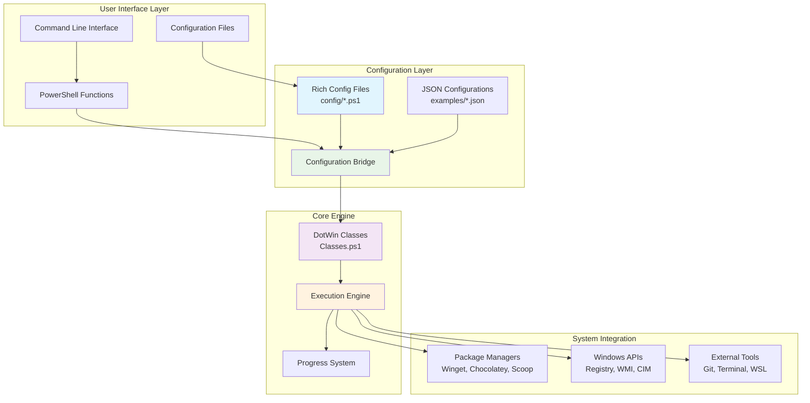

### Component Architecture

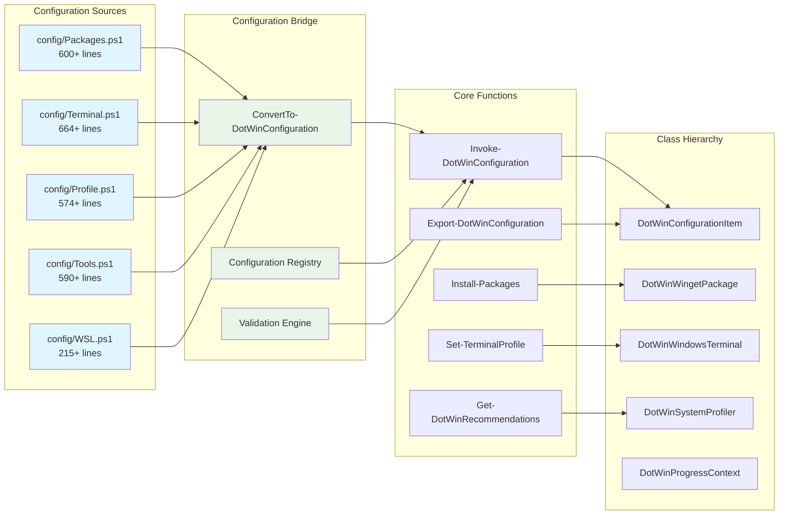

## Core Components

### 1. Rich Configuration System

#### Configuration Files Structure

```text
config/
├── Packages.ps1      # Package definitions and categories
├── Terminal.ps1      # Terminal themes and profiles
├── Profile.ps1       # PowerShell profile templates
├── Tools.ps1         # System tools and optimizations
└── WSL.ps1          # WSL distribution configurations
```

#### Configuration File Architecture

Each configuration file follows a consistent pattern:

```powershell
# Category-based organization
function Get-DevelopmentPackages { ... }
function Get-ProductivityPackages { ... }

# Template builders
function Get-SolarizedDarkTheme { ... }
function Get-CampbellTheme { ... }

# Helper functions
function Install-PackageCategory { ... }
function Test-PackageInstalled { ... }
```

### 2. Class Hierarchy

#### Base Classes

**DotWinConfigurationItem** - Foundation for all configuration items

```powershell
class DotWinConfigurationItem {
    [string] $Name
    [string] $Type
    [bool] $Enabled
    [hashtable] $Properties

    [bool] Test()           # Check if item is in desired state
    [void] Apply()          # Apply the configuration
    [object] GetCurrentState()  # Get current system state
}
```

**DotWinExecutionResult** - Standardized execution results

```powershell
class DotWinExecutionResult {
    [bool] $Success
    [string] $Message
    [timespan] $Duration
    [hashtable] $Changes
    [hashtable] $Metadata
}
```

#### Specialized Classes

##### Package Management

- `DotWinWingetPackage` - Windows Package Manager integration
- `DotWinChocolateyPackage` - Chocolatey package management
- `DotWinScoopPackage` - Scoop package management

##### System Configuration

- `DotWinWindowsTerminal` - Terminal configuration management
- `DotWinPowerShellProfile` - PowerShell profile management
- `DotWinRegistryConfiguration` - Registry setting management
- `DotWinWindowsFeature` - Windows feature management

##### Intelligence & Profiling

- `DotWinSystemProfiler` - System analysis and profiling
- `DotWinRecommendationEngine` - ML-based recommendations
- `DotWinHardwareProfile` - Hardware detection and analysis
- `DotWinSoftwareProfile` - Software inventory and analysis

### 3. Configuration Bridge Layer

The configuration bridge translates between rich PowerShell configurations and the JSON schema expected by core functions.

#### Bridge Architecture

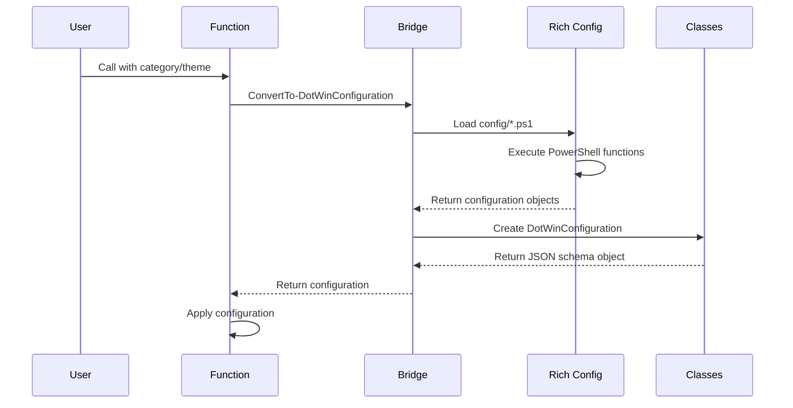

#### Bridge Functions

- **`ConvertTo-DotWinConfiguration`** - Main conversion function
- **`Get-DotWinConfigurationRegistry`** - Configuration discovery
- **`Test-DotWinConfiguration`** - Configuration validation
- **`Resolve-DotWinConfigurationDependencies`** - Dependency resolution

### 4. Progress and Execution System

#### Progress Architecture

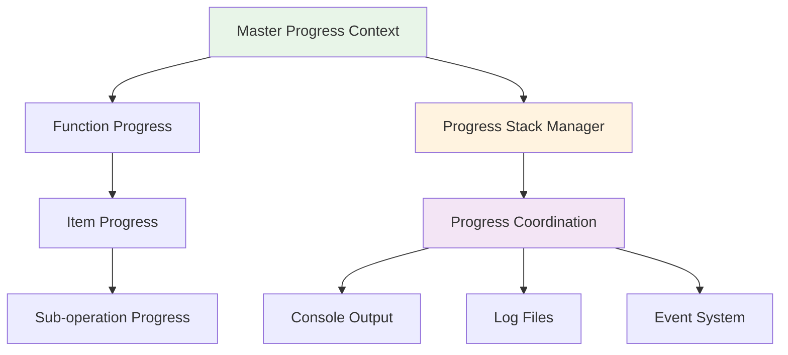

#### Progress Classes

- **`DotWinProgressContext`** - Individual progress tracking
- **`DotWinProgressStackManager`** - Hierarchical progress management
- **`DotWinProgressCoordinator`** - Multi-threaded progress coordination

### 5. Intelligence and Recommendation System

#### System Profiling Architecture

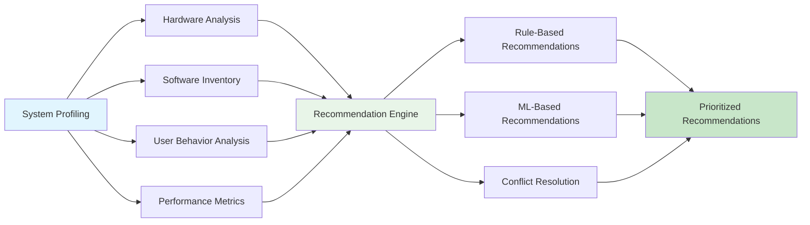

#### Intelligence Components

- **Hardware Profiling**: CPU, memory, storage, and peripheral detection
- **Software Analysis**: Installed packages, running services, and usage patterns
- **User Behavior**: Command history, preference analysis, and workflow detection
- **Performance Metrics**: System performance scoring and optimization potential

## Data Flow Patterns

### 1. Configuration Application Flow

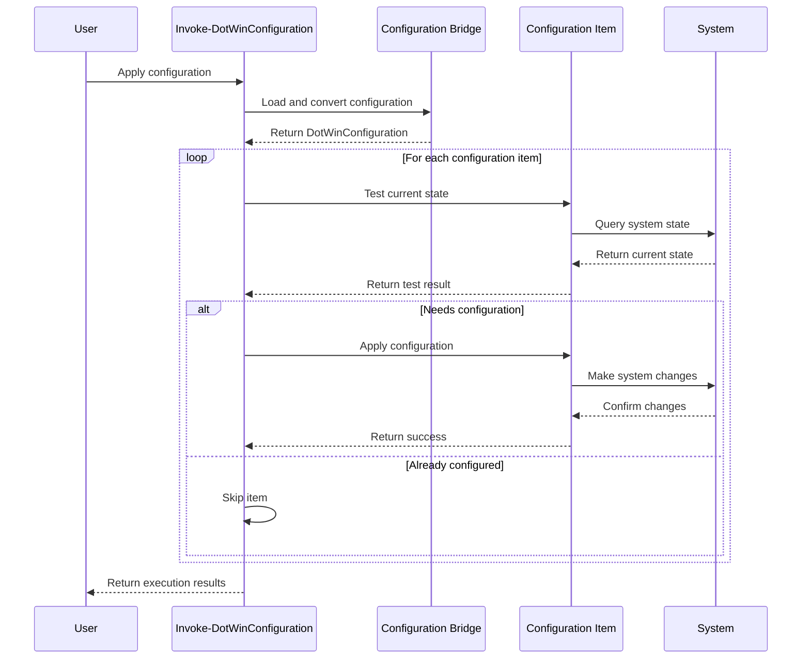

### 2. Package Installation Flow

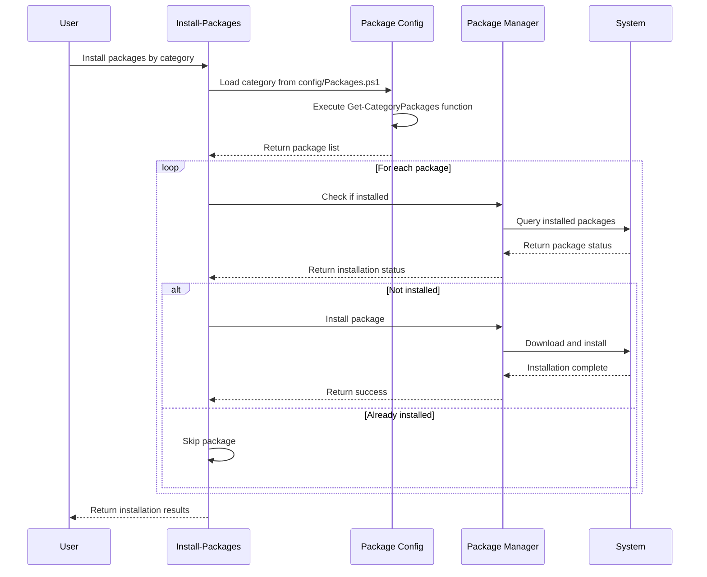

### 3. Terminal Configuration Flow

```mermaid
sequenceDiagram
    participant U as User
    participant STP as Set-TerminalProfile
    participant TC as Terminal Config
    parameter WT as Windows Terminal
    
    U->>STP: Configure terminal with theme
    STP->>TC: Load theme from config/Terminal.ps1
    TC->>TC: Execute theme builder function
    TC-->>STP: Return theme configuration
    
    STP->>STP: Create DotWinWindowsTerminal object
    STP->>WT: Read current settings
    WT-->>STP: Return current configuration
    
    STP->>STP: Merge configurations
    STP->>WT: Write new settings
    WT-->>STP: Confirm settings applied

    STP-->>U: Return configuration result
```

## Integration Patterns

### 1. Rich Configuration Integration

#### Current State (Partial Integration)

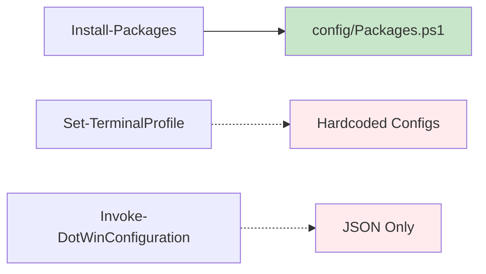

#### Target State (Full Integration)

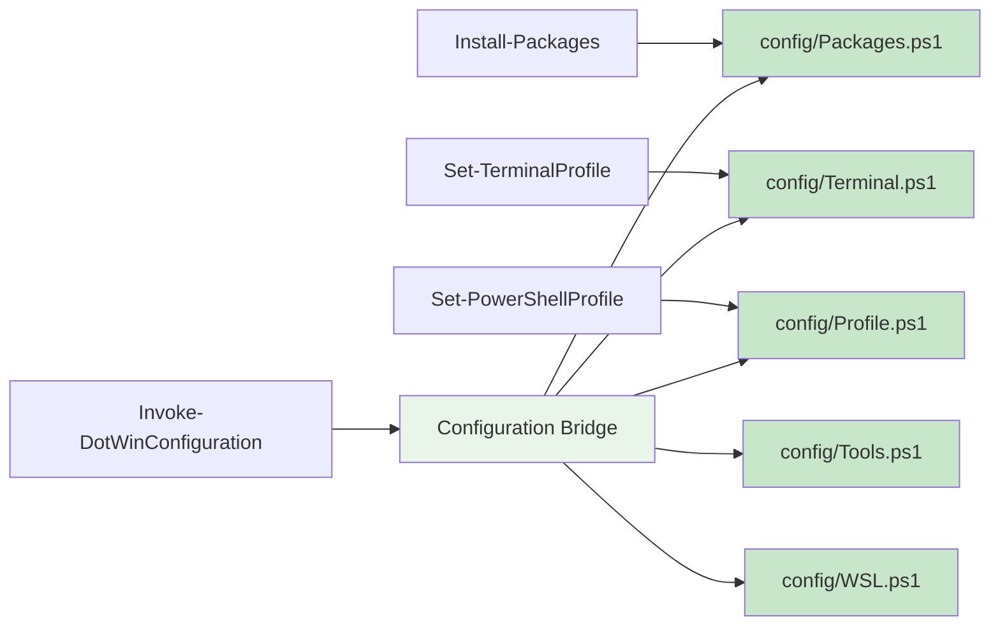

### 2. Error Handling and Recovery

#### Error Handling Architecture

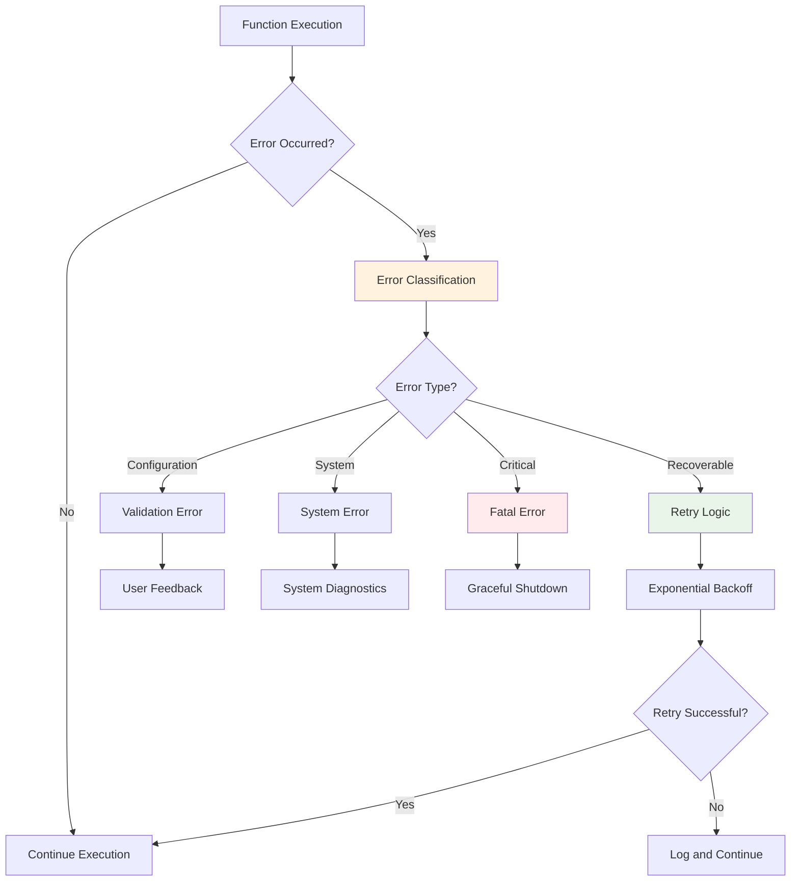

### 3. Performance Optimization

#### Parallel Processing Architecture

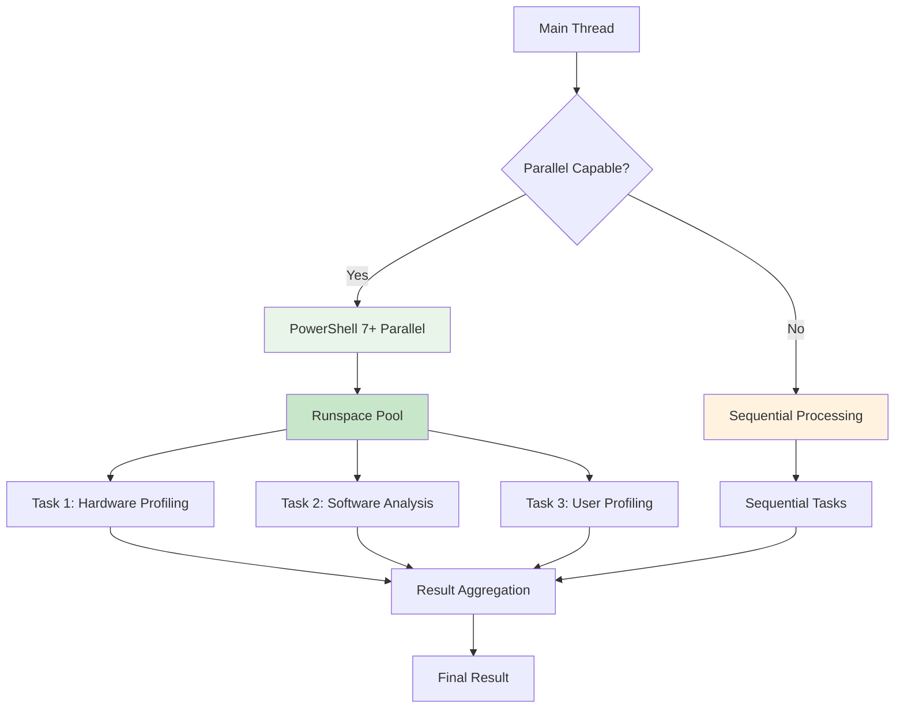

## Security Architecture

### 1. Execution Security

#### Security Layers

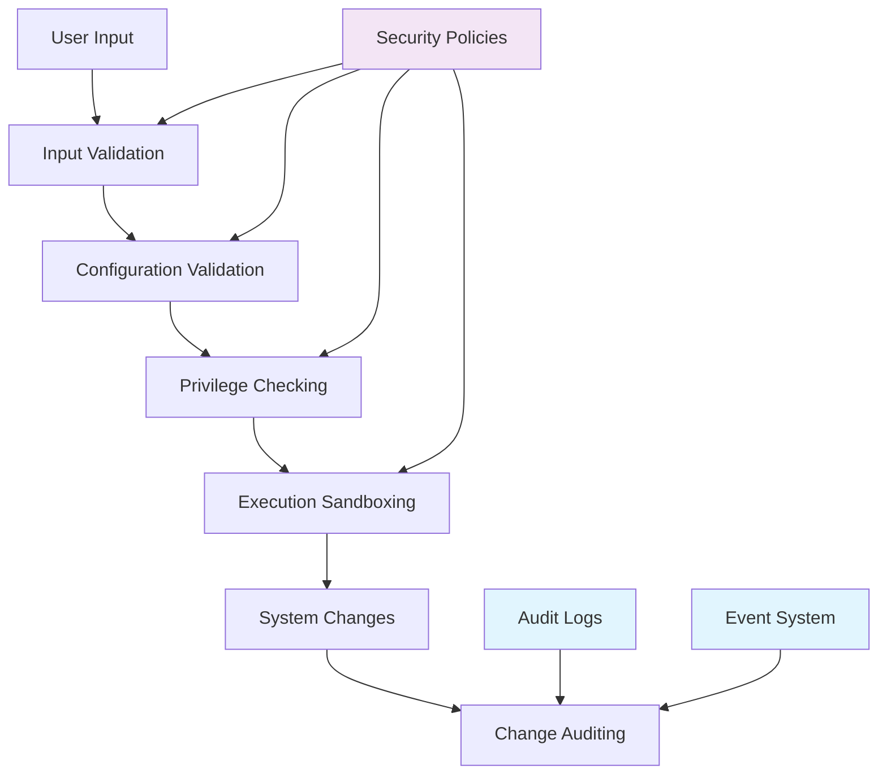

### 2. Configuration Security

#### Secure Configuration Handling

- **Input Sanitization**: All user inputs validated and sanitized
- **Code Injection Prevention**: PowerShell execution context isolation
- **Privilege Escalation Protection**: Minimal privilege principle
- **Audit Trail**: Comprehensive logging of all system changes

## Extensibility Architecture

### 1. Plugin System

#### Plugin Architecture

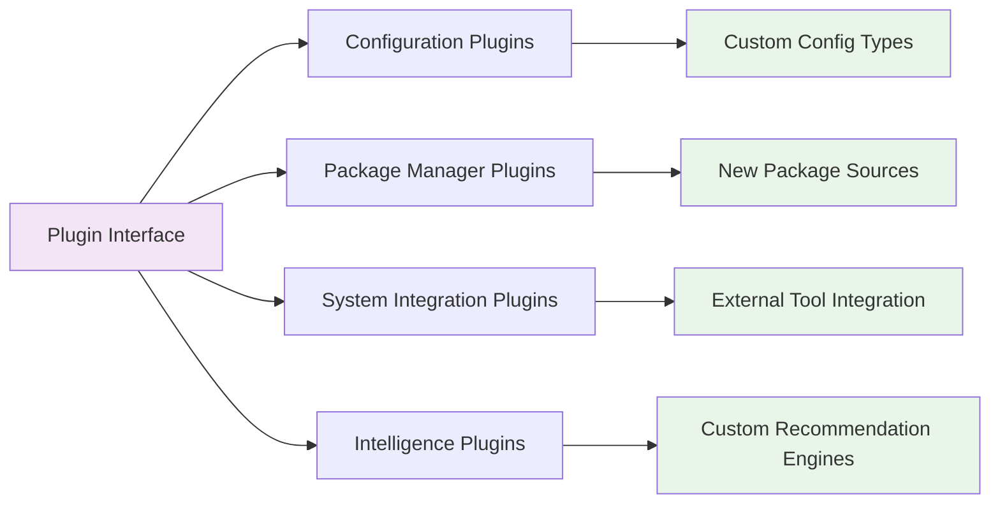

### 2. Extension Points

#### Key Extension Points

- **Configuration Types**: Custom configuration item types
- **Package Sources**: Additional package manager support
- **Recommendation Engines**: Custom recommendation algorithms
- **Progress Providers**: Custom progress tracking implementations
- **Validation Rules**: Custom configuration validation logic

## Performance Characteristics

### 1. Scalability Metrics

| Component | Small System | Medium System | Large System |
|-----------|--------------|---------------|--------------|
| Configuration Items | < 50 | 50-200 | 200+ |
| Package Installation | < 10 packages | 10-50 packages | 50+ packages |
| System Profiling | < 5 seconds | 5-15 seconds | 15+ seconds |
| Memory Usage | < 100MB | 100-300MB | 300+ MB |

### 2. Performance Optimizations

#### Optimization Strategies

- **Lazy Loading**: Configuration files loaded on demand
- **Caching**: Frequently accessed data cached in memory
- **Parallel Processing**: Multi-threaded operations where possible
- **Incremental Updates**: Only apply necessary changes
- **Progress Streaming**: Real-time progress updates

## Future Architecture Considerations

### 1. Cloud Integration

- **Configuration Sync**: Cloud-based configuration synchronization
- **Remote Management**: Centralized configuration management
- **Telemetry**: Anonymous usage analytics and improvement insights

### 2. Advanced Intelligence

- **Machine Learning**: Enhanced recommendation algorithms
- **Predictive Analysis**: Proactive system optimization suggestions
- **Behavioral Learning**: Adaptive configurations based on usage patterns

### 3. Enterprise Features

- **Group Policy Integration**: Enterprise policy compliance
- **Centralized Deployment**: Mass deployment capabilities
- **Compliance Reporting**: Automated compliance verification

---

This architecture provides a solid foundation for declarative Windows configuration management while maintaining flexibility for future enhancements and enterprise requirements.
