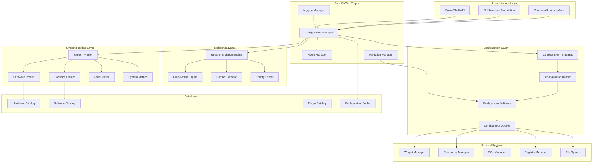
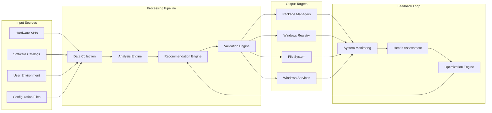
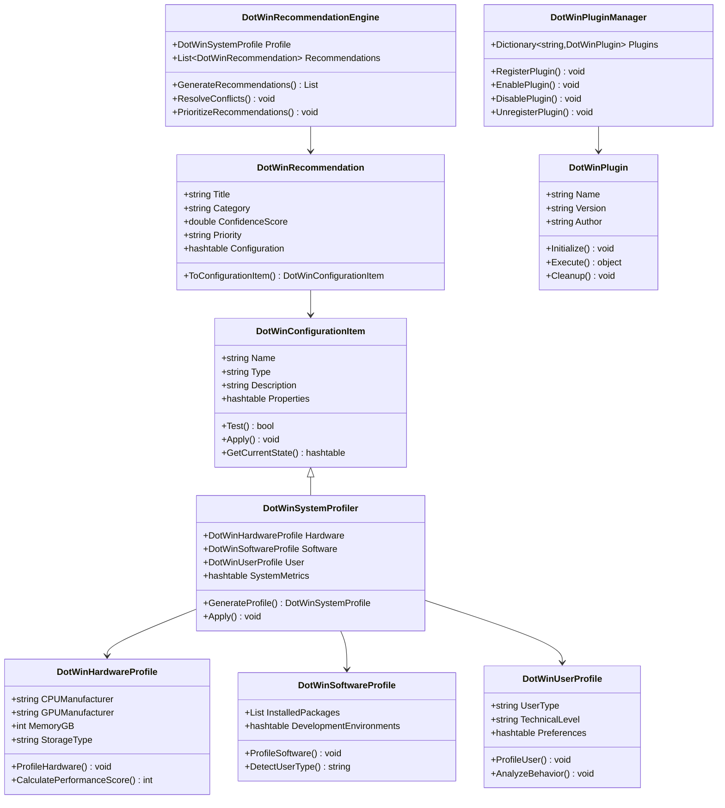

# DotWin System Architecture Documentation

## Overview

This document provides comprehensive architecture diagrams and technical documentation for the DotWin Windows 11 configuration management system. The system follows a layered architecture with clear separation of concerns, intelligent profiling capabilities, and extensible plugin architecture.

## 1. Overall System Architecture

The DotWin system is built using a layered architecture that promotes maintainability, extensibility, and clear separation of concerns.

### Architecture Layers

#### User Interface Layer

- **Command Line Interface (CLI)**: PowerShell functions and cmdlets
- **GUI Interface Foundation**: Windows Forms/WPF interface foundation
- **PowerShell API**: Programmatic access to DotWin functionality

#### Core DotWin Engine

- **Configuration Manager**: Central orchestration of all configuration operations
- **Plugin Manager**: Complete plugin lifecycle management
- **Logging Manager**: Structured logging and audit trails
- **Validation Manager**: Configuration validation and safety checks

#### System Profiling Layer

- **System Profiler**: Main profiling orchestrator
- **Hardware Profiler**: CPU, GPU, memory, storage detection and analysis
- **Software Profiler**: Package managers, applications, development environments
- **User Profiler**: User behavior analysis and type detection
- **System Metrics**: Performance scoring and optimization potential

#### Intelligence Layer

- **Recommendation Engine**: Main recommendation orchestrator
- **Rule-Based Engine**: Hardware and software pattern-based recommendations
- **Conflict Detector**: Automatic conflict detection and resolution
- **Priority Scorer**: Confidence-based scoring and prioritization

#### Configuration Layer

- **Configuration Templates**: Pre-built configuration profiles
- **Configuration Builder**: Dynamic configuration generation
- **Configuration Validator**: Pre-flight validation and compatibility checks
- **Configuration Applier**: Safe configuration application with rollback

#### Data Layer

- **Hardware Catalog**: Hardware compatibility and optimization database
- **Software Catalog**: Software packages and configuration database
- **Plugin Catalog**: Registered plugins and metadata
- **Configuration Cache**: Performance optimization and state caching

## 2. Data Flow Architecture

### Data Flow Principles

1. **Input Collection**: Gather data from multiple sources (hardware, software, user, configuration)
2. **Analysis Pipeline**: Process collected data through analysis and recommendation engines
3. **Validation Gate**: Ensure all changes are validated before application
4. **Safe Application**: Apply changes to target systems with monitoring
5. **Feedback Loop**: Monitor results and optimize future recommendations

## 3. Class Hierarchy and Relationships

### Key Design Patterns

#### Inheritance Hierarchy

- **DotWinConfigurationItem**: Base class for all configuration items
- **DotWinSystemProfiler**: Extends configuration item for system profiling
- **Profile Classes**: Specialized profiling for different system aspects

#### Composition Patterns

- **System Profiler**: Composes hardware, software, and user profilers
- **Recommendation Engine**: Composes rule engine, conflict detector, and priority scorer
- **Plugin Manager**: Manages collection of plugins with lifecycle operations

#### Strategy Pattern

- **Recommendation Generation**: Multiple strategies (rule-based, ML-based)
- **Configuration Application**: Different strategies for different configuration types
- **Validation**: Multiple validation strategies based on configuration type

## 4. Component Responsibilities

### Core Components

| Component | Responsibility | Key Functions |
|-----------|---------------|---------------|
| **System Profiler** | Analyze system state | Hardware detection, software inventory, user analysis |
| **Recommendation Engine** | Generate intelligent suggestions | Rule processing, conflict resolution, prioritization |
| **Configuration Manager** | Orchestrate configuration operations | Validation, application, rollback |
| **Plugin Manager** | Manage plugin lifecycle | Registration, loading, execution, cleanup |
| **Validation Manager** | Ensure configuration safety | Pre-flight checks, compatibility validation |

### Supporting Components

| Component | Responsibility | Key Functions |
|-----------|---------------|---------------|
| **Logging Manager** | Structured logging and auditing | Event logging, performance metrics, audit trails |
| **Cache Manager** | Performance optimization | Profile caching, configuration caching |
| **Backup Manager** | System state protection | Configuration backup, rollback capabilities |
| **Health Monitor** | System health assessment | Performance monitoring, drift detection |

## 5. Integration Points

### External System Integration

- **Package Managers**: Winget, Chocolatey, PowerShell Gallery
- **Windows Registry**: System configuration and optimization
- **File System**: Configuration files, scripts, templates
- **Windows Services**: Service configuration and management
- **WSL**: Linux subsystem management
- **Hardware APIs**: System information and performance data

### Plugin Integration Points

- **Configuration Plugins**: Custom configuration item types
- **Recommendation Plugins**: Custom recommendation logic
- **Validation Plugins**: Custom validation rules
- **Monitoring Plugins**: Custom health monitoring

## 6. Security Considerations

### Access Control

- **Privilege Validation**: Check administrator rights where required
- **Plugin Security**: Validate plugin integrity and permissions
- **Configuration Safety**: Validate configuration changes before application

### Data Protection

- **Sensitive Data**: Secure handling of system information
- **Audit Logging**: Complete audit trail of all operations
- **Backup Security**: Secure backup and rollback mechanisms

## 7. Performance Characteristics

### Profiling Performance

- **Hardware Profiling**: ~2 seconds for complete hardware analysis
- **Software Profiling**: ~10-15 seconds for comprehensive software inventory
- **User Profiling**: ~1 second for user behavior analysis
- **Metrics Calculation**: <1 second for performance scoring

### Recommendation Performance

- **Rule Processing**: <1 second for standard rule set
- **Conflict Resolution**: Efficient algorithm for conflict detection
- **Prioritization**: Real-time confidence scoring and ranking

### Memory and Resource Usage

- **Module Load Time**: 3-5 seconds including all functions and classes
- **Memory Footprint**: Minimal impact with efficient class design
- **Parallel Processing**: Configurable throttle limits for resource management

## 8. Extensibility Framework

### Plugin Architecture

- **Base Plugin Interface**: Standard interface for all plugins
- **Plugin Registration**: Dynamic plugin discovery and registration
- **Plugin Lifecycle**: Complete lifecycle management (load, execute, unload)
- **Plugin Communication**: Event-based communication between plugins

### Configuration Extensibility

- **Custom Configuration Types**: Extensible configuration item framework
- **Template System**: Customizable configuration templates
- **Validation Framework**: Pluggable validation rules
- **Application Strategies**: Extensible configuration application methods

This architecture provides a solid foundation for intelligent Windows configuration management while maintaining flexibility for future enhancements and customizations.
