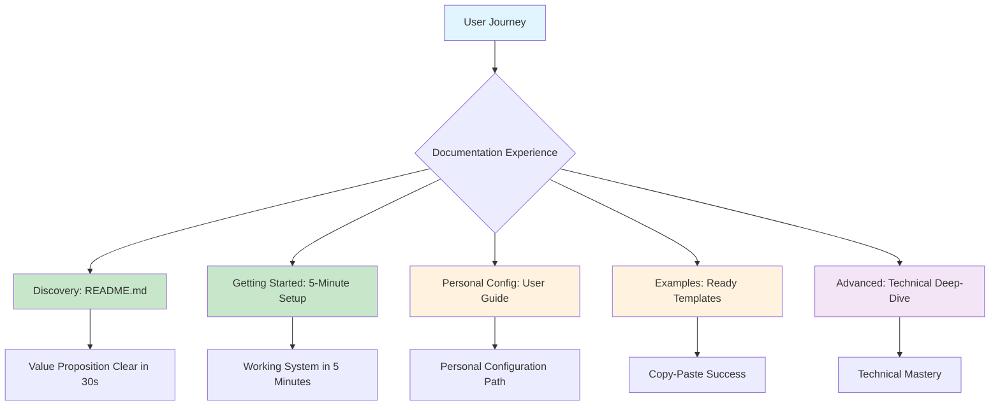
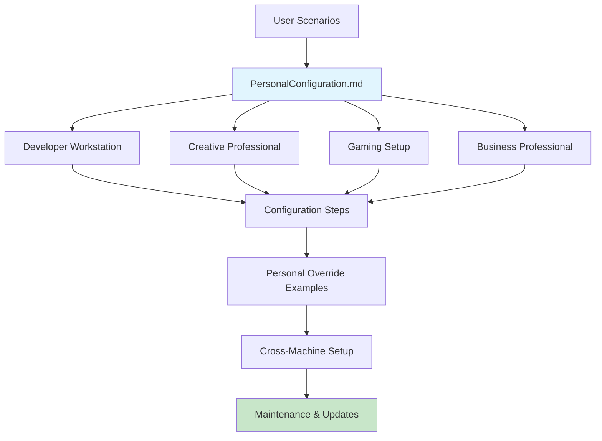
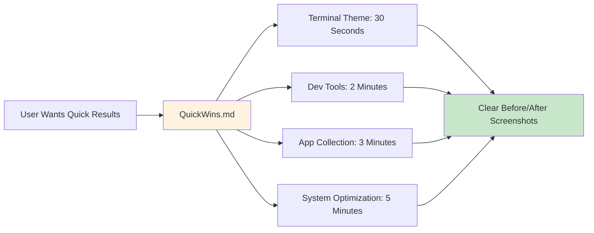
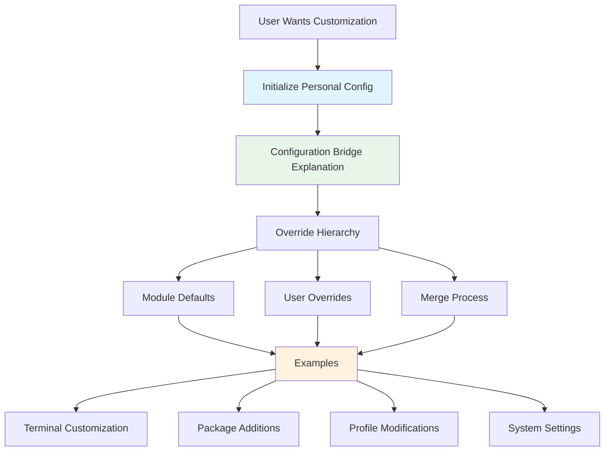
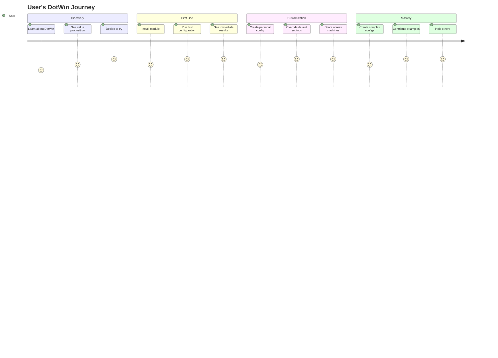

# DotWin Documentation Overhaul Plan

## Strategic Transformation: From Technical Showcase to User Enablement

**Status:** Planned  
**Goal:** Transform DotWin documentation from complex system showcase to "5-minute personal Windows configuration"  
**Focus:** Immediate user value leveraging the completed Configuration Bridge system

---

## 🎯 Strategic Vision

### **Narrative Transformation**

**FROM:** "Sophisticated PowerShell module with rich configurations"  
**TO:** "Personal Windows 11 configuration that follows you across machines"

### **Core Value Proposition**

- Create your perfect Windows setup once
- Carry it across any machine  
- Customize anything with personal overrides
- Working system in 5 minutes

---

## 📊 Current Documentation Assessment

### **Issues Identified**

#### README.md (374 lines)

- ❌ Focuses on architecture complexity rather than user value
- ❌ Lead with technical features instead of personal benefits
- ❌ 🚀 Quick Start section buried under architecture diagrams
- ❌ Missing "personal configuration" narrative

#### GettingStarted.md (497 lines)

- ❌ 497 lines of complexity for "getting started"
- ❌ Doesn't emphasize key differentiator (user override system)
- ❌ Technical walkthrough instead of value demonstration
- ❌ Missing "5-minute working system" approach

#### Missing Critical Documentation

- ❌ No user-focused configuration guide
- ❌ No personal override examples
- ❌ No ready-to-use configuration templates
- ❌ No cross-machine setup guide

### **Key Insight: Documentation-Reality Gap**

Current documentation describes DotWin as having "implementation gaps" when the Configuration Bridge system is **fully complete and working**. Documentation needs to reflect the sophisticated, production-ready system that exists.

---

## 🏗️ Documentation Architecture Plan



---

## 📋 Detailed Implementation Plan

### **Phase 1: Foundation (Maximum Impact) - Week 1**

#### 1.1 Transform README.md

**Goal:** "Personal Windows Configuration" narrative in first 30 seconds

**New Structure:**

```markdown
# DotWin - Your Personal Windows Configuration
> Create, customize, and carry your perfect Windows setup across any machine

## 🚀 5-Minute Setup
[Immediate value demonstration with working example]

## 💡 Why DotWin?
[Personal benefits: reproducible setup, cross-machine consistency, easy customization]

## 🎯 What You Get
[Tangible outcomes: terminal themes, app collections, system optimizations]

## 📖 Your First Configuration
[Step-by-step that actually works in 5 minutes]

## 🔧 Personal Customization
[How the Configuration Bridge enables user overrides]

## 📚 Learn More
[Progressive disclosure to advanced features]
```

**Success Criteria:**

- Value proposition clear in first 30 seconds
- Working example provided immediately
- Technical details moved to later sections

#### 1.2 Rewrite GettingStarted.md

**Goal:** From 497 lines to "Working in 5 minutes"

**New Structure (Target: 200 lines):**

1. **Immediate Value** (Lines 1-50): What you get and why you want it
2. **5-Minute Setup** (Lines 51-100): Working configuration with tangible results
3. **Your First Customization** (Lines 101-150): Personal override example
4. **Next Steps** (Lines 151-200): Where to go from here

**Success Criteria:**

- Working system demonstrated in under 100 lines
- Clear progression from installation to customization
- Immediate tangible results shown

#### 1.3 Create PersonalConfiguration.md

##### The cornerstone user guide



**Content Structure:**

- **User Scenarios**: Developer, Creative, Gaming, Business
- **Step-by-Step Setup**: For each scenario
- **Personal Overrides**: How to customize any aspect
- **Cross-Machine Sync**: Configuration portability
- **Real Examples**: Working configuration files

---

### **Phase 2: Practical Value (User Enablement) - Week 2**

#### 2.1 Create ConfigurationExamples.md

##### Real-world templates users can copy-paste

**Content:**

- **Complete Templates**: Ready-to-use configurations for common scenarios
- **Personal Override Patterns**: Common customization examples
- **Multi-Format Examples**: .ps1, .jsonc, .json, .yaml demonstrations
- **Before/After Comparisons**: Show the impact of configurations

**Template Categories:**

- Development environments (various tech stacks)
- Creative workstations (design, video, audio)
- Gaming setups (performance optimization)
- Business configurations (productivity, security)

#### 2.2 Create QuickWins.md

##### Immediate tangible benefits



**Content:**

- **30-Second Wins**: Terminal themes, color schemes
- **2-Minute Wins**: Essential tool installation
- **5-Minute Wins**: Complete environment setup
- **Visual Results**: Before/after screenshots
- **Measurable Benefits**: Time saved, productivity gains

#### 2.3 Build examples/personal-configs/ Directory

##### Ready-to-use configuration templates

```text
examples/personal-configs/
├── developer/
│   ├── basic-dev-setup.ps1          # Essential development tools
│   ├── full-stack-developer.jsonc   # Complete full-stack environment
│   ├── data-scientist.ps1           # Python, R, Jupyter setup
│   └── README.md                    # Setup instructions
├── creative/
│   ├── content-creator.ps1          # Video editing, streaming tools
│   ├── designer-workstation.jsonc   # Adobe suite, design tools
│   ├── photographer.ps1             # Photo editing, management
│   └── README.md
├── business/
│   ├── office-professional.ps1      # Office suite, productivity tools
│   ├── remote-worker.jsonc          # VPN, communication, collaboration
│   ├── consultant.ps1               # Presentation, analysis tools
│   └── README.md
├── gaming/
│   ├── gaming-setup.ps1             # Game platforms, optimization
│   ├── streamer-config.jsonc        # OBS, streaming tools
│   ├── competitive-gamer.ps1        # Performance optimization
│   └── README.md
└── base-templates/
    ├── minimal-setup.ps1            # Basic Windows optimization
    ├── security-focused.jsonc       # Security-hardened configuration
    └── README.md
```

---

### **Phase 3: Technical Enablement (Configuration Bridge Focus) - Week 3**

#### 3.1 Create UserOverrides.md

##### Configuration Bridge system made accessible



**Content:**

- **Configuration Bridge Simplified**: How the sophisticated system works in user terms
- **Override Hierarchy**: Module defaults → User overrides → Final configuration
- **Practical Examples**: Real customization scenarios
- **File Organization**: Where to put user configuration files
- **Troubleshooting**: Common override issues and solutions

#### 3.2 Create ConfigurationFormats.md

##### Multi-format support guide

**Content:**

- **Format Comparison**: When to use .ps1 vs .jsonc vs .json vs .yaml
- **Format Strengths**: PowerShell flexibility vs JSON portability
- **Conversion Examples**: Moving between formats
- **Best Practices**: Format selection guidelines
- **Integration**: How different formats work together

#### 3.3 Build examples/override-patterns/ Directory

##### Common customization patterns

```text
examples/override-patterns/
├── terminal-themes/
│   ├── my-custom-colors.ps1         # Personal color schemes
│   ├── company-branding.jsonc       # Corporate terminal themes
│   ├── accessibility.ps1            # High contrast, large fonts
│   └── README.md
├── package-additions/
│   ├── my-extra-tools.ps1           # Personal tool additions
│   ├── team-specific-apps.jsonc     # Team/company required apps
│   ├── language-specific.ps1        # Go, Rust, specific tech stacks
│   └── README.md
├── profile-customizations/
│   ├── my-aliases.ps1               # Personal PowerShell aliases
│   ├── team-functions.jsonc         # Shared team functions
│   ├── prompt-customization.ps1     # Custom PowerShell prompts
│   └── README.md
└── system-optimizations/
    ├── performance-tweaks.ps1       # Personal performance settings
    ├── security-hardening.jsonc     # Additional security measures
    └── README.md
```

---

### **Phase 4: User Experience Enhancement - Week 4**

#### 4.1 Create UserJourney.md

##### Progressive learning path



**Content:**

- **Learning Stages**: Beginner → User → Power User → Contributor
- **Milestone Achievements**: Clear progression markers
- **Resource Recommendations**: What to read/do at each stage
- **Community Connection**: How to engage with other users

#### 4.2 Create FAQ.md

##### Address common user concerns

**Categories:**

- **Getting Started**: Installation, first setup, basic usage
- **Customization**: How to override, file organization, formats
- **Troubleshooting**: Common issues, error resolution
- **Integration**: Existing setups, company policies, security
- **Advanced Usage**: Complex scenarios, contributions, extensions

**Key Questions:**

- "How is this different from traditional dotfiles?"
- "Will this break my existing Windows setup?"
- "Can I undo changes if something goes wrong?"
- "How do I share my configuration with teammates?"
- "What if my company has software restrictions?"

#### 4.3 Review and Polish

##### Documentation quality assurance

**Review Criteria:**

- **Clarity**: Can a new user follow the instructions?
- **Completeness**: Are all steps included?
- **Accuracy**: Do examples actually work?
- **Value**: Is the benefit clear immediately?
- **Progression**: Does it lead naturally to next steps?

---

## 🚀 Implementation Timeline

### **Week 1: Foundation (Maximum Impact)**

**Focus:** Transform core documentation for immediate user value

| Day | Task | Expected Outcome |
|-----|------|------------------|
| 1-2 | Transform README.md | Personal configuration narrative, 5-minute value demonstration |
| 3-4 | Rewrite GettingStarted.md | 200-line guide showing working system in 5 minutes |
| 5   | Create PersonalConfiguration.md | Cornerstone user guide with scenarios |

### **Week 2: Practical Value**

**Focus:** Ready-to-use templates and examples

| Day | Task | Expected Outcome |
|-----|------|------------------|
| 1-2 | Create ConfigurationExamples.md | Copy-paste templates for common scenarios |
| 3   | Create QuickWins.md | Immediate benefit demonstrations |
| 4-5 | Build examples/personal-configs/ | Working configuration templates |

### **Week 3: Technical Enablement**

**Focus:** Configuration Bridge user guides

| Day | Task | Expected Outcome |
|-----|------|------------------|
| 1-2 | Create UserOverrides.md | Configuration Bridge made accessible |
| 3   | Create ConfigurationFormats.md | Multi-format usage guide |
| 4-5 | Build examples/override-patterns/ | Common customization patterns |

### **Week 4: User Experience**

**Focus:** Complete user journey support

| Day | Task | Expected Outcome |
|-----|------|------------------|
| 1-2 | Create UserJourney.md | Progressive learning path |
| 3   | Create FAQ.md | Common questions addressed |
| 4-5 | Review and polish | Quality assurance, consistency |

---

## 📊 Success Metrics

### **User Engagement Metrics**

- **Time to Value**: < 5 minutes from installation to working configuration
- **Setup Success Rate**: > 90% success rate for first-time users following documentation
- **User Override Adoption**: Measure percentage of users creating personal configurations
- **Community Sharing**: Number of user-contributed configuration examples

### **Documentation Quality Metrics**

- **README Value Clarity**: Value proposition understandable in < 30 seconds
- **GettingStarted Effectiveness**: Working system demonstration in < 100 lines
- **Example Usage**: Adoption rate of provided templates
- **Support Request Reduction**: Decrease in basic setup questions

### **Technical Achievement Metrics**

- **Configuration Bridge Utilization**: Usage of user override capabilities
- **Cross-Machine Setup Success**: Users successfully replicating configurations
- **Format Adoption**: Usage distribution across .ps1, .jsonc, .json, .yaml
- **Community Contributions**: User-contributed examples and improvements

---

## 🎯 Key Documentation Principles

### **1. Value-First Approach**

- **Lead with Benefits**: Show what users get, not how it works
- **Immediate Results**: Demonstrate tangible outcomes quickly
- **Personal Narrative**: "Your Windows configuration" not "configuration management system"

### **2. Progressive Disclosure**

- **Simple First**: Start with basic use cases, build to complexity
- **Layer Information**: Match detail level to user expertise
- **Clear Progression**: Obvious path from beginner to advanced

### **3. Working Examples**

- **Copy-Paste Success**: All examples must work without modification
- **Expected Outcomes**: Show what success looks like
- **Before/After**: Demonstrate clear improvements

### **4. User Empowerment**

- **Customization Focus**: Emphasize the Configuration Bridge override system
- **Personal Control**: Users can modify anything to their preferences
- **Cross-Machine Consistency**: Configuration follows user across systems

### **5. Community Building**

- **Sharing Culture**: Make it easy to share configurations
- **Contribution Path**: Clear way to contribute back
- **Success Stories**: Highlight user achievements

---

## 🔄 Maintenance Strategy

### **Documentation Maintenance**

- **Regular Review**: Quarterly documentation accuracy review
- **User Feedback Integration**: Incorporate user suggestions and pain points
- **Example Updates**: Keep configuration examples current with latest software
- **Link Validation**: Ensure all references and examples remain functional

### **Community Engagement**

- **User Contributions**: Process and integrate community examples
- **Feedback Collection**: Regular surveys and usage analytics
- **Success Story Sharing**: Feature user achievements and configurations
- **Expert User Recognition**: Highlight power users and contributors

---

## 🎉 Expected Outcomes

### **Immediate Impact (Week 1-2)**

- Users can successfully set up DotWin in 5 minutes
- Clear understanding of personal configuration value proposition
- Working examples demonstrate immediate benefits

### **Short-term Impact (Month 1)**

- Users creating and sharing personal configurations
- Reduced support burden for basic setup questions
- Increased adoption of Configuration Bridge user override features

### **Long-term Impact (Quarter 1)**

- Thriving community of configuration sharing
- User-contributed examples and templates
- DotWin positioned as "the personal Windows configuration solution"

### **Strategic Success**

- **Documentation-Reality Alignment**: Documentation accurately reflects the sophisticated, working system
- **User Enablement**: Users successfully leverage the complete Configuration Bridge system
- **Community Growth**: Active community sharing and contributing configurations
- **Market Position**: DotWin recognized as the leading personal Windows configuration solution

---

This documentation overhaul plan transforms DotWin from a "complex PowerShell module showcase" into **"the easiest way to create and maintain your personal Windows configuration"** - emphasizing the completed, production-ready system and immediate user value.
