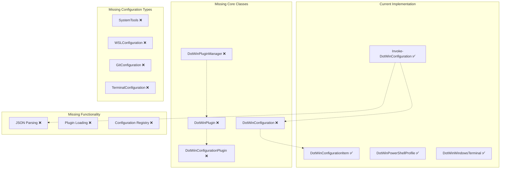
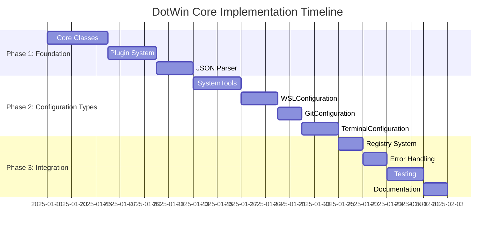
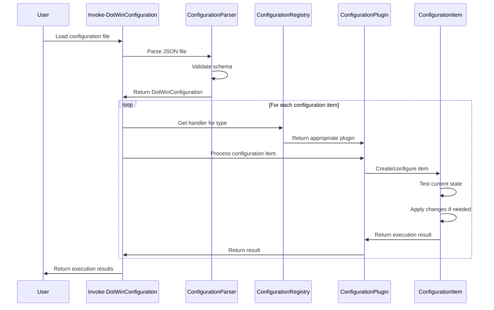

# DotWin Core Configuration Management Implementation Plan

## Executive Summary

This plan addresses the critical missing components in the DotWin module to enable production-ready configuration management. The focus is on implementing JSON configuration file parsing, a working plugin system, and essential developer-focused configuration types that can process the existing example configurations.

## 1. Core Architecture Analysis

### Current State Assessment

**✅ What's Working:**
- Base configuration item classes ([`DotWinConfigurationItem`](../Classes.ps1:12), [`DotWinPowerShellProfile`](../Classes.ps1:98), [`DotWinWindowsTerminal`](../Classes.ps1:198))
- Module loading infrastructure ([`DotWin.psm1`](../DotWin.psm1:1))
- Function framework ([`Invoke-DotWinConfiguration`](../Functions/Invoke-DotWinConfiguration.ps1:1))
- Comprehensive test infrastructure

**❌ Critical Missing Components:**
- [`DotWinConfiguration`](../Classes.ps1:311) class (referenced but not implemented)
- [`DotWinPlugin`](PluginDevelopment.md:18) base classes
- [`DotWinPluginManager`](Architecture.md:280) class
- JSON configuration file parsing in [`Invoke-DotWinConfiguration`](../Functions/Invoke-DotWinConfiguration.ps1:148)
- Developer-focused configuration types

### Architecture Gaps



## 2. Implementation Strategy

### Phase 1: Core Foundation (Priority 1 - Critical Blockers)

#### 1.1 Core Configuration Classes

**[`DotWinConfiguration`](../Classes.ps1:311) Class Implementation**
```powershell
class DotWinConfiguration {
    [string]$Name
    [string]$Version
    [string]$Description
    [System.Collections.Generic.List[DotWinConfigurationItem]]$Items
    [hashtable]$Metadata
    [datetime]$Created
    [datetime]$LastModified
    
    # Collection management methods
    [void] AddItem([DotWinConfigurationItem]$Item)
    [bool] RemoveItem([string]$Name)
    [DotWinConfigurationItem] GetItem([string]$Name)
    [DotWinConfigurationItem[]] GetItemsByType([string]$Type)
    
    # Validation and testing
    [hashtable] TestAll()
    [DotWinValidationResult[]] ValidateConfiguration()
}
```

**Plugin System Base Classes**
```powershell
class DotWinPlugin {
    [string]$Name
    [string]$Version
    [string]$Author
    [string]$Category
    [hashtable]$Metadata
    [string[]]$Dependencies
    [bool]$Enabled
    
    # Virtual methods for inheritance
    [bool] Initialize()
    [void] Cleanup()
    [hashtable] GetCapabilities()
    [bool] ValidateEnvironment()
}

class DotWinConfigurationPlugin : DotWinPlugin {
    [string[]]$SupportedTypes
    [hashtable]$ConfigurationHandlers
    
    [void] RegisterHandler([string]$Type, [scriptblock]$Handler)
    [DotWinExecutionResult] ProcessConfiguration([DotWinConfigurationItem]$Item)
}

class DotWinPluginManager {
    [hashtable]$LoadedPlugins
    [hashtable]$PluginRegistry
    [string[]]$PluginPaths
    [bool]$AutoLoadEnabled
    
    [void] RegisterPlugin([DotWinPlugin]$Plugin)
    [bool] LoadPlugin([string]$Name)
    [bool] UnloadPlugin([string]$Name)
    [DotWinPlugin[]] GetPluginsByCategory([string]$Category)
}
```

#### 1.2 JSON Configuration Parser

**Configuration File Processing Engine**
```powershell
class DotWinConfigurationParser {
    [DotWinConfiguration] ParseFromJson([string]$JsonContent)
    [DotWinConfiguration] ParseFromFile([string]$FilePath)
    [DotWinConfigurationItem] CreateConfigurationItem([hashtable]$ItemData)
    [void] ValidateConfigurationSchema([hashtable]$ConfigData)
}
```

**Integration with [`Invoke-DotWinConfiguration`](../Functions/Invoke-DotWinConfiguration.ps1:148)**
- Replace TODO comments with actual JSON parsing logic
- Implement configuration object creation from parsed JSON
- Add validation for configuration file schema

### Phase 2: Developer Configuration Types (Priority 2 - Core Features)

#### 2.1 SystemTools Configuration Type

```powershell
class DotWinSystemTools : DotWinConfigurationItem {
    [string]$Category
    [string]$Source  # winget, chocolatey, scoop
    [string[]]$Tools
    [bool]$AcceptLicenses
    [hashtable]$InstallOptions
    
    [bool] Test()      # Check if tools are installed
    [void] Apply()     # Install missing tools
    [hashtable] GetCurrentState()  # Get installation status
}
```

**Capabilities:**
- Winget package installation and management
- Chocolatey integration (if available)
- Bulk tool installation with progress tracking
- License acceptance automation

#### 2.2 WSLConfiguration Type

```powershell
class DotWinWSLConfiguration : DotWinConfigurationItem {
    [string]$Distribution
    [string]$DefaultUser
    [hashtable]$Settings
    [string[]]$Packages
    [string[]]$PostInstallCommands
    
    [bool] Test()      # Check WSL and distribution status
    [void] Apply()     # Install/configure WSL and distribution
    [hashtable] GetCurrentState()  # Get WSL configuration state
}
```

**Capabilities:**
- WSL feature enablement
- Linux distribution installation
- Package installation within WSL
- Post-installation script execution

#### 2.3 GitConfiguration Type

```powershell
class DotWinGitConfiguration : DotWinConfigurationItem {
    [hashtable]$GlobalConfig
    [hashtable]$Aliases
    [string]$UserName
    [string]$UserEmail
    [bool]$ConfigureCredentialHelper
    
    [bool] Test()      # Check Git configuration
    [void] Apply()     # Apply Git settings
    [hashtable] GetCurrentState()  # Get current Git config
}
```

#### 2.4 Enhanced TerminalConfiguration Type

```powershell
class DotWinTerminalConfiguration : DotWinConfigurationItem {
    [string]$DefaultProfile
    [string]$Theme
    [int]$FontSize
    [string]$FontFace
    [hashtable[]]$Profiles
    [hashtable]$ColorSchemes
    
    [bool] Test()      # Check terminal configuration
    [void] Apply()     # Apply terminal settings
    [hashtable] GetCurrentState()  # Get current terminal state
}
```

### Phase 3: Integration and Validation (Priority 3 - Production Readiness)

#### 3.1 Configuration Registry System

**Plugin-to-Configuration Type Mapping**
```powershell
class DotWinConfigurationRegistry {
    [hashtable]$TypeHandlers
    [hashtable]$PluginMappings
    
    [void] RegisterConfigurationType([string]$Type, [DotWinPlugin]$Plugin)
    [DotWinPlugin] GetHandlerForType([string]$Type)
    [string[]] GetSupportedTypes()
}
```

#### 3.2 Error Handling and Validation

**Comprehensive Validation Framework**
- Schema validation for JSON configuration files
- Configuration item property validation
- Dependency checking between configuration items
- Environment compatibility validation

#### 3.3 Testing and Quality Assurance

**Test Coverage Expansion**
- Unit tests for all new classes
- Integration tests for JSON parsing
- End-to-end tests with example configurations
- Performance testing for large configurations

## 3. Detailed Implementation Plan

### 3.1 Development Phases



### 3.2 File Structure Changes

**New Files to Create:**
```
Classes/
├── Core/
│   ├── DotWinConfiguration.ps1
│   ├── DotWinConfigurationParser.ps1
│   └── DotWinConfigurationRegistry.ps1
├── Plugins/
│   ├── DotWinPlugin.ps1
│   ├── DotWinConfigurationPlugin.ps1
│   └── DotWinPluginManager.ps1
└── ConfigurationTypes/
    ├── DotWinSystemTools.ps1
    ├── DotWinWSLConfiguration.ps1
    ├── DotWinGitConfiguration.ps1
    └── DotWinTerminalConfiguration.ps1

plugins/
├── SystemToolsPlugin.ps1
├── WSLConfigurationPlugin.ps1
├── GitConfigurationPlugin.ps1
└── TerminalConfigurationPlugin.ps1
```

**Modified Files:**
- [`Classes.ps1`](../Classes.ps1:1) - Add new class imports
- [`Functions/Invoke-DotWinConfiguration.ps1`](../Functions/Invoke-DotWinConfiguration.ps1:148) - Implement JSON parsing
- [`DotWin.psm1`](../DotWin.psm1:1) - Update class loading logic

### 3.3 Configuration Processing Workflow



## 4. Implementation Priority Matrix

### Phase 1: Critical Blockers (Must Have for v1.0)

| Component | Priority | Effort | Dependencies | Risk |
|-----------|----------|--------|--------------|------|
| DotWinConfiguration | P0 | High | None | Low |
| DotWinPlugin Base Classes | P0 | Medium | None | Low |
| DotWinPluginManager | P0 | High | Plugin Classes | Medium |
| JSON Configuration Parser | P0 | Medium | DotWinConfiguration | Low |
| SystemTools Configuration | P1 | Medium | Plugin System | Low |

### Phase 2: Core Features (Should Have for v1.0)

| Component | Priority | Effort | Dependencies | Risk |
|-----------|----------|--------|--------------|------|
| WSLConfiguration | P1 | High | SystemTools | Medium |
| GitConfiguration | P1 | Low | SystemTools | Low |
| TerminalConfiguration | P1 | Medium | JSON Parser | Low |
| PowerShellProfile Enhancement | P2 | Low | Existing Classes | Low |

### Phase 3: Production Features (Nice to Have for v1.1+)

| Component | Priority | Effort | Dependencies | Risk |
|-----------|----------|--------|--------------|------|
| Configuration Registry | P2 | Medium | All Core Types | Low |
| Advanced Error Handling | P2 | Medium | Core System | Low |
| Performance Optimization | P3 | Low | Complete System | Low |
| Comprehensive Testing | P1 | High | All Components | Low |

## 5. Integration Strategy

### 5.1 Backward Compatibility

**Existing Function Compatibility**
- Maintain existing function signatures
- Ensure existing configuration items continue to work
- Provide migration path for any breaking changes

**Class Inheritance Preservation**
- Keep existing base class structure
- Extend rather than replace existing classes
- Maintain virtual method contracts

### 5.2 Plugin System Integration

**Plugin Discovery and Loading**
```powershell
# Automatic plugin registration for core types
$corePlugins = @(
    'SystemToolsPlugin',
    'WSLConfigurationPlugin', 
    'GitConfigurationPlugin',
    'TerminalConfigurationPlugin'
)

foreach ($pluginName in $corePlugins) {
    $plugin = [scriptblock]::Create("[$pluginName]::new()").Invoke()
    Register-DotWinPlugin -Plugin $plugin
}
```

**Configuration Type Registration**
```powershell
# Map configuration types to their handlers
$script:DotWinConfigurationRegistry.RegisterConfigurationType('SystemTools', $systemToolsPlugin)
$script:DotWinConfigurationRegistry.RegisterConfigurationType('WSLConfiguration', $wslPlugin)
$script:DotWinConfigurationRegistry.RegisterConfigurationType('GitConfiguration', $gitPlugin)
$script:DotWinConfigurationRegistry.RegisterConfigurationType('TerminalConfiguration', $terminalPlugin)
```

### 5.3 Testing Strategy

**Unit Testing Approach**
- Test each class in isolation with comprehensive mocks
- Validate all public methods and properties
- Test error conditions and edge cases

**Integration Testing**
- Test complete configuration processing workflow
- Validate JSON parsing with real configuration files
- Test plugin loading and execution

**End-to-End Testing**
- Process [`developer-workstation.json`](../examples/configurations/developer-workstation.json:1) completely
- Verify all configuration types work together
- Test rollback and error recovery scenarios

## 6. Risk Assessment and Mitigation

### 6.1 Technical Risks

| Risk | Impact | Probability | Mitigation |
|------|--------|-------------|------------|
| PowerShell class loading issues | High | Medium | Multiple loading strategies, comprehensive testing |
| JSON schema complexity | Medium | Low | Incremental schema development, validation |
| Plugin system performance | Medium | Low | Lazy loading, caching strategies |
| WSL integration complexity | High | Medium | Phased implementation, fallback options |

### 6.2 Implementation Risks

| Risk | Impact | Probability | Mitigation |
|------|--------|-------------|------------|
| Scope creep | Medium | Medium | Strict phase boundaries, clear requirements |
| Testing complexity | Medium | High | Automated testing, mock frameworks |
| Documentation lag | Low | High | Inline documentation, automated generation |

## 7. Success Criteria

### 7.1 Functional Requirements

**✅ Core Configuration Management**
- [ ] Load and parse [`developer-workstation.json`](../examples/configurations/developer-workstation.json:1) successfully
- [ ] Process all developer-focused configuration types
- [ ] Execute configuration items with proper error handling
- [ ] Provide detailed execution results and logging

**✅ Plugin System**
- [ ] Register and load configuration plugins
- [ ] Map configuration types to appropriate handlers
- [ ] Support plugin dependencies and lifecycle management
- [ ] Enable/disable plugins dynamically

**✅ Configuration Types**
- [ ] SystemTools: Install development tools via winget
- [ ] WSLConfiguration: Enable WSL and install distributions
- [ ] GitConfiguration: Configure Git settings and aliases
- [ ] TerminalConfiguration: Configure Windows Terminal profiles

### 7.2 Quality Requirements

**✅ Reliability**
- [ ] 95%+ test coverage for core classes
- [ ] Graceful error handling and recovery
- [ ] Rollback capability for failed configurations
- [ ] Comprehensive logging and diagnostics

**✅ Performance**
- [ ] Process 50+ configuration items in <30 seconds
- [ ] Minimal memory footprint (<100MB)
- [ ] Efficient plugin loading and caching
- [ ] Parallel execution support where applicable

**✅ Maintainability**
- [ ] Clear separation of concerns
- [ ] Comprehensive inline documentation
- [ ] Consistent coding standards
- [ ] Extensible architecture for future enhancements

## 8. Next Steps

### 8.1 Immediate Actions

1. **Create Core Classes** - Implement [`DotWinConfiguration`](../Classes.ps1:311), [`DotWinPlugin`](PluginDevelopment.md:18), and [`DotWinPluginManager`](Architecture.md:280)
2. **Implement JSON Parser** - Add configuration file parsing to [`Invoke-DotWinConfiguration`](../Functions/Invoke-DotWinConfiguration.ps1:148)
3. **Create SystemTools Plugin** - First developer-focused configuration type
4. **Update Test Suite** - Ensure all new components have comprehensive tests

### 8.2 Validation Approach

1. **Unit Testing** - Test each component in isolation
2. **Integration Testing** - Test complete workflow with sample configurations
3. **User Acceptance Testing** - Validate against real-world developer scenarios
4. **Performance Testing** - Ensure acceptable performance characteristics

## 9. Configuration Type Specifications

### 9.1 SystemTools Configuration Schema

```json
{
  "name": "Essential Development Tools",
  "type": "SystemTools",
  "description": "Core development tools and utilities",
  "enabled": true,
  "properties": {
    "category": "Development",
    "source": "winget",
    "tools": [
      "git",
      "vscode",
      "powershell",
      "windows-terminal",
      "docker-desktop",
      "nodejs",
      "python3"
    ],
    "acceptLicenses": true,
    "installOptions": {
      "scope": "machine",
      "silent": true
    }
  }
}
```

### 9.2 WSLConfiguration Schema

```json
{
  "name": "WSL Ubuntu Development Environment",
  "type": "WSLConfiguration",
  "description": "Ubuntu-based development environment",
  "enabled": true,
  "properties": {
    "distribution": "Ubuntu-22.04",
    "defaultUser": "developer",
    "settings": {
      "memory": "8GB",
      "processors": "4",
      "swap": "2GB"
    },
    "packages": [
      "build-essential",
      "curl",
      "git",
      "nodejs",
      "python3"
    ],
    "postInstallCommands": [
      "sudo usermod -aG docker $USER"
    ]
  }
}
```

### 9.3 GitConfiguration Schema

```json
{
  "name": "Git Configuration",
  "type": "GitConfiguration",
  "description": "Configure Git with best practices",
  "enabled": true,
  "properties": {
    "globalConfig": {
      "core.autocrlf": "true",
      "core.editor": "code --wait",
      "init.defaultBranch": "main",
      "pull.rebase": "false"
    },
    "aliases": {
      "st": "status",
      "co": "checkout",
      "br": "branch"
    }
  }
}
```

### 9.4 TerminalConfiguration Schema

```json
{
  "name": "Windows Terminal Configuration",
  "type": "TerminalConfiguration",
  "description": "Modern terminal configuration",
  "enabled": true,
  "properties": {
    "defaultProfile": "PowerShell",
    "theme": "dark",
    "fontSize": 12,
    "fontFace": "Cascadia Code PL",
    "profiles": [
      {
        "name": "PowerShell 7",
        "commandline": "pwsh.exe",
        "colorScheme": "Campbell Powershell"
      },
      {
        "name": "Ubuntu WSL",
        "commandline": "wsl.exe -d Ubuntu-22.04",
        "colorScheme": "Ubuntu"
      }
    ]
  }
}
```

This implementation plan provides a clear roadmap to transform DotWin from its current state into a production-ready configuration management system focused on developer workflows. The phased approach ensures critical blockers are addressed first while maintaining a clear path to full functionality.