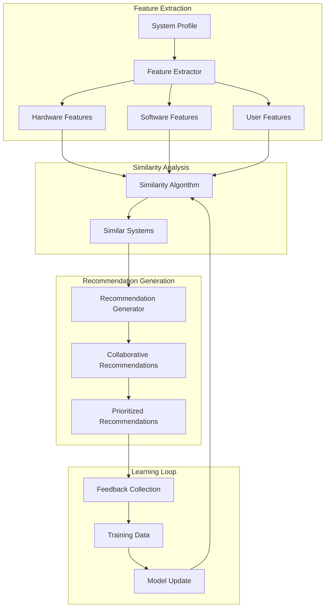
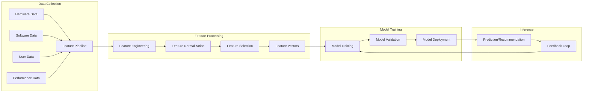
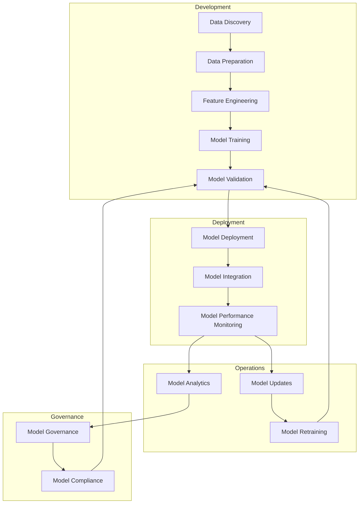

# DotWin Machine Learning Framework

## Overview

This document describes the machine learning capabilities and framework within the DotWin Windows 11 configuration management system. While the current implementation focuses on rule-based intelligence, the architecture is designed to incorporate advanced machine learning techniques for enhanced system profiling, recommendation generation, and predictive configuration management.

## Current ML Implementation

### 1. Foundation Architecture

The DotWin system includes foundational ML classes and interfaces that provide the groundwork for machine learning capabilities:

```powershell
class DotWinMLRecommendationEngine {
    [DotWinSystemProfile]$SystemProfile
    [hashtable]$TrainingData
    [hashtable]$Models
    [string]$ModelVersion
    
    # Similarity-based recommendation using clustering
    [System.Collections.Generic.List[DotWinRecommendation]] GenerateRecommendations()
    
    # Find systems with similar hardware/software profiles
    [System.Collections.Generic.List[hashtable]] FindSimilarSystems()
    
    # Create feature vectors for ML processing
    [hashtable] CreateFeatureVector([DotWinSystemProfile]$Profile)
}
```

### 2. Feature Engineering

The system automatically extracts meaningful features from system profiles for ML processing:

#### Hardware Features

- **CPU Characteristics**: Cores, threads, architecture, manufacturer, performance score
- **Memory Profile**: Total capacity, speed, type, utilization patterns
- **Storage Profile**: Type (SSD/HDD), capacity, performance metrics, usage patterns
- **GPU Profile**: Manufacturer, memory, compute capability, driver version
- **System Performance**: Benchmark scores, thermal characteristics, power consumption

#### Software Features

- **Package Ecosystem**: Installed package managers, package counts by category
- **Development Environment**: Programming languages, IDEs, frameworks detected
- **Application Categories**: Productivity, gaming, creative, business software ratios
- **System Configuration**: Windows features enabled, registry optimizations applied
- **Usage Patterns**: Application launch frequency, system uptime patterns

#### User Behavior Features

- **User Type Classification**: Developer, gamer, business, creative, general user
- **Technical Proficiency**: Beginner, intermediate, advanced based on installed tools
- **Workflow Patterns**: Command line usage, automation tool presence, customization level
- **Security Posture**: Security tools installed, update patterns, configuration hardening

### 3. Similarity-Based Recommendations

The current ML implementation uses similarity algorithms to find comparable systems and generate recommendations:



## Advanced ML Capabilities (Roadmap)

### 1. Predictive Configuration Management

#### System Health Prediction

```powershell
class DotWinPredictiveHealthModel {
    # Predict system issues before they occur
    [DotWinHealthPrediction] PredictSystemHealth([DotWinSystemProfile]$Profile, [int]$DaysAhead)
    
    # Identify configuration drift patterns
    [DotWinDriftPrediction] PredictConfigurationDrift([DotWinSystemProfile]$Baseline)
    
    # Recommend preventive maintenance
    [System.Collections.Generic.List[DotWinRecommendation]] GeneratePreventiveRecommendations()
}
```

#### Performance Optimization Prediction

- **Resource Usage Forecasting**: Predict CPU, memory, and storage needs
- **Bottleneck Identification**: Identify potential performance bottlenecks before they impact users
- **Optimization Timing**: Recommend optimal times for system maintenance and updates

### 2. Intelligent User Profiling

#### Advanced User Type Detection

```powershell
class DotWinUserProfilingML {
    # Multi-dimensional user classification
    [DotWinUserProfile] ClassifyUser([DotWinSystemProfile]$Profile)
    
    # Predict user needs based on behavior patterns
    [System.Collections.Generic.List[string]] PredictUserNeeds([DotWinUserProfile]$UserProfile)
    
    # Adaptive learning from user feedback
    [void] UpdateUserModel([DotWinUserFeedback]$Feedback)
}
```

#### Behavioral Pattern Recognition

- **Workflow Analysis**: Identify common user workflows and optimize for them
- **Application Usage Patterns**: Predict which applications users will need
- **Customization Preferences**: Learn user preferences for system customization
- **Security Behavior**: Adapt security recommendations based on user risk tolerance

### 3. Anomaly Detection and Security

#### Configuration Anomaly Detection

```powershell
class DotWinAnomalyDetectionModel {
    # Detect unusual configuration changes
    [DotWinAnomalyResult] DetectConfigurationAnomalies([DotWinSystemProfile]$Current, [DotWinSystemProfile]$Baseline)
    
    # Identify potential security threats
    [DotWinSecurityThreatAssessment] AssessSecurityThreats([DotWinSystemProfile]$Profile)
    
    # Recommend security improvements
    [System.Collections.Generic.List[DotWinSecurityRecommendation]] GenerateSecurityRecommendations()
}
```

#### Security Intelligence

- **Threat Pattern Recognition**: Identify patterns that indicate security threats
- **Vulnerability Assessment**: Predict system vulnerabilities based on configuration
- **Compliance Monitoring**: Ensure configurations meet security compliance requirements
- **Incident Response**: Automatically respond to detected security anomalies

## ML Model Architecture

### 1. Feature Pipeline



### 2. Model Types and Applications

#### Clustering Models

- **System Similarity**: K-means clustering for finding similar system configurations
- **User Segmentation**: Hierarchical clustering for user type classification
- **Configuration Patterns**: DBSCAN for identifying common configuration patterns

#### Classification Models

- **User Type Classification**: Random Forest for multi-class user type prediction
- **Hardware Compatibility**: SVM for hardware/software compatibility prediction
- **Issue Classification**: Neural networks for categorizing system issues

#### Regression Models

- **Performance Prediction**: Linear regression for performance metric forecasting
- **Resource Usage**: Time series regression for resource utilization prediction
- **Optimization Impact**: Regression models for predicting optimization effectiveness

#### Deep Learning Models

- **Sequence Analysis**: LSTM networks for analyzing configuration change sequences
- **Anomaly Detection**: Autoencoders for detecting unusual system configurations
- **Natural Language Processing**: Transformer models for processing user feedback and documentation

### 3. Training Data Sources

#### Internal Data Collection

```powershell
class DotWinMLDataCollector {
    # Collect anonymized system profiles
    [void] CollectSystemProfile([DotWinSystemProfile]$Profile, [bool]$Anonymous = $true)
    
    # Collect user feedback on recommendations
    [void] CollectRecommendationFeedback([DotWinRecommendationFeedback]$Feedback)
    
    # Collect performance metrics
    [void] CollectPerformanceMetrics([DotWinPerformanceMetrics]$Metrics)
    
    # Collect configuration outcomes
    [void] CollectConfigurationOutcome([DotWinConfigurationResult]$Result)
}
```

#### External Data Integration

- **Hardware Databases**: CPU, GPU, and component specification databases
- **Software Catalogs**: Package manager databases and software compatibility matrices
- **Security Feeds**: CVE databases and security threat intelligence
- **Performance Benchmarks**: Industry standard benchmark databases

## Implementation Strategy

### Phase 1: Foundation (Current)

- ✅ **Rule-Based Intelligence**: Comprehensive rule engine for recommendations
- ✅ **Feature Extraction**: System profiling with feature vector generation
- ✅ **Similarity Algorithms**: Basic clustering for finding similar systems
- ✅ **Data Collection Framework**: Infrastructure for collecting training data

### Phase 2: Basic ML (Next 6 months)

- 🔄 **Collaborative Filtering**: Recommendation engine based on similar users
- 🔄 **Classification Models**: User type and hardware compatibility prediction
- 🔄 **Anomaly Detection**: Basic outlier detection for configuration anomalies
- 🔄 **Performance Prediction**: Simple regression models for performance forecasting

### Phase 3: Advanced ML (6-12 months)

- 📋 **Deep Learning**: Neural networks for complex pattern recognition
- 📋 **Time Series Analysis**: Predictive models for system health and performance
- 📋 **Natural Language Processing**: Analysis of user feedback and documentation
- 📋 **Reinforcement Learning**: Adaptive recommendation systems

### Phase 4: AI-Driven Automation (12+ months)

- 📋 **Autonomous Configuration**: Self-configuring systems based on ML insights
- 📋 **Predictive Maintenance**: Proactive system maintenance recommendations
- 📋 **Intelligent Troubleshooting**: AI-powered problem diagnosis and resolution
- 📋 **Adaptive Security**: Dynamic security posture based on threat intelligence

## ML Model Management

### 1. Model Lifecycle



### 2. Model Versioning and Deployment

```powershell
class DotWinMLModelManager {
    # Model version management
    [DotWinMLModel] LoadModel([string]$ModelName, [string]$Version = "latest")
    
    # A/B testing for model performance
    [DotWinABTestResult] RunABTest([DotWinMLModel]$ModelA, [DotWinMLModel]$ModelB)
    
    # Model performance monitoring
    [DotWinModelMetrics] MonitorModelPerformance([DotWinMLModel]$Model)
    
    # Automated model retraining
    [void] ScheduleModelRetraining([string]$ModelName, [TimeSpan]$Interval)
}
```

### 3. Privacy and Ethics

#### Data Privacy

- **Anonymization**: All collected data is anonymized before ML processing
- **Opt-in Collection**: Users explicitly consent to data collection for ML
- **Local Processing**: Sensitive data processing happens locally when possible
- **Data Retention**: Clear policies for data retention and deletion

#### Ethical AI

- **Bias Detection**: Regular auditing for algorithmic bias in recommendations
- **Transparency**: Clear explanations for ML-driven recommendations
- **User Control**: Users can override or disable ML recommendations
- **Fairness**: Ensure ML models work fairly across different user types and hardware

## Performance Metrics and Evaluation

### 1. Model Performance Metrics

#### Recommendation Quality

- **Precision**: Percentage of recommended configurations that are actually useful
- **Recall**: Percentage of useful configurations that are recommended
- **F1-Score**: Harmonic mean of precision and recall
- **User Satisfaction**: Direct user feedback on recommendation quality

#### Prediction Accuracy

- **Mean Absolute Error (MAE)**: Average prediction error for continuous metrics
- **Root Mean Square Error (RMSE)**: Standard deviation of prediction errors
- **Classification Accuracy**: Percentage of correct classifications
- **Area Under Curve (AUC)**: Performance of binary classification models

#### System Impact

- **Configuration Success Rate**: Percentage of ML-recommended configurations that apply successfully
- **Performance Improvement**: Measured improvement in system performance after ML recommendations
- **Issue Prevention**: Number of system issues prevented through predictive models
- **User Adoption**: Percentage of users who accept and apply ML recommendations

### 2. Continuous Learning Framework

```powershell
class DotWinContinuousLearning {
    # Collect feedback on recommendations
    [void] CollectFeedback([DotWinRecommendation]$Recommendation, [DotWinUserFeedback]$Feedback)
    
    # Update models based on new data
    [void] UpdateModels([DotWinTrainingData]$NewData)
    
    # Evaluate model performance
    [DotWinModelEvaluation] EvaluateModel([DotWinMLModel]$Model, [DotWinTestData]$TestData)
    
    # Automated model improvement
    [void] OptimizeModel([DotWinMLModel]$Model, [DotWinOptimizationCriteria]$Criteria)
}
```

## Integration with DotWin Core

### 1. ML-Enhanced System Profiling

The ML framework enhances the existing system profiling capabilities:

```powershell
# Enhanced profiling with ML insights
$profile = Get-DotWinSystemProfile -IncludeMLInsights
$profile.MLInsights.UserTypeConfidence    # 0.95 (95% confidence in Developer classification)
$profile.MLInsights.SimilarSystems        # List of similar system configurations
$profile.MLInsights.PredictedNeeds         # Predicted software/hardware needs
$profile.MLInsights.OptimizationPotential # ML-calculated optimization opportunities
```

### 2. ML-Driven Recommendations

```powershell
# Get ML-enhanced recommendations
$recommendations = Get-DotWinRecommendations -UseMLEngine -ConfidenceThreshold 0.8
foreach ($rec in $recommendations) {
    Write-Host "Recommendation: $($rec.Title)"
    Write-Host "ML Confidence: $($rec.MLConfidence)"
    Write-Host "Based on: $($rec.MLReasoning)"
    Write-Host "Similar Systems: $($rec.SimilarSystemsCount)"
}
```

### 3. Predictive Configuration Management

```powershell
# Predictive system health assessment
$healthPrediction = Get-DotWinHealthPrediction -DaysAhead 30
if ($healthPrediction.RiskLevel -eq "High") {
    $preventiveActions = Get-DotWinPreventiveRecommendations -HealthPrediction $healthPrediction
    Invoke-DotWinConfiguration -Recommendations $preventiveActions -WhatIf
}
```

## Future ML Capabilities

### 1. Advanced Analytics

#### System Optimization Intelligence

- **Holistic Optimization**: Consider entire system ecosystem for optimization recommendations
- **Multi-Objective Optimization**: Balance performance, security, and usability
- **Temporal Optimization**: Optimize configurations based on time-of-day usage patterns
- **Contextual Optimization**: Adapt optimizations based on current user context

#### Predictive Maintenance

- **Hardware Failure Prediction**: Predict component failures before they occur
- **Software Degradation Detection**: Identify software performance degradation patterns
- **Capacity Planning**: Predict future resource needs based on usage trends
- **Update Impact Assessment**: Predict the impact of system updates before applying them

### 2. Autonomous Configuration Management

#### Self-Healing Systems

- **Automatic Issue Resolution**: Automatically fix common system issues
- **Configuration Drift Correction**: Automatically correct configuration drift
- **Performance Auto-Tuning**: Continuously optimize system performance
- **Security Auto-Hardening**: Automatically apply security improvements

#### Adaptive Learning

- **User Preference Learning**: Learn and adapt to individual user preferences
- **Environment Adaptation**: Adapt configurations based on changing environments
- **Workload Optimization**: Optimize for specific workload patterns
- **Continuous Improvement**: Continuously improve recommendations based on outcomes

## Conclusion

The DotWin machine learning framework provides a solid foundation for intelligent Windows configuration management. Starting with rule-based intelligence and similarity algorithms, the system is designed to evolve into a sophisticated AI-driven platform that can predict, prevent, and automatically resolve system issues while continuously learning and adapting to user needs.

The ML capabilities transform DotWin from a reactive configuration tool into a proactive, intelligent system that anticipates user needs, prevents problems before they occur, and continuously optimizes system performance and security. This evolution positions DotWin as a next-generation configuration management platform that leverages the power of machine learning to deliver unprecedented automation and intelligence in Windows system management.

## References and Further Reading

### Technical Resources

- [PowerShell Machine Learning](https://docs.microsoft.com/en-us/powershell/module/microsoft.powershell.machinelearning/)
- [Windows Performance Toolkit](https://docs.microsoft.com/en-us/windows-hardware/test/wpt/)
- [System Information APIs](https://docs.microsoft.com/en-us/windows/win32/cimwin32prov/computer-system-hardware-classes)

### ML Frameworks and Libraries

- [ML.NET](https://dotnet.microsoft.com/apps/machinelearning-ai/ml-dotnet) - .NET machine learning framework
- [Python Integration](https://docs.microsoft.com/en-us/windows/python/) - Python ML libraries on Windows
- [Azure Machine Learning](https://azure.microsoft.com/services/machine-learning/) - Cloud-based ML platform

### Research Papers and Articles

- Configuration Management Automation with Machine Learning
- Predictive System Administration using AI
- Anomaly Detection in System Configurations
- User Behavior Analysis for System Optimization
