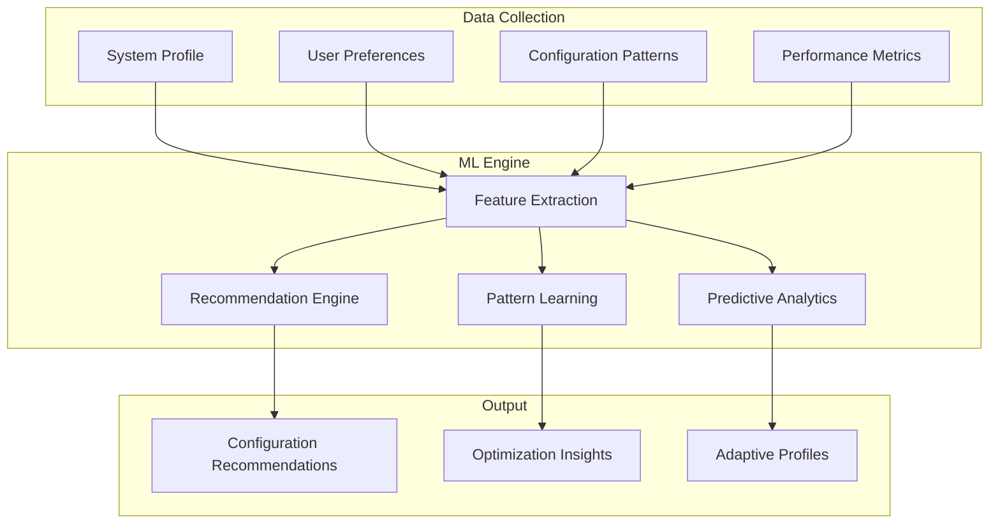

# Machine Learning in DotWin

DotWin incorporates machine learning capabilities to provide intelligent configuration recommendations and adaptive system management. This document explains the ML architecture, recommendation engine, and how to leverage AI-driven insights for optimal system configuration.

## Overview

The DotWin ML system consists of several components:

- **Recommendation Engine**: Analyzes system profiles to suggest optimal configurations
- **Pattern Recognition**: Identifies common configuration patterns and user preferences
- **Adaptive Learning**: Learns from user choices and system performance
- **Predictive Analytics**: Anticipates configuration needs based on usage patterns

## Architecture

### ML Components



### Class Hierarchy

The ML system is built on several key classes defined in [`Classes.ps1`](../Classes.ps1):

```powershell
# Core ML Classes
class DotWinRecommendationEngine {
    [DotWinSystemProfile] $SystemProfile
    [DotWinMLModel] $Model
    [DotWinRecommendationContext] $Context
    
    [DotWinRecommendation[]] GenerateRecommendations()
    [void] TrainModel([DotWinTrainingData] $data)
    [void] UpdateModel([DotWinFeedback] $feedback)
}

class DotWinMLModel {
    [string] $ModelType
    [hashtable] $Parameters
    [datetime] $LastTrained
    
    [object] Predict([object] $input)
    [void] Train([object[]] $trainingData)
    [void] Save([string] $path)
    [void] Load([string] $path)
}

class DotWinRecommendation {
    [string] $Category
    [string] $Type
    [object] $Configuration
    [double] $Confidence
    [string] $Reasoning
    
    [bool] IsApplicable([DotWinSystemProfile] $profile)
    [void] Apply()
    [DotWinRecommendationResult] Test()
}
```

## Recommendation Engine

### Core Functionality

The recommendation engine analyzes your system profile and generates personalized configuration suggestions:

```powershell
# Get system recommendations
$profile = Get-DotWinSystemProfile
$recommendations = Get-DotWinRecommendations -SystemProfile $profile

# View recommendations by category
$recommendations | Group-Object Category | ForEach-Object {
    Write-Host "=== $($_.Name) ===" -ForegroundColor Cyan
    $_.Group | ForEach-Object {
        Write-Host "  $($_.Type): $($_.Configuration.Name)" -ForegroundColor Green
        Write-Host "    Confidence: $($_.Confidence * 100)%" -ForegroundColor Yellow
        Write-Host "    Reason: $($_.Reasoning)" -ForegroundColor Gray
    }
}
```

### Recommendation Categories

#### 1. Package Recommendations

Based on system profile and user type:

```powershell
# Developer workstation recommendations
$devRecommendations = Get-DotWinRecommendations -Category "Packages" -UserType "Developer"

# Example output:
# - Git (Confidence: 95%) - Essential for version control
# - Visual Studio Code (Confidence: 90%) - Popular code editor for developers
# - Docker Desktop (Confidence: 85%) - Containerization platform
# - Node.js (Confidence: 80%) - JavaScript runtime for web development
```

#### 2. Terminal Configuration

Optimized terminal settings based on usage patterns:

```powershell
# Terminal theme recommendations
$terminalRecommendations = Get-DotWinRecommendations -Category "Terminal"

# Example recommendations:
# - Solarized Dark theme for developers (reduces eye strain)
# - Cascadia Code font for programming (excellent readability)
# - Custom key bindings for power users
# - Profile configurations for different workflows
```

#### 3. System Optimization

Performance and security recommendations:

```powershell
# System optimization recommendations
$systemRecommendations = Get-DotWinRecommendations -Category "System"

# Example recommendations:
# - Enable Windows Defender real-time protection
# - Configure automatic updates
# - Optimize power settings for performance/battery
# - Configure Windows features based on usage
```

### Recommendation Algorithm

The recommendation engine uses multiple algorithms:

#### 1. Rule-Based Recommendations

```powershell
class DotWinRuleBasedRecommendations {
    [DotWinRecommendation[]] GenerateRecommendations([DotWinSystemProfile] $profile) {
        $recommendations = @()

        # Developer-specific recommendations
        if ($profile.Software.GetUserType() -eq "Developer") {
            $recommendations += $this.GetDeveloperRecommendations($profile)
        }

        # Hardware-based recommendations
        if ($profile.Hardware.TotalMemoryGB -lt 8) {
            $recommendations += $this.GetLowMemoryRecommendations($profile)
        }

        # Gaming-specific recommendations
        if ($profile.Hardware.HasDedicatedGPU()) {
            $recommendations += $this.GetGamingRecommendations($profile)
        }

        return $recommendations
    }
}
```

#### 2. Collaborative Filtering

```powershell
class DotWinCollaborativeFiltering {
    [DotWinRecommendation[]] GenerateRecommendations([DotWinSystemProfile] $profile) {
        # Find similar users
        $similarUsers = $this.FindSimilarUsers($profile)

        # Get their configurations
        $configurations = $similarUsers | ForEach-Object {
            Get-DotWinUserConfiguration -UserId $_.Id
        }

        # Recommend popular configurations among similar users
        return $this.RankConfigurationsByPopularity($configurations, $profile)
    }
}
```

#### 3. Content-Based Filtering

```powershell
class DotWinContentBasedFiltering {
    [DotWinRecommendation[]] GenerateRecommendations([DotWinSystemProfile] $profile) {
        # Analyze current configuration
        $currentConfig = Get-DotWinCurrentConfiguration

        # Find similar configurations
        $similarConfigs = $this.FindSimilarConfigurations($currentConfig)

        # Recommend complementary items
        return $this.GetComplementaryRecommendations($similarConfigs, $profile)
    }
}
```

## Feature Extraction

### System Features

The ML system extracts relevant features from system profiles:

```powershell
class DotWinFeatureExtractor {
    [hashtable] ExtractFeatures([DotWinSystemProfile] $profile) {
        return @{
            # Hardware features
            'cpu_cores' = $profile.Hardware.ProcessorCores
            'memory_gb' = $profile.Hardware.TotalMemoryGB
            'storage_type' = $profile.Hardware.PrimaryStorageType
            'gpu_type' = $profile.Hardware.GraphicsCardType

            # Software features
            'os_version' = $profile.Software.OperatingSystemVersion
            'installed_packages' = $profile.Software.InstalledPackages.Count
            'user_type' = $profile.Software.GetUserType()

            # Usage features
            'primary_activities' = $profile.User.PrimaryActivities
            'experience_level' = $profile.User.ExperienceLevel
            'preferences' = $profile.User.Preferences
        }
    }
}
```

### Configuration Features

Extract features from existing configurations:

```powershell
class DotWinConfigurationFeatureExtractor {
    [hashtable] ExtractConfigurationFeatures([object] $configuration) {
        return @{
            'package_categories' = $this.GetPackageCategories($configuration)
            'terminal_themes' = $this.GetTerminalThemes($configuration)
            'customization_level' = $this.GetCustomizationLevel($configuration)
            'performance_focus' = $this.GetPerformanceFocus($configuration)
            'security_level' = $this.GetSecurityLevel($configuration)
        }
    }
}
```

## Model Training

### Training Data Collection

```powershell
# Collect training data from user interactions
class DotWinTrainingDataCollector {
    [void] CollectUserFeedback([DotWinRecommendation] $recommendation, [bool] $accepted) {
        $feedback = [DotWinFeedback]::new()
        $feedback.RecommendationId = $recommendation.Id
        $feedback.Accepted = $accepted
        $feedback.Timestamp = Get-Date
        $feedback.UserProfile = Get-DotWinSystemProfile

        $this.SaveFeedback($feedback)
    }
    
    [void] CollectConfigurationSuccess([object] $configuration, [bool] $successful) {
        $data = [DotWinConfigurationResult]::new()
        $data.Configuration = $configuration
        $data.Successful = $successful
        $data.SystemProfile = Get-DotWinSystemProfile

        $this.SaveConfigurationResult($data)
    }
}
```

### Model Training Process

```powershell
# Train recommendation models
function Train-DotWinRecommendationModel {
    param(
        [string] $ModelType = "RandomForest",
        [string] $TrainingDataPath = "training-data.json"
    )
    
    # Load training data
    $trainingData = Get-Content $TrainingDataPath | ConvertFrom-Json
    
    # Create and train model
    $model = [DotWinMLModel]::new($ModelType)
    $model.Train($trainingData)

    # Evaluate model performance
    $evaluation = Test-DotWinModel -Model $model -TestData $trainingData
    Write-Host "Model Accuracy: $($evaluation.Accuracy * 100)%"

    # Save trained model
    $model.Save("models/recommendation-model.json")

    return $model
}
```

### Model Evaluation

```powershell
function Test-DotWinModel {
    param(
        [DotWinMLModel] $Model,
        [object[]] $TestData
    )
    
    $correct = 0
    $total = $TestData.Count
    
    foreach ($testCase in $TestData) {
        $prediction = $Model.Predict($testCase.Features)
        if ($prediction -eq $testCase.ExpectedResult) {
            $correct++
        }
    }
    
    return @{
        Accuracy = $correct / $total
        CorrectPredictions = $correct
        TotalPredictions = $total
    }
}
```

## Adaptive Learning

### Continuous Learning

The system continuously learns from user interactions:

```powershell
class DotWinAdaptiveLearning {
    [void] UpdateModelFromFeedback([DotWinFeedback[]] $feedback) {
        # Convert feedback to training examples
        $trainingExamples = $feedback | ForEach-Object {
            @{
                Features = $this.ExtractFeatures($_.UserProfile)
                Label = $_.Accepted
                Weight = $this.CalculateWeight($_)
            }
        }

        # Update model with new examples
        $this.Model.UpdateWithNewData($trainingExamples)
    }

    [double] CalculateWeight([DotWinFeedback] $feedback) {
        # Recent feedback has higher weight
        $daysSinceFeedback = (Get-Date) - $feedback.Timestamp
        return [Math]::Exp(-$daysSinceFeedback.TotalDays / 30)
    }
}
```

### Personalization

```powershell
class DotWinPersonalization {
    [DotWinRecommendation[]] PersonalizeRecommendations(
        [DotWinRecommendation[]] $recommendations,
        [DotWinUserProfile] $userProfile
    ) {
        foreach ($recommendation in $recommendations) {
            # Adjust confidence based on user preferences
            $recommendation.Confidence *= $this.GetUserPreferenceScore($recommendation, $userProfile)

            # Customize reasoning for user
            $recommendation.Reasoning = $this.PersonalizeReasoning($recommendation, $userProfile)
        }

        # Sort by personalized confidence
        return $recommendations | Sort-Object Confidence -Descending
    }
}
```

## Usage Examples

### Basic Recommendations

```powershell
# Get all recommendations
$recommendations = Get-DotWinRecommendations

# Apply high-confidence recommendations automatically
$recommendations | Where-Object { $_.Confidence -gt 0.8 } | ForEach-Object {
    Write-Host "Applying: $($_.Type)" -ForegroundColor Green
    $_.Apply()
}

# Review medium-confidence recommendations
$recommendations | Where-Object { $_.Confidence -gt 0.5 -and $_.Confidence -le 0.8 } | ForEach-Object {
    $response = Read-Host "Apply $($_.Type)? (y/n)"
    if ($response -eq 'y') {
        $_.Apply()
    }
}
```

### Category-Specific Recommendations

```powershell
# Get package recommendations for developers
$devPackages = Get-DotWinRecommendations -Category "Packages" -UserType "Developer"
$devPackages | ForEach-Object {
    Write-Host "$($_.Configuration.Name): $($_.Reasoning)"
}

# Get terminal optimization recommendations
$terminalOptimizations = Get-DotWinRecommendations -Category "Terminal" -Focus "Performance"
$terminalOptimizations | ForEach-Object {
    $_.Apply()
}
```

### Custom Recommendation Filters

```powershell
# Get recommendations for specific scenarios
$gamingRecommendations = Get-DotWinRecommendations | Where-Object {
    $_.Category -eq "Gaming" -or
    ($_.Category -eq "System" -and $_.Type -like "*Performance*")
}

$securityRecommendations = Get-DotWinRecommendations | Where-Object {
    $_.Category -eq "Security" -or
    $_.Type -like "*Security*"
}
```

### Feedback and Learning

```powershell
# Provide feedback on recommendations
$recommendation = Get-DotWinRecommendations | Select-Object -First 1
Submit-DotWinFeedback -Recommendation $recommendation -Accepted $true -Comments "Very helpful"

# Train model with new data
$newTrainingData = Get-DotWinFeedbackData -Since (Get-Date).AddDays(-30)
Update-DotWinRecommendationModel -TrainingData $newTrainingData
```

## Advanced Features

### Ensemble Methods

```powershell
class DotWinEnsembleRecommendations {
    [DotWinRecommendation[]] GenerateRecommendations([DotWinSystemProfile] $profile) {
        # Get recommendations from multiple algorithms
        $ruleBasedRecs = $this.RuleBasedEngine.GenerateRecommendations($profile)
        $collaborativeRecs = $this.CollaborativeEngine.GenerateRecommendations($profile)
        $contentBasedRecs = $this.ContentBasedEngine.GenerateRecommendations($profile)

        # Combine and weight recommendations
        return $this.CombineRecommendations($ruleBasedRecs, $collaborativeRecs, $contentBasedRecs)
    }
}
```

### A/B Testing

```powershell
class DotWinABTesting {
    [DotWinRecommendation[]] GetRecommendationsWithTesting([DotWinSystemProfile] $profile) {
        # Determine test group
        $testGroup = $this.GetTestGroup($profile.User.Id)

        switch ($testGroup) {
            "A" { return $this.AlgorithmA.GenerateRecommendations($profile) }
            "B" { return $this.AlgorithmB.GenerateRecommendations($profile) }
            default { return $this.DefaultAlgorithm.GenerateRecommendations($profile) }
        }
    }
}
```

### Explainable AI

```powershell
class DotWinExplainableRecommendations {
    [string] ExplainRecommendation([DotWinRecommendation] $recommendation, [DotWinSystemProfile] $profile) {
        $explanation = @()

        # Feature importance
        $features = $this.GetImportantFeatures($recommendation, $profile)
        $explanation += "Key factors:"
        $features | ForEach-Object {
            $explanation += "  - $($_.Name): $($_.Value) (importance: $($_.Importance))"
        }

        # Similar users
        $similarUsers = $this.FindSimilarUsers($profile)
        $explanation += "Users with similar profiles also chose:"
        $similarUsers.PopularChoices | ForEach-Object {
            $explanation += "  - $($_)"
        }

        return $explanation -join "`n"
    }
}
```

## Configuration

### ML Settings

Configure ML behavior through DotWin settings:

```powershell
# Configure recommendation engine
Set-DotWinConfiguration -Section "MachineLearning" -Settings @{
    EnableRecommendations = $true
    RecommendationAlgorithm = "Ensemble"
    MinimumConfidence = 0.6
    MaxRecommendations = 10
    EnableLearning = $true
    FeedbackWeight = 0.8
}

# Configure model training
Set-DotWinConfiguration -Section "ModelTraining" -Settings @{
    AutoTraining = $true
    TrainingInterval = "Weekly"
    MinimumFeedbackSamples = 100
    ModelValidationSplit = 0.2
}
```

### Privacy Settings

```powershell
# Configure data collection and privacy
Set-DotWinConfiguration -Section "Privacy" -Settings @{
    CollectUsageData = $true
    CollectSystemProfile = $true
    ShareAnonymousData = $false
    DataRetentionDays = 365
}
```

## Performance Monitoring

### Model Performance Metrics

```powershell
# Monitor recommendation performance
$metrics = Get-DotWinMLMetrics
Write-Host "Recommendation Accuracy: $($metrics.Accuracy * 100)%"
Write-Host "User Satisfaction: $($metrics.UserSatisfaction * 100)%"
Write-Host "Adoption Rate: $($metrics.AdoptionRate * 100)%"

# Model drift detection
$drift = Test-DotWinModelDrift
if ($drift.HasDrift) {
    Write-Warning "Model drift detected. Consider retraining."
    Start-DotWinModelRetraining
}
```

### Performance Optimization

```powershell
# Optimize recommendation performance
Optimize-DotWinRecommendationEngine -MaxLatency 500ms -CacheSize 1000

# Profile recommendation generation
Measure-Command {
    Get-DotWinRecommendations -SystemProfile $profile
} | Select-Object TotalMilliseconds
```

## Future Enhancements

### Planned ML Features

1. **Deep Learning Models**: Neural networks for complex pattern recognition
2. **Natural Language Processing**: Understanding user intent from text descriptions
3. **Computer Vision**: Analyzing screenshots for UI/UX recommendations
4. **Reinforcement Learning**: Learning optimal configuration sequences
5. **Federated Learning**: Learning from multiple users while preserving privacy

### Integration Opportunities

1. **Cloud ML Services**: Integration with Azure ML, AWS SageMaker
2. **External Data Sources**: Package popularity, security advisories
3. **Community Feedback**: Crowdsourced recommendations and ratings
4. **Telemetry Integration**: Performance metrics from configured systems

---

The DotWin ML system provides intelligent, personalized configuration recommendations that improve over time. By leveraging machine learning, DotWin can help users discover optimal configurations and automate routine system management tasks.
