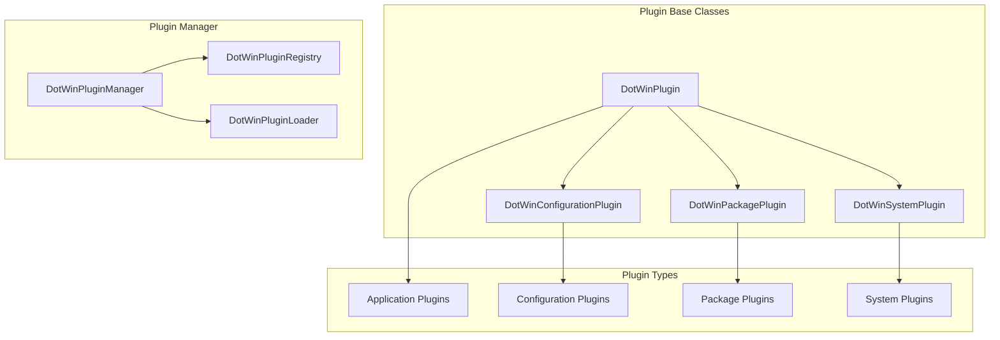

# DotWin Plugin Development Guide

This guide explains how to develop plugins for DotWin to extend its functionality with custom configuration management capabilities.

## Overview

DotWin's plugin architecture allows developers to create modular extensions that integrate seamlessly with the core configuration management system. Plugins can add support for new applications, configuration formats, system integrations, and custom workflows.

## Plugin Architecture

### Core Plugin System

The plugin system is built on several key classes defined in [`Classes.ps1`](../Classes.ps1):



### Plugin Base Classes

#### DotWinPlugin Base Class

```powershell
class DotWinPlugin {
    [string] $Name
    [string] $Version
    [string] $Author
    [string] $Description
    [string[]] $Dependencies
    [hashtable] $Metadata

    # Core plugin lifecycle methods
    [void] Initialize() { }
    [void] Load() { }
    [void] Unload() { }
    [bool] IsCompatible([DotWinSystemProfile] $profile) { return $true }

    # Configuration methods
    [object] GetDefaultConfiguration() { return @{} }
    [bool] ValidateConfiguration([object] $config) { return $true }

    # Plugin information
    [string] GetPluginInfo() {
        return "$($this.Name) v$($this.Version) by $($this.Author)"
    }
}
```

#### DotWinConfigurationPlugin

For plugins that manage application configurations:

```powershell
class DotWinConfigurationPlugin : DotWinPlugin {
    [string] $ApplicationName
    [string[]] $SupportedFormats
    [string] $ConfigurationPath

    # Configuration management methods
    [object] GetCurrentConfiguration() { throw "Not implemented" }
    [void] ApplyConfiguration([object] $config) { throw "Not implemented" }
    [bool] TestConfiguration([object] $config) { throw "Not implemented" }
    [object] BackupConfiguration() { throw "Not implemented" }
    [void] RestoreConfiguration([object] $backup) { throw "Not implemented" }

    # Configuration validation
    [bool] ValidateConfigurationFormat([object] $config) { throw "Not implemented" }
    [string[]] GetConfigurationErrors([object] $config) { return @() }
}
```

#### DotWinPackagePlugin

For plugins that manage package installations:

```powershell
class DotWinPackagePlugin : DotWinPlugin {
    [string] $PackageManager
    [string[]] $SupportedPackageTypes

    # Package management methods
    [bool] IsPackageInstalled([string] $packageId) { throw "Not implemented" }
    [void] InstallPackage([string] $packageId, [hashtable] $options) { throw "Not implemented" }
    [void] UninstallPackage([string] $packageId) { throw "Not implemented" }
    [void] UpdatePackage([string] $packageId) { throw "Not implemented" }
    [object[]] GetInstalledPackages() { throw "Not implemented" }
    [object[]] SearchPackages([string] $query) { throw "Not implemented" }
}
```

#### DotWinSystemPlugin

For plugins that manage system-level configurations:

```powershell
class DotWinSystemPlugin : DotWinPlugin {
    [string[]] $RequiredPermissions
    [string[]] $SupportedOperatingSystems
    
    # System management methods
    [object] GetSystemState() { throw "Not implemented" }
    [void] ApplySystemConfiguration([object] $config) { throw "Not implemented" }
    [bool] TestSystemConfiguration([object] $config) { throw "Not implemented" }
    [void] RevertSystemChanges() { throw "Not implemented" }
    
    # Permission and compatibility checks
    [bool] HasRequiredPermissions() { throw "Not implemented" }
    [bool] IsOperatingSystemSupported() { throw "Not implemented" }
}
```

## Creating Your First Plugin

### 1. Plugin Structure

Create a new plugin following this structure:

```text
MyPlugin/
├── MyPlugin.psd1          # Plugin manifest
├── MyPlugin.psm1          # Main plugin module
├── Classes/
│   └── MyPluginClasses.ps1 # Plugin-specific classes
├── Functions/
│   ├── Public/            # Public functions
│   └── Private/           # Private helper functions
├── Config/
│   └── DefaultConfig.ps1  # Default configurations
├── Tests/
│   └── MyPlugin.Tests.ps1 # Pester tests
└── README.md              # Plugin documentation
```

### 2. Plugin Manifest (MyPlugin.psd1)

```powershell
@{
    # Plugin metadata
    PluginName = 'MyPlugin'
    PluginVersion = '1.0.0'
    Author = 'Your Name'
    Description = 'Description of your plugin functionality'
    
    # DotWin compatibility
    MinimumDotWinVersion = '1.0.0'
    CompatiblePSVersions = @('5.1', '7.0', '7.1', '7.2', '7.3', '7.4')
    
    # Plugin dependencies
    RequiredModules = @()
    RequiredPlugins = @()

    # Plugin type and capabilities
    PluginType = 'Configuration'  # Configuration, Package, System, Application
    SupportedPlatforms = @('Windows')

    # Files to load
    RootModule = 'MyPlugin.psm1'
    NestedModules = @('Classes\MyPluginClasses.ps1')

    # Functions to export
    FunctionsToExport = @('*')

    # Plugin-specific metadata
    PrivateData = @{
        DotWinPlugin = @{
            Category = 'Development'
            Tags = @('configuration', 'development', 'tools')
            ProjectUri = 'https://github.com/yourusername/myplugin'
            LicenseUri = 'https://github.com/yourusername/myplugin/blob/main/LICENSE'
        }
    }
}
```

### 3. Main Plugin Module (MyPlugin.psm1)

```powershell
# Import plugin classes
. "$PSScriptRoot\Classes\MyPluginClasses.ps1"

# Import functions
Get-ChildItem -Path "$PSScriptRoot\Functions\Public\*.ps1" | ForEach-Object {
    . $_.FullName
}

Get-ChildItem -Path "$PSScriptRoot\Functions\Private\*.ps1" | ForEach-Object {
    . $_.FullName
}

# Plugin initialization
$script:PluginInstance = $null

function Initialize-MyPlugin {
    [CmdletBinding()]
    param()

    if (-not $script:PluginInstance) {
        $script:PluginInstance = [MyPlugin]::new()
        $script:PluginInstance.Initialize()
        
        Write-Verbose "MyPlugin initialized successfully"
    }

    return $script:PluginInstance
}

function Get-MyPlugin {
    [CmdletBinding()]
    param()

    if (-not $script:PluginInstance) {
        Initialize-MyPlugin
    }

    return $script:PluginInstance
}

# Export functions
Export-ModuleMember -Function @(
    'Initialize-MyPlugin',
    'Get-MyPlugin'
)
```

### 4. Plugin Class Implementation

```powershell
# Classes\MyPluginClasses.ps1

class MyPlugin : DotWinConfigurationPlugin {
    MyPlugin() {
        $this.Name = "MyPlugin"
        $this.Version = "1.0.0"
        $this.Author = "Your Name"
        $this.Description = "Custom configuration plugin"
        $this.ApplicationName = "MyApplication"
        $this.SupportedFormats = @("json", "yaml", "xml")
        $this.ConfigurationPath = "$env:APPDATA\MyApplication\config.json"
    }

    [void] Initialize() {
        Write-Verbose "Initializing MyPlugin"

        # Perform plugin initialization
        $this.ValidateEnvironment()
        $this.LoadConfiguration()
    }

    [bool] IsCompatible([DotWinSystemProfile] $profile) {
        # Check if the plugin is compatible with the current system
        return $profile.Software.OperatingSystem -eq "Windows" -and
               $profile.Software.PowerShellVersion -ge [version]"5.1"
    }

    [object] GetCurrentConfiguration() {
        if (Test-Path $this.ConfigurationPath) {
            return Get-Content $this.ConfigurationPath | ConvertFrom-Json
        }
        return $this.GetDefaultConfiguration()
    }

    [void] ApplyConfiguration([object] $config) {
        # Validate configuration before applying
        if (-not $this.ValidateConfiguration($config)) {
            throw "Invalid configuration provided"
        }

        # Backup current configuration
        $backup = $this.BackupConfiguration()

        try {
            # Apply the new configuration
            $configJson = $config | ConvertTo-Json -Depth 10
            $configJson | Set-Content -Path $this.ConfigurationPath -Encoding UTF8

            # Restart application if needed
            $this.RestartApplicationIfNeeded()

            Write-Verbose "Configuration applied successfully"
        }
        catch {
            # Restore backup on failure
            $this.RestoreConfiguration($backup)
            throw "Failed to apply configuration: $($_.Exception.Message)"
        }
    }

    [bool] TestConfiguration([object] $config) {
        try {
            # Test if configuration is valid and can be applied
            $this.ValidateConfiguration($config)

            # Additional tests specific to your application
            return $this.TestApplicationSpecificConfiguration($config)
        }
        catch {
            Write-Warning "Configuration test failed: $($_.Exception.Message)"
            return $false
        }
    }

    [object] BackupConfiguration() {
        if (Test-Path $this.ConfigurationPath) {
            $backupPath = "$($this.ConfigurationPath).backup.$(Get-Date -Format 'yyyyMMddHHmmss')"
            Copy-Item $this.ConfigurationPath $backupPath
            return @{ BackupPath = $backupPath }
        }
        return $null
    }

    [void] RestoreConfiguration([object] $backup) {
        if ($backup -and $backup.BackupPath -and (Test-Path $backup.BackupPath)) {
            Copy-Item $backup.BackupPath $this.ConfigurationPath -Force
            Write-Verbose "Configuration restored from backup"
        }
    }

    [object] GetDefaultConfiguration() {
        return @{
            version = "1.0"
            settings = @{
                theme = "default"
                language = "en-US"
                autoSave = $true
            }
            features = @{
                enableLogging = $true
                enableTelemetry = $false
            }
        }
    }

    [bool] ValidateConfiguration([object] $config) {
        # Implement configuration validation logic
        if (-not $config) { return $false }
        if (-not $config.version) { return $false }
        if (-not $config.settings) { return $false }

        return $true
    }

    # Private helper methods
    hidden [void] ValidateEnvironment() {
        # Check if the target application is installed
        if (-not $this.IsApplicationInstalled()) {
            throw "Target application is not installed"
        }
    }

    hidden [bool] IsApplicationInstalled() {
        # Implement application detection logic
        return Test-Path "C:\Program Files\MyApplication\MyApplication.exe"
    }

    hidden [void] LoadConfiguration() {
        # Load any plugin-specific configuration
        $pluginConfig = Get-Content "$PSScriptRoot\..\Config\DefaultConfig.ps1" | Invoke-Expression
        $this.Metadata = $pluginConfig
    }

    hidden [bool] TestApplicationSpecificConfiguration([object] $config) {
        # Implement application-specific configuration tests
        return $true
    }

    hidden [void] RestartApplicationIfNeeded() {
        # Restart the application if configuration changes require it
        $processes = Get-Process -Name "MyApplication" -ErrorAction SilentlyContinue
        if ($processes) {
            Write-Verbose "Restarting MyApplication to apply configuration changes"
            $processes | Stop-Process -Force
            Start-Sleep -Seconds 2
            Start-Process "C:\Program Files\MyApplication\MyApplication.exe"
        }
    }
}
```

## Plugin Types and Examples

### Configuration Plugin Example

A plugin for managing Visual Studio Code settings:

```powershell
class VSCodePlugin : DotWinConfigurationPlugin {
    VSCodePlugin() {
        $this.Name = "VSCode"
        $this.ApplicationName = "Visual Studio Code"
        $this.SupportedFormats = @("json")
        $this.ConfigurationPath = "$env:APPDATA\Code\User\settings.json"
    }

    [object] GetCurrentConfiguration() {
        if (Test-Path $this.ConfigurationPath) {
            return Get-Content $this.ConfigurationPath | ConvertFrom-Json
        }
        return @{}
    }

    [void] ApplyConfiguration([object] $config) {
        # Merge with existing settings
        $currentConfig = $this.GetCurrentConfiguration()
        $mergedConfig = $this.MergeConfigurations($currentConfig, $config)

        # Apply merged configuration
        $mergedConfig | ConvertTo-Json -Depth 10 | Set-Content $this.ConfigurationPath
    }

    hidden [object] MergeConfigurations([object] $current, [object] $new) {
        # Implement configuration merging logic
        $merged = $current.PSObject.Copy()
        foreach ($property in $new.PSObject.Properties) {
            $merged | Add-Member -NotePropertyName $property.Name -NotePropertyValue $property.Value -Force
        }
        return $merged
    }
}
```

### Package Plugin Example

A plugin for managing Chocolatey packages:

```powershell
class ChocolateyPlugin : DotWinPackagePlugin {
    ChocolateyPlugin() {
        $this.Name = "Chocolatey"
        $this.PackageManager = "chocolatey"
        $this.SupportedPackageTypes = @("chocolatey", "choco")
    }

    [bool] IsPackageInstalled([string] $packageId) {
        $result = & choco list --local-only $packageId --exact
        return $result -match $packageId
    }

    [void] InstallPackage([string] $packageId, [hashtable] $options) {
        $args = @("install", $packageId, "-y")

        if ($options.Version) {
            $args += "--version", $options.Version
        }

        if ($options.Source) {
            $args += "--source", $options.Source
        }

        & choco @args

        if ($LASTEXITCODE -ne 0) {
            throw "Failed to install package: $packageId"
        }
    }

    [void] UninstallPackage([string] $packageId) {
        & choco uninstall $packageId -y

        if ($LASTEXITCODE -ne 0) {
            throw "Failed to uninstall package: $packageId"
        }
    }

    [object[]] GetInstalledPackages() {
        $output = & choco list --local-only
        return $output | Where-Object { $_ -match "^\S+" } | ForEach-Object {
            $parts = $_ -split " "
            @{
                Name = $parts[0]
                Version = $parts[1]
                Source = "chocolatey"
            }
        }
    }
}
```

### System Plugin Example

A plugin for managing Windows features:

```powershell
class WindowsFeaturesPlugin : DotWinSystemPlugin {
    WindowsFeaturesPlugin() {
        $this.Name = "WindowsFeatures"
        $this.RequiredPermissions = @("Administrator")
        $this.SupportedOperatingSystems = @("Windows")
    }
    
    [object] GetSystemState() {
        $features = Get-WindowsOptionalFeature -Online
        return @{
            EnabledFeatures = $features | Where-Object State -eq "Enabled" | Select-Object -ExpandProperty FeatureName
            DisabledFeatures = $features | Where-Object State -eq "Disabled" | Select-Object -ExpandProperty FeatureName
        }
    }

    [void] ApplySystemConfiguration([object] $config) {
        if ($config.EnableFeatures) {
            foreach ($feature in $config.EnableFeatures) {
                Enable-WindowsOptionalFeature -Online -FeatureName $feature -All -NoRestart
            }
        }
        
        if ($config.DisableFeatures) {
            foreach ($feature in $config.DisableFeatures) {
                Disable-WindowsOptionalFeature -Online -FeatureName $feature -NoRestart
            }
        }
    }

    [bool] TestSystemConfiguration([object] $config) {
        $currentState = $this.GetSystemState()
        
        # Test enabled features
        if ($config.EnableFeatures) {
            foreach ($feature in $config.EnableFeatures) {
                if ($feature -notin $currentState.EnabledFeatures) {
                    return $false
                }
            }
        }

        # Test disabled features
        if ($config.DisableFeatures) {
            foreach ($feature in $config.DisableFeatures) {
                if ($feature -notin $currentState.DisabledFeatures) {
                    return $false
                }
            }
        }

        return $true
    }

    [bool] HasRequiredPermissions() {
        return ([Security.Principal.WindowsPrincipal] [Security.Principal.WindowsIdentity]::GetCurrent()).IsInRole([Security.Principal.WindowsBuiltInRole] "Administrator")
    }
}
```

## Plugin Registration and Management

### Plugin Manager

The DotWin plugin manager handles plugin lifecycle:

```powershell
class DotWinPluginManager {
    [hashtable] $LoadedPlugins = @{}
    [DotWinPluginRegistry] $Registry

    DotWinPluginManager() {
        $this.Registry = [DotWinPluginRegistry]::new()
    }

    [void] LoadPlugin([string] $pluginPath) {
        try {
            # Load plugin manifest
            $manifest = Import-PowerShellDataFile "$pluginPath\*.psd1"

            # Validate plugin compatibility
            $this.ValidatePluginCompatibility($manifest)

            # Import plugin module
            Import-Module $pluginPath -Force

            # Initialize plugin
            $pluginInstance = $this.CreatePluginInstance($manifest)
            $pluginInstance.Initialize()

            # Register plugin
            $this.LoadedPlugins[$manifest.PluginName] = $pluginInstance
            $this.Registry.RegisterPlugin($pluginInstance)

            Write-Verbose "Plugin loaded: $($manifest.PluginName)"
        }
        catch {
            Write-Error "Failed to load plugin from $pluginPath`: $($_.Exception.Message)"
        }
    }

    [void] UnloadPlugin([string] $pluginName) {
        if ($this.LoadedPlugins.ContainsKey($pluginName)) {
            $plugin = $this.LoadedPlugins[$pluginName]
            $plugin.Unload()
            $this.LoadedPlugins.Remove($pluginName)
            $this.Registry.UnregisterPlugin($pluginName)

            Write-Verbose "Plugin unloaded: $pluginName"
        }
    }

    [DotWinPlugin[]] GetLoadedPlugins() {
        return $this.LoadedPlugins.Values
    }

    [DotWinPlugin] GetPlugin([string] $pluginName) {
        return $this.LoadedPlugins[$pluginName]
    }
}
```

### Plugin Registry

```powershell
class DotWinPluginRegistry {
    [hashtable] $RegisteredPlugins = @{}
    [hashtable] $PluginsByType = @{}
    [hashtable] $PluginsByCategory = @{}

    [void] RegisterPlugin([DotWinPlugin] $plugin) {
        $this.RegisteredPlugins[$plugin.Name] = $plugin

        # Index by type
        $type = $plugin.GetType().Name
        if (-not $this.PluginsByType.ContainsKey($type)) {
            $this.PluginsByType[$type] = @()
        }
        $this.PluginsByType[$type] += $plugin

        # Index by category
        if ($plugin.Metadata.Category) {
            $category = $plugin.Metadata.Category
            if (-not $this.PluginsByCategory.ContainsKey($category)) {
                $this.PluginsByCategory[$category] = @()
            }
            $this.PluginsByCategory[$category] += $plugin
        }
    }

    [DotWinPlugin[]] GetPluginsByType([string] $type) {
        return $this.PluginsByType[$type]
    }

    [DotWinPlugin[]] GetPluginsByCategory([string] $category) {
        return $this.PluginsByCategory[$category]
    }
}
```

## Plugin Integration with DotWin

### Configuration Integration

Plugins integrate with DotWin's configuration system:

```powershell
# In DotWin core functions
function Invoke-DotWinConfiguration {
    param(
        [object] $Configuration
    )

    # Get plugin manager
    $pluginManager = Get-DotWinPluginManager

    # Process configuration sections
    foreach ($section in $Configuration.PSObject.Properties) {
        $sectionName = $section.Name
        $sectionConfig = $section.Value

        # Find plugins that can handle this section
        $applicablePlugins = $pluginManager.GetLoadedPlugins() | Where-Object {
            $_.CanHandleConfiguration($sectionName, $sectionConfig)
        }

        foreach ($plugin in $applicablePlugins) {
            Write-Verbose "Applying configuration section '$sectionName' using plugin '$($plugin.Name)'"
            $plugin.ApplyConfiguration($sectionConfig)
        }
    }
}
```

### Rich Configuration Integration

Plugins can contribute to rich configuration files:

```powershell
# In config/Packages.ps1
function Get-PluginPackages {
    param(
        [string] $Category
    )

    $pluginManager = Get-DotWinPluginManager
    $packagePlugins = $pluginManager.GetPluginsByType("DotWinPackagePlugin")

    $packages = @()
    foreach ($plugin in $packagePlugins) {
        if ($plugin.SupportsCategory($Category)) {
            $packages += $plugin.GetPackagesForCategory($Category)
        }
    }

    return $packages
}
```

## Testing Plugins

### Unit Tests

Create Pester tests for your plugin:

```powershell
# Tests\MyPlugin.Tests.ps1

Describe "MyPlugin" {
    BeforeAll {
        Import-Module "$PSScriptRoot\..\MyPlugin.psm1" -Force
        $plugin = Initialize-MyPlugin
    }

    Context "Plugin Initialization" {
        It "Should initialize successfully" {
            $plugin | Should -Not -BeNullOrEmpty
            $plugin.Name | Should -Be "MyPlugin"
        }

        It "Should be compatible with current system" {
            $profile = Get-DotWinSystemProfile
            $plugin.IsCompatible($profile) | Should -Be $true
        }
    }

    Context "Configuration Management" {
        It "Should return default configuration" {
            $config = $plugin.GetDefaultConfiguration()
            $config | Should -Not -BeNullOrEmpty
            $config.version | Should -Not -BeNullOrEmpty
        }

        It "Should validate valid configuration" {
            $config = $plugin.GetDefaultConfiguration()
            $plugin.ValidateConfiguration($config) | Should -Be $true
        }

        It "Should reject invalid configuration" {
            $invalidConfig = @{}
            $plugin.ValidateConfiguration($invalidConfig) | Should -Be $false
        }
    }

    Context "Configuration Application" {
        It "Should apply configuration successfully" {
            $config = $plugin.GetDefaultConfiguration()
            { $plugin.ApplyConfiguration($config) } | Should -Not -Throw
        }

        It "Should test configuration correctly" {
            $config = $plugin.GetDefaultConfiguration()
            $plugin.TestConfiguration($config) | Should -Be $true
        }
    }
}
```

### Integration Tests

Test plugin integration with DotWin:

```powershell
Describe "MyPlugin Integration" {
    BeforeAll {
        Import-Module DotWin -Force
        Import-Module "$PSScriptRoot\..\MyPlugin.psm1" -Force

        # Register plugin with DotWin
        $pluginManager = Get-DotWinPluginManager
        $pluginManager.LoadPlugin("$PSScriptRoot\..")
    }

    It "Should be registered with DotWin" {
        $pluginManager = Get-DotWinPluginManager
        $plugin = $pluginManager.GetPlugin("MyPlugin")
        $plugin | Should -Not -BeNullOrEmpty
    }

    It "Should integrate with configuration system" {
        $config = @{
            MyPlugin = @{
                settings = @{
                    theme = "dark"
                }
            }
        }

        { Invoke-DotWinConfiguration -Configuration $config } | Should -Not -Throw
    }
}
```

## Plugin Distribution

### Plugin Packaging

Package your plugin for distribution:

```powershell
# Build script for plugin packaging
function Build-PluginPackage {
    param(
        [string] $PluginPath,
        [string] $OutputPath
    )

    # Create package directory
    $packageDir = Join-Path $OutputPath "MyPlugin"
    New-Item -ItemType Directory -Path $packageDir -Force

    # Copy plugin files
    Copy-Item -Path "$PluginPath\*" -Destination $packageDir -Recurse -Exclude @("Tests", "*.Tests.ps1", ".git*")

    # Create package archive
    $archivePath = Join-Path $OutputPath "MyPlugin.zip"
    Compress-Archive -Path $packageDir -DestinationPath $archivePath -Force

    Write-Host "Plugin package created: $archivePath"
}
```

### Plugin Installation

Users can install plugins using DotWin commands:

```powershell
# Install plugin from local path
Install-DotWinPlugin -Path "C:\Path\To\MyPlugin"

# Install plugin from archive
Install-DotWinPlugin -Archive "MyPlugin.zip"

# Install plugin from repository
Install-DotWinPlugin -Name "MyPlugin" -Repository "DotWinPlugins"

# List installed plugins
Get-DotWinPlugin

# Uninstall plugin
Uninstall-DotWinPlugin -Name "MyPlugin"
```

## Best Practices

### Plugin Development Guidelines

1. **Follow PowerShell Best Practices**:
   - Use approved verbs for function names
   - Implement proper error handling
   - Support `-WhatIf` and `-Confirm` parameters
   - Use verbose and debug output appropriately

2. **Configuration Management**:
   - Always backup configurations before making changes
   - Implement rollback mechanisms
   - Validate configurations thoroughly
   - Support incremental updates

3. **Error Handling**:
   - Use try-catch blocks for error handling
   - Provide meaningful error messages
   - Log errors appropriately
   - Implement graceful degradation

4. **Performance**:
   - Minimize resource usage
   - Implement caching where appropriate
   - Use parallel processing for bulk operations
   - Optimize file I/O operations

5. **Security**:
   - Validate all inputs
   - Use secure methods for credential handling
   - Implement proper permission checks
   - Follow principle of least privilege

### Plugin Testing

1. **Unit Testing**:
   - Test all public methods
   - Test error conditions
   - Use mocking for external dependencies
   - Achieve high code coverage

2. **Integration Testing**:
   - Test plugin integration with DotWin
   - Test configuration application
   - Test plugin lifecycle events
   - Test plugin interactions

3. **System Testing**:
   - Test on different Windows versions
   - Test with different PowerShell versions
   - Test with various system configurations
   - Test performance under load

### Documentation

1. **Code Documentation**:
   - Use comment-based help for functions
   - Document class methods and properties
   - Include usage examples
   - Document configuration schemas

2. **User Documentation**:
   - Provide clear installation instructions
   - Document configuration options
   - Include troubleshooting guides
   - Provide usage examples

## Advanced Plugin Features

### Plugin Dependencies

Handle plugin dependencies:

```powershell
class DotWinPluginDependencyManager {
    [void] ResolveDependencies([DotWinPlugin] $plugin) {
        foreach ($dependency in $plugin.Dependencies) {
            if (-not $this.IsPluginLoaded($dependency)) {
                $this.LoadPlugin($dependency)
            }
        }
    }

    [bool] IsPluginLoaded([string] $pluginName) {
        $pluginManager = Get-DotWinPluginManager
        return $pluginManager.GetPlugin($pluginName) -ne $null
    }
}
```

### Plugin Events

Implement event-driven plugin architecture:

```powershell
class DotWinPluginEventManager {
    [hashtable] $EventHandlers = @{}

    [void] RegisterEventHandler([string] $eventName, [scriptblock] $handler) {
        if (-not $this.EventHandlers.ContainsKey($eventName)) {
            $this.EventHandlers[$eventName] = @()
        }
        $this.EventHandlers[$eventName] += $handler
    }

    [void] RaiseEvent([string] $eventName, [object] $eventData) {
        if ($this.EventHandlers.ContainsKey($eventName)) {
            foreach ($handler in $this.EventHandlers[$eventName]) {
                & $handler $eventData
            }
        }
    }
}
```

### Plugin Configuration UI

Create configuration interfaces for plugins:

```powershell
class DotWinPluginConfigurationUI {
    [object] ShowConfigurationDialog([DotWinPlugin] $plugin) {
        # Implementation would show a GUI dialog for plugin configuration
        # This could use Windows Forms, WPF, or web-based UI
        return $this.CreateConfigurationForm($plugin)
    }

    [object] CreateConfigurationForm([DotWinPlugin] $plugin) {
        # Create dynamic configuration form based on plugin schema
        $schema = $plugin.GetConfigurationSchema()
        return $this.BuildFormFromSchema($schema)
    }

    hidden [object] BuildFormFromSchema([object] $schema) {
        # Implementation would build UI controls based on configuration schema
        # This is a placeholder for actual UI implementation
        return @{
            FormType = "Dynamic"
            Schema = $schema
            Controls = @()
        }
    }
}
```

## Plugin Marketplace

### Plugin Discovery

DotWin can discover and install plugins from various sources:

```powershell
# Search for plugins
Find-DotWinPlugin -Name "*terminal*"
Find-DotWinPlugin -Category "Development"
Find-DotWinPlugin -Author "Microsoft"

# Get plugin information
Get-DotWinPluginInfo -Name "VSCodePlugin"

# Install from marketplace
Install-DotWinPlugin -Name "VSCodePlugin" -Source "DotWinMarketplace"
```

### Plugin Publishing

Publish your plugin to the DotWin marketplace:

```powershell
# Publish plugin
Publish-DotWinPlugin -Path "MyPlugin" -ApiKey $apiKey -Repository "DotWinMarketplace"

# Update plugin
Update-DotWinPlugin -Name "MyPlugin" -Version "1.1.0" -ApiKey $apiKey
```

## Troubleshooting Plugin Development

### Common Issues

1. **Plugin Not Loading**:
   - Check plugin manifest syntax
   - Verify PowerShell version compatibility
   - Check for missing dependencies

2. **Configuration Not Applying**:
   - Verify configuration validation logic
   - Check file permissions
   - Ensure target application is installed

3. **Performance Issues**:
   - Profile plugin operations
   - Optimize file I/O
   - Implement caching

### Debugging Plugins

```powershell
# Enable plugin debugging
$DebugPreference = "Continue"
$VerbosePreference = "Continue"

# Test plugin in isolation
$plugin = Initialize-MyPlugin
$plugin.GetCurrentConfiguration()
$plugin.TestConfiguration($testConfig)

# Use plugin manager debugging
$pluginManager = Get-DotWinPluginManager
$pluginManager.EnableDebugMode()
```

## Resources

### Plugin Templates

DotWin provides templates for common plugin types:

```powershell
# Create new plugin from template
New-DotWinPlugin -Name "MyPlugin" -Type "Configuration" -Template "Basic"
New-DotWinPlugin -Name "MyPackagePlugin" -Type "Package" -Template "PackageManager"
New-DotWinPlugin -Name "MySystemPlugin" -Type "System" -Template "Registry"
```

### Community Resources

- **Plugin Gallery**: [https://dotwin.github.io/plugins](https://dotwin.github.io/plugins)
- **Development Guide**: [https://dotwin.github.io/dev](https://dotwin.github.io/dev)
- **API Reference**: [https://dotwin.github.io/api](https://dotwin.github.io/api)
- **Community Forum**: [https://github.com/dotwin/dotwin/discussions](https://github.com/dotwin/dotwin/discussions)

### Sample Plugins

Study these sample plugins for reference:

- **VSCode Plugin**: Configuration management for Visual Studio Code
- **Git Plugin**: Git configuration and repository management
- **Docker Plugin**: Docker container and image management
- **Windows Terminal Plugin**: Advanced terminal configuration
- **PowerShell Profile Plugin**: PowerShell profile customization

---

The DotWin plugin system provides a powerful and flexible way to extend configuration management capabilities. By following this guide and best practices, you can create robust plugins that integrate seamlessly with the DotWin ecosystem.
