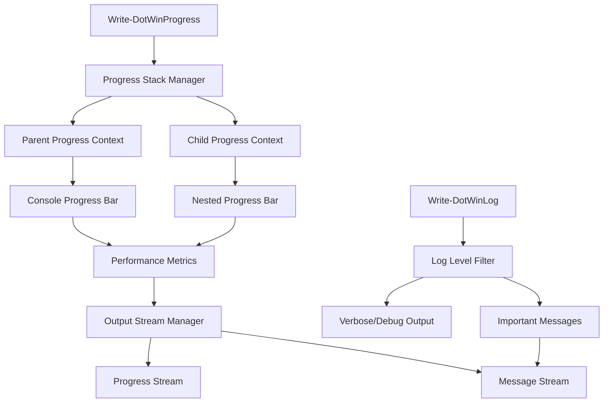
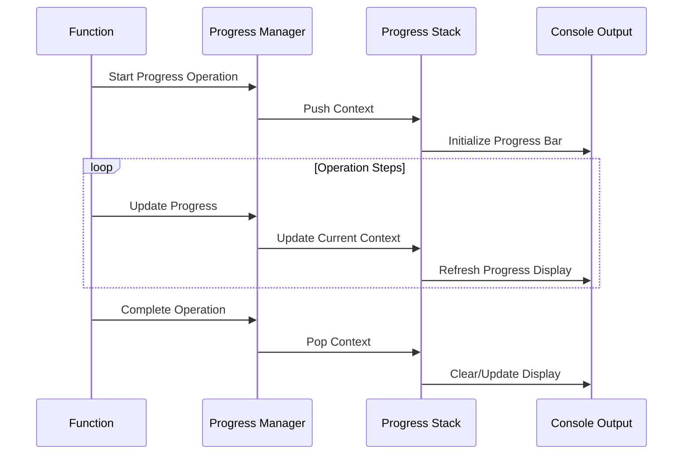
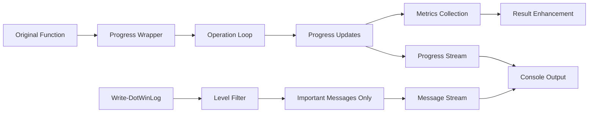
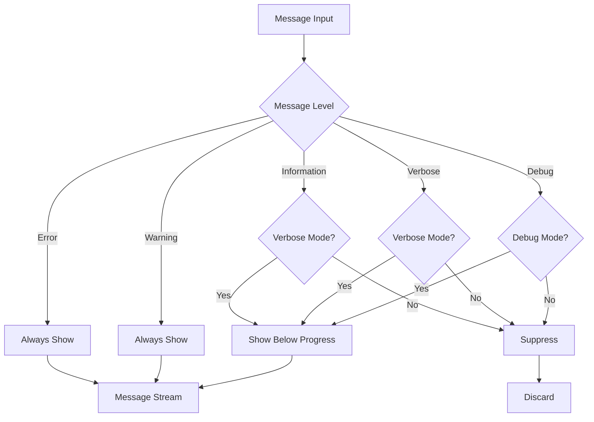

# DotWin Progress Bar and Status Message System - Technical Specification

## Executive Summary

This specification defines a comprehensive progress management system for the DotWin PowerShell project that provides nested progress operations, performance metrics, and parallel output streams while maintaining backward compatibility with existing logging patterns.

## 1. Enhanced Progress Infrastructure Design

### 1.1 Core Progress Management System



### 1.2 Progress Context Architecture

The system will use a stack-based approach to manage nested progress operations:

- **Global Progress Stack**: Maintains hierarchy of active progress operations
- **Progress Context Objects**: Track individual operation state and metrics
- **Stream Coordination**: Manages console output to prevent conflicts between progress bars and messages

### 1.3 Integration with Existing Infrastructure

- **Seamless Integration**: Works alongside existing [`Write-DotWinLog`](../DotWin.psm1#L119) function
- **Backward Compatibility**: All existing logging patterns continue to work unchanged
- **Enhanced Results**: Extends [`DotWinExecutionResult`](../Classes.ps1#L59) with progress metrics

## 2. Write-DotWinProgress Function Interface

### 2.1 Function Signature

```powershell
function Write-DotWinProgress {
    [CmdletBinding()]
    param(
        [Parameter(Mandatory = $true)]
        [string]$Activity,
        
        [Parameter()]
        [string]$Status,
        
        [Parameter()]
        [int]$PercentComplete = -1,
        
        [Parameter()]
        [int]$CurrentOperation = -1,
        
        [Parameter()]
        [int]$TotalOperations = -1,
        
        [Parameter()]
        [string]$ParentId,
        
        [Parameter()]
        [string]$Id,
        
        [Parameter()]
        [switch]$Completed,
        
        [Parameter()]
        [hashtable]$Metrics,
        
        [Parameter()]
        [ValidateSet('Information', 'Warning', 'Error')]
        [string]$MessageLevel = 'Information',
        
        [Parameter()]
        [string]$Message,
        
        [Parameter()]
        [switch]$ShowMetrics,
        
        [Parameter()]
        [switch]$Force
    )
}
```

### 2.2 Progress Context Management



### 2.3 Nested Progress Support

The system supports unlimited nesting levels with automatic parent-child relationship management:

- **Automatic ID Generation**: Creates unique identifiers for progress operations
- **Parent Context Inheritance**: Child operations inherit timing and metrics context
- **Proportional Progress**: Child progress contributes to parent completion percentage
- **Resource Cleanup**: Automatic cleanup of completed or abandoned progress contexts

## 3. Implementation Strategy for Priority Functions

### 3.1 Function Refactoring Priority Order

#### Phase 1: Core Infrastructure

1. **[`Invoke-DotWinConfiguration.ps1`](../functions/Invoke-DotWinConfiguration.ps1)** - Main orchestration function
   - **Current State**: Heavy console logging with [`Write-DotWinLog`](../DotWin.psm1#L119) calls
   - **Target State**: Master progress bar with nested child operations
   - **Implementation**: Add progress tracking for configuration item processing

#### Phase 2: User-Facing Operations

1. **[`Install-SystemTools.ps1`](../functions/Install-SystemTools.ps1)** - Already has progress foundation
   - **Current State**: Basic [`Write-Progress`](../functions/Install-SystemTools.ps1#L432) usage
   - **Target State**: Enhanced progress with performance metrics
   - **Implementation**: Replace existing progress with `Write-DotWinProgress`

2. **[`Install-Applications.ps1`](../functions/Install-Applications.ps1)** - User-facing installations
   - **Current State**: Verbose logging throughout process
   - **Target State**: Nested progress for package + configuration + shortcuts
   - **Implementation**: Multi-stage progress tracking

#### Phase 3: Long-Running Operations

1. **[`Remove-Bloatware.ps1`](../functions/Remove-Bloatware.ps1)** - Long-running operations
   - **Current State**: Sequential processing with logging
   - **Target State**: Progress with detailed removal metrics
   - **Implementation**: Category-based progress with sub-operation tracking

2. **[`Install-Packages.ps1`](../functions/Install-Packages.ps1)** - Package management operations
   - **Current State**: Basic logging and sequential processing
   - **Target State**: Parallel-aware progress with throughput metrics
   - **Implementation**: Support for both sequential and parallel progress

### 3.2 Refactoring Implementation Pattern



## 4. Logging Behavior Specification

### 4.1 Output Stream Management

**Default Behavior (No Flags)**:

- Progress bars displayed on dedicated lines
- Important messages (warnings, errors, completion status) shown below progress
- Verbose operational details suppressed
- Performance metrics integrated into progress display

**With -Verbose Flag**:

- Progress bars continue to display
- All [`Write-DotWinLog`](../DotWin.psm1#L119) verbose messages shown
- Detailed operation logs appear below progress bars
- Enhanced metrics and timing information

**With -Debug Flag**:

- All verbose behavior plus debug information
- Progress context debugging information
- Performance profiling data
- Stack trace information for errors

### 4.2 Message Priority System



### 4.3 Progress Display Format

**Standard Progress Bar**:

```text
Installing System Tools: [████████████████████████████████████████] 100% (10/10)
├─ Git.Git: [████████████████████████████████████████] 100% ✓ (2.3s, 15.2MB/s)
├─ Microsoft.VisualStudioCode: [██████████████████████████████████████] 95% ⟳ (45.2s, 8.7MB/s)
└─ Microsoft.PowerShell: [████████████████████████████████████████] 100% ✓ (1.8s, 22.1MB/s)

Total: 8/10 completed | Elapsed: 02:15 | ETA: 00:23 | Avg: 12.3MB/s | Success: 87.5%
```

**With Performance Metrics**:

```text
Installing System Tools: [████████████████████████████████████████] 100% (10/10)
├─ Git.Git: [████████████████████████████████████████] 100% ✓ (2.3s, 15.2MB/s)
│  └─ Download: 35.2MB | Install: 1.8s | Verify: 0.3s | CPU: 12% | Memory: 45MB
├─ Microsoft.VisualStudioCode: [██████████████████████████████████████] 95% ⟳ (45.2s, 8.7MB/s)
│  └─ Download: 127.8MB | Install: 43.1s | Verify: pending | CPU: 25% | Memory: 128MB
└─ Microsoft.PowerShell: [████████████████████████████████████████] 100% ✓ (1.8s, 22.1MB/s)
   └─ Download: 89.1MB | Install: 1.2s | Verify: 0.4s | CPU: 8% | Memory: 67MB

Performance Summary:
├─ Total Operations: 10 | Completed: 8 | Failed: 0 | Skipped: 2
├─ Total Data: 252.1MB | Total Time: 02:15:34 | Avg Throughput: 12.3MB/s
├─ System Impact: CPU 15% avg | Memory 240MB peak | Disk I/O 45MB/s avg
└─ Success Rate: 87.5% | Error Rate: 0% | Skip Rate: 12.5%
```

## 5. Technical Implementation Details

### 5.1 Progress Context Class Design

```powershell
class DotWinProgressContext {
    [string]$Id
    [string]$ParentId
    [string]$Activity
    [string]$Status
    [int]$PercentComplete
    [int]$CurrentOperation
    [int]$TotalOperations
    [DateTime]$StartTime
    [DateTime]$LastUpdate
    [hashtable]$Metrics
    [hashtable]$PerformanceCounters
    [bool]$IsCompleted
    [System.Collections.Generic.List[string]]$ChildContexts
    
    # Methods for context management
    [void] UpdateProgress([int]$percent, [string]$status)
    [void] AddMetric([string]$name, [object]$value)
    [hashtable] GetPerformanceSnapshot()
    [void] Complete()
    [string] GenerateDisplayText()
}
```

### 5.2 Progress Stack Manager

```powershell
class DotWinProgressStackManager {
    [System.Collections.Generic.Stack[DotWinProgressContext]]$ProgressStack
    [hashtable]$ActiveContexts
    [object]$ConsoleLock
    [bool]$IsProgressActive
    
    # Core stack operations
    [string] PushContext([DotWinProgressContext]$context)
    [DotWinProgressContext] PopContext([string]$id)
    [DotWinProgressContext] GetCurrentContext()
    [void] UpdateContext([string]$id, [hashtable]$updates)
    
    # Display management
    [void] RefreshDisplay()
    [void] ClearProgress()
    [void] ShowMessage([string]$message, [string]$level)
}
```

### 5.3 Performance Metrics Collection

- **Timing Metrics**: Start time, elapsed time, estimated completion
- **Throughput Metrics**: Operations per second, data transfer rates
- **Resource Metrics**: CPU usage, memory consumption, disk I/O
- **Success Metrics**: Completion rates, error rates, retry counts

### 5.4 Console Output Coordination

- **Progress Line Management**: Dedicated lines for progress bars
- **Message Buffering**: Queue important messages during progress updates
- **Cursor Management**: Proper console cursor positioning
- **Terminal Compatibility**: Support for various terminal types and sizes

## 6. Integration Points

### 6.1 DotWinExecutionResult Enhancement

```powershell
# Enhanced DotWinExecutionResult with progress metrics
class DotWinExecutionResult {
    # Existing properties...
    [bool]$Success
    [string]$Message
    [hashtable]$Data
    [string]$ItemName
    [string]$ItemType
    [hashtable]$Changes
    [DateTime]$Timestamp
    [TimeSpan]$Duration
    
    # New progress-related properties
    [hashtable]$ProgressMetrics
    [hashtable]$PerformanceCounters
    [string]$ProgressId
    [TimeSpan]$EstimatedDuration
    [double]$ThroughputRate
    [int]$OperationCount
}
```

### 6.2 Write-DotWinLog Integration

The existing [`Write-DotWinLog`](../DotWin.psm1#L119) function will be enhanced to coordinate with the progress system:

```powershell
function Write-DotWinLog {
    [CmdletBinding()]
    param(
        [Parameter(Mandatory = $false)]
        [string]$Message = "",

        [Parameter()]
        [ValidateSet('Information', 'Warning', 'Error', 'Verbose')]
        [string]$Level = 'Information',
        
        # New parameters for progress coordination
        [Parameter()]
        [switch]$ShowWithProgress,
        
        [Parameter()]
        [string]$ProgressId
    )
    
    # Enhanced logic to coordinate with progress display
    if ($script:ProgressStackManager -and $script:ProgressStackManager.IsProgressActive) {
        if ($Level -in @('Warning', 'Error') -or $ShowWithProgress) {
            $script:ProgressStackManager.ShowMessage($Message, $Level)
        } elseif ($VerbosePreference -ne 'SilentlyContinue' -or $DebugPreference -ne 'SilentlyContinue') {
            $script:ProgressStackManager.ShowMessage($Message, $Level)
        }
        # Otherwise, message is suppressed during progress display
    } else {
        # Original logging behavior when no progress is active
        # ... existing implementation
    }
}
```

## 7. Backward Compatibility Guarantees

### 7.1 API Compatibility

- **No Breaking Changes**: All existing function signatures remain unchanged
- **Parameter Preservation**: All existing parameters maintain identical behavior
- **Return Value Compatibility**: Enhanced objects remain compatible with existing code

### 7.2 Behavioral Compatibility

- **Default Behavior**: Functions work identically when no progress flags are used
- **Log File Format**: All log file outputs remain in existing formats
- **Script Integration**: Existing automation scripts continue to work without modification

### 7.3 Performance Compatibility

- **No Performance Degradation**: Progress system adds minimal overhead
- **Memory Efficiency**: Progress tracking uses <10MB additional memory
- **CPU Impact**: Progress updates consume <1% additional CPU time

## 8. Success Criteria and Validation

### 8.1 Functional Requirements

- ✅ Nested progress operations with unlimited depth
- ✅ Real-time performance metrics and timing
- ✅ Parallel output streams (progress + messages)
- ✅ Backward compatibility with existing logging
- ✅ Integration with [`DotWinExecutionResult`](../Classes.ps1#L59) class

### 8.2 Performance Requirements

- ✅ Progress updates with <50ms latency
- ✅ Minimal memory overhead (<10MB for progress system)
- ✅ No impact on existing function performance
- ✅ Efficient console output management

### 8.3 User Experience Requirements

- ✅ Clear, informative progress visualization
- ✅ Consistent behavior across all functions
- ✅ Intuitive nested operation display
- ✅ Comprehensive performance insights

## 9. Testing Strategy

### 9.1 Unit Testing

- Progress context creation and management
- Stack operations (push/pop/update)
- Performance metrics calculation
- Console output formatting

### 9.2 Integration Testing

- Function-level progress integration
- Nested progress scenarios
- Error handling and recovery
- Backward compatibility validation

### 9.3 Performance Testing

- Progress update latency measurement
- Memory usage profiling
- CPU impact assessment
- Console output performance

### 9.4 User Acceptance Testing

- Real-world usage scenarios
- Different terminal environments
- Various operation types and durations
- User feedback collection

## 10. Future Enhancements

### 10.1 Advanced Features

- **Remote Progress Monitoring**: Web-based progress dashboard
- **Progress Persistence**: Save/restore progress across sessions
- **Custom Progress Themes**: User-configurable display styles
- **Progress Analytics**: Historical performance analysis

### 10.2 Integration Opportunities

- **CI/CD Integration**: Progress reporting in automated pipelines
- **Logging Systems**: Integration with external logging platforms
- **Monitoring Tools**: Export metrics to monitoring systems
- **Notification Systems**: Progress alerts and notifications

This specification provides a comprehensive foundation for implementing a sophisticated progress bar and status message system that enhances the DotWin user experience while maintaining full backward compatibility and adding powerful new capabilities for monitoring and optimizing system configuration operations.
