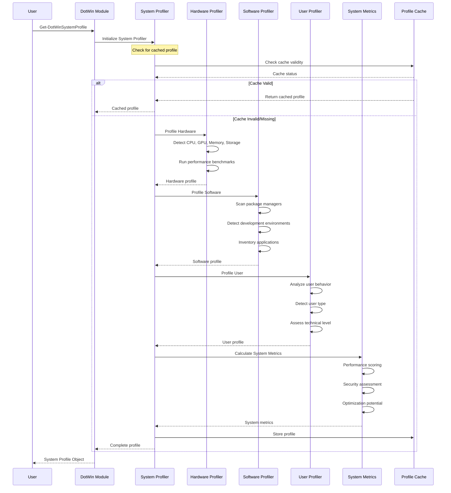
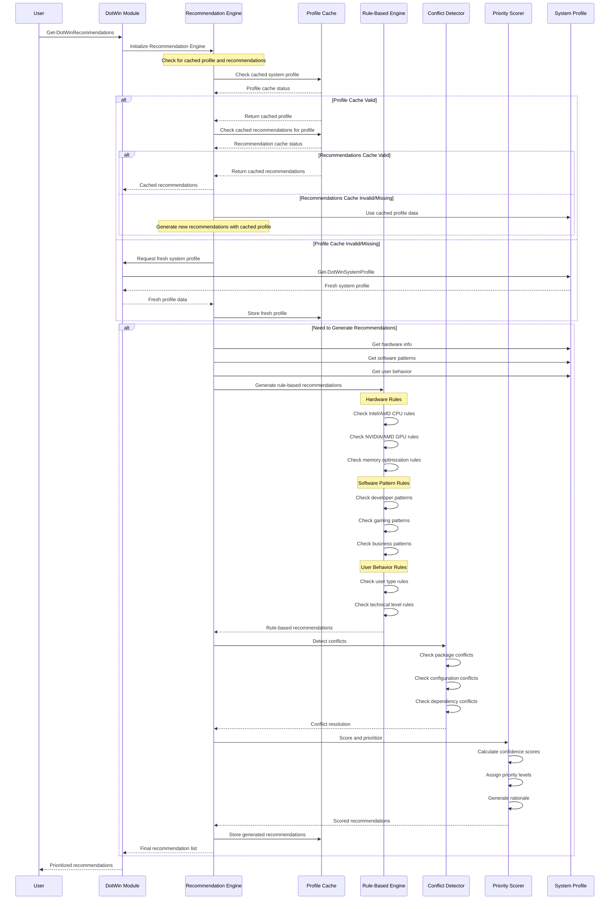
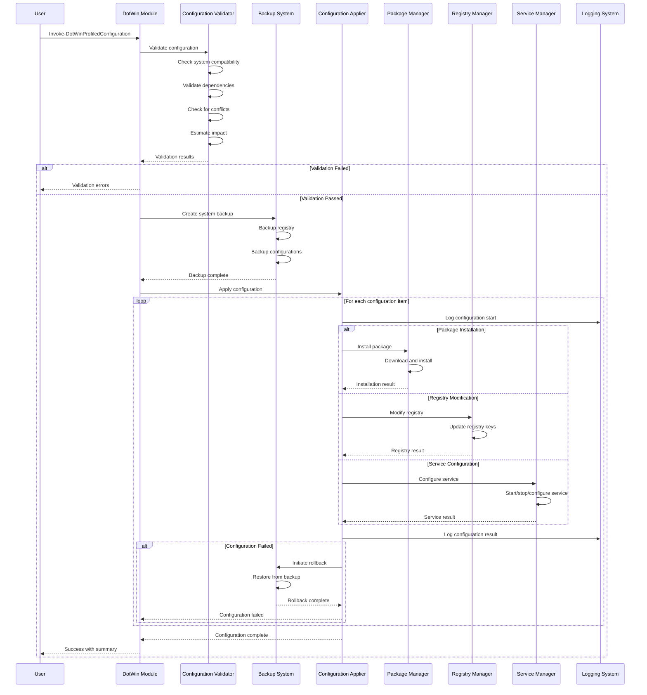
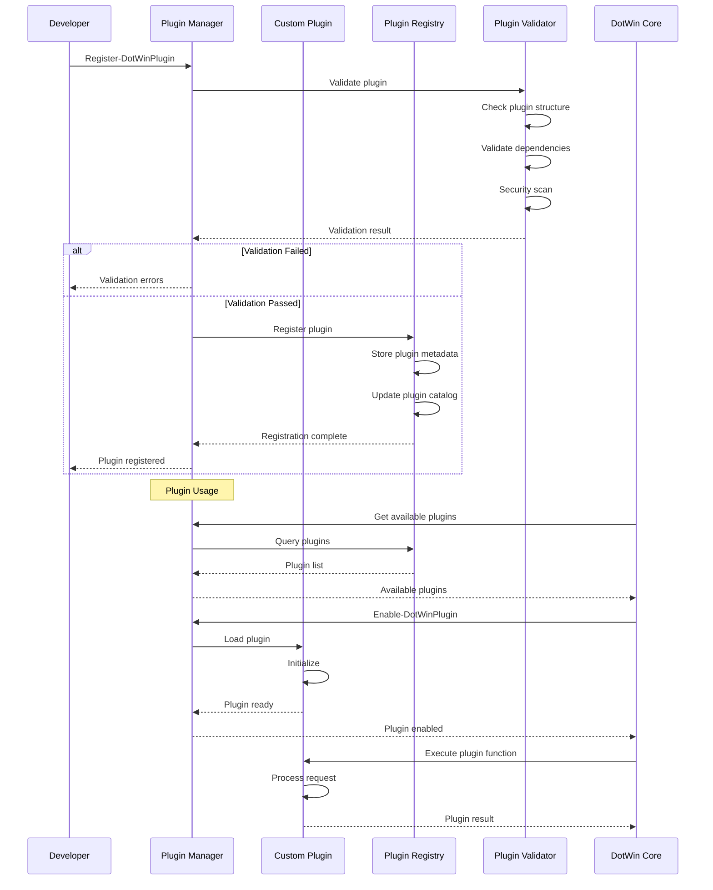
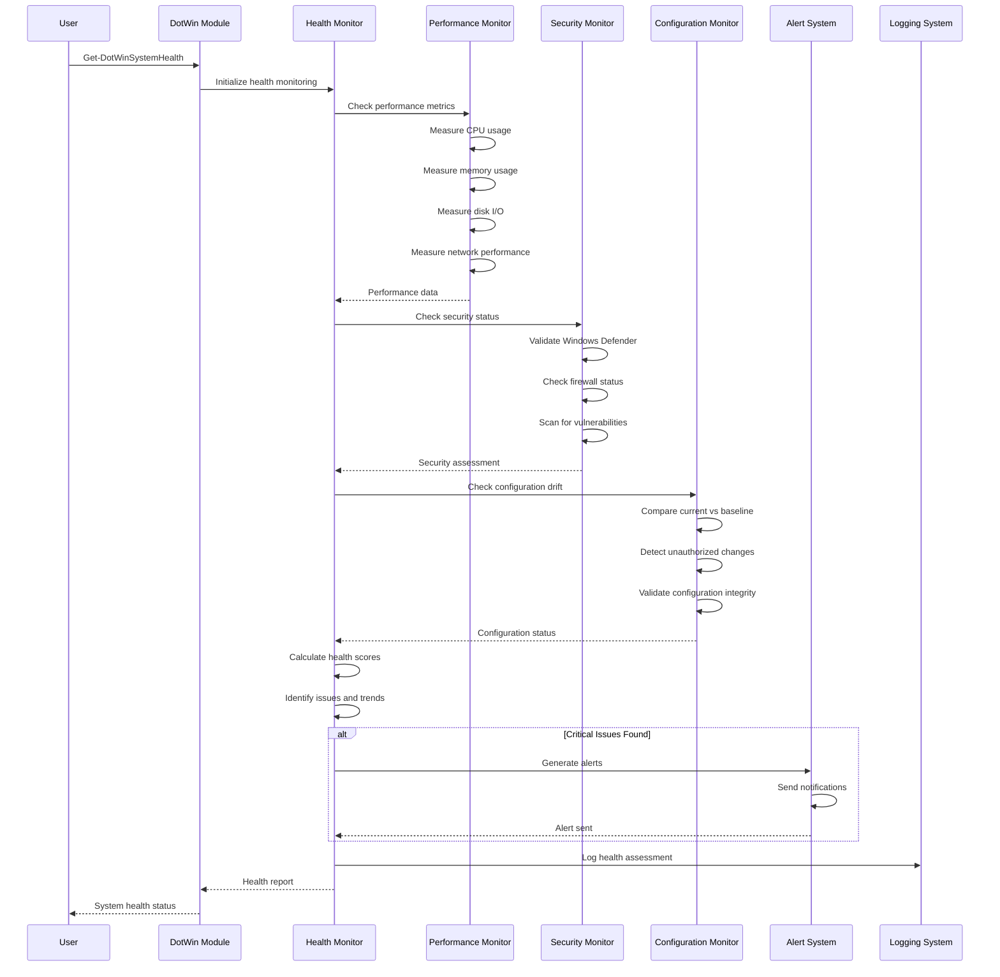
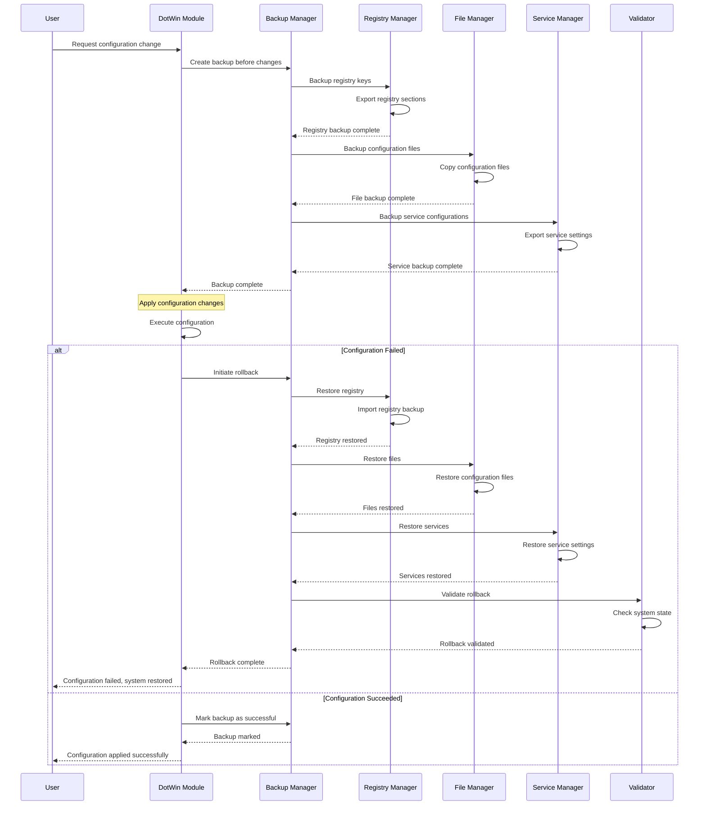
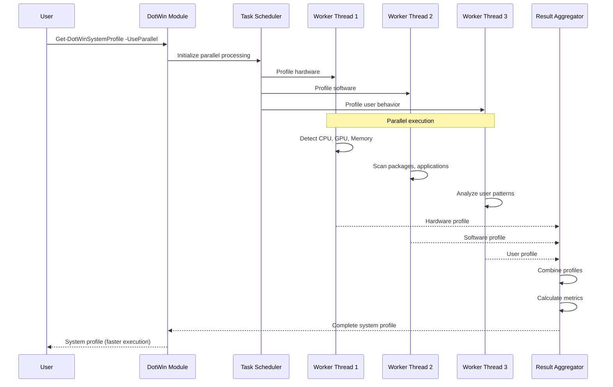

# DotWin Sequence Diagrams

## Overview

This document contains detailed sequence diagrams that illustrate the key workflows and interactions within the DotWin system. These diagrams show how different components collaborate to provide intelligent Windows configuration management.

## 1. System Profiling Workflow

The system profiling workflow demonstrates how DotWin analyzes the current system state to build a comprehensive profile.

### Key Steps in System Profiling

1. **Cache Check**: First check if a valid cached profile exists
2. **Hardware Profiling**: Detect and analyze hardware components
3. **Software Profiling**: Inventory installed software and development environments
4. **User Profiling**: Analyze user behavior and determine user type
5. **Metrics Calculation**: Calculate performance scores and optimization potential
6. **Caching**: Store the complete profile for future use

## 2. Recommendation Engine Workflow

This sequence shows how the recommendation engine generates intelligent suggestions based on the system profile.

### Recommendation Generation Process

1. **Cache Check**: First check for cached system profile and existing recommendations
2. **Profile Retrieval**: Use cached profile or request fresh system profiling if cache is invalid
3. **Recommendation Cache**: Check if valid recommendations exist for the current profile
4. **Rule Processing**: Apply hardware, software, and user-specific rules (if generating new recommendations)
5. **Conflict Detection**: Identify and resolve conflicting recommendations
6. **Scoring and Prioritization**: Calculate confidence scores and assign priorities
7. **Cache Storage**: Store generated recommendations for future use
8. **Final Output**: Return prioritized list of recommendations (cached or freshly generated)

## 3. Configuration Application Workflow

This sequence demonstrates the safe application of configurations with validation and rollback capabilities.

### Configuration Application Safety

1. **Pre-flight Validation**: Comprehensive validation before any changes
2. **System Backup**: Create restore points before applying changes
3. **Incremental Application**: Apply configurations one at a time with logging
4. **Error Recovery**: Automatic rollback on critical failures
5. **Success Reporting**: Detailed summary of applied changes

## 4. Plugin Architecture Workflow

This sequence shows how the plugin system manages the complete lifecycle of plugins.

### Plugin Lifecycle Management

1. **Registration**: Validate and register new plugins
2. **Discovery**: Query available plugins from registry
3. **Loading**: Load and initialize plugins on demand
4. **Execution**: Execute plugin functionality
5. **Management**: Enable, disable, and unregister plugins

## 5. System Health Monitoring Workflow

This sequence demonstrates how the system continuously monitors health and detects issues.

### Health Monitoring Components

1. **Performance Monitoring**: CPU, memory, disk, and network metrics
2. **Security Assessment**: Defender status, firewall, vulnerability scanning
3. **Configuration Drift**: Compare current state to baseline configuration
4. **Health Scoring**: Calculate overall system health scores
5. **Alerting**: Generate notifications for critical issues

## 6. Backup and Rollback Workflow

This sequence shows how the system protects against configuration failures through backup and rollback.

### Backup and Recovery Process

1. **Pre-Change Backup**: Create comprehensive backup before any changes
2. **Registry Backup**: Export relevant registry sections
3. **File Backup**: Copy configuration files and settings
4. **Service Backup**: Export service configurations
5. **Automatic Rollback**: Restore system state on critical failures
6. **Validation**: Verify system integrity after rollback

## 7. Parallel Processing Workflow (PowerShell 7+)

This sequence demonstrates how DotWin leverages PowerShell 7+ parallel processing capabilities.

### Parallel Processing Benefits

1. **Concurrent Execution**: Multiple profiling tasks run simultaneously
2. **Improved Performance**: Significant reduction in total execution time
3. **Resource Optimization**: Better utilization of multi-core systems
4. **Graceful Fallback**: Automatic fallback to sequential processing on PowerShell 5.1
5. **Result Aggregation**: Combine parallel results into cohesive output

## Summary

These sequence diagrams illustrate the sophisticated workflows that make DotWin a professional-grade configuration management system:

- **Intelligent Profiling**: Comprehensive system analysis with caching
- **Smart Recommendations**: Rule-based engine with conflict resolution
- **Safe Configuration**: Validation, backup, and rollback mechanisms
- **Extensible Architecture**: Plugin system with complete lifecycle management
- **Proactive Monitoring**: Continuous health assessment and alerting
- **Performance Optimization**: Parallel processing for improved speed

Each workflow is designed with safety, reliability, and user experience in mind, providing enterprise-grade capabilities while maintaining ease of use.
