# DotWin Sequence Diagrams

This document provides detailed sequence diagrams showing the flow of operations within DotWin's configuration management system. These diagrams illustrate how different components interact during various scenarios.

## Core Configuration Flow

### Main Configuration Application

This diagram shows the complete flow when applying a configuration using [`Invoke-DotWinConfiguration`](../functions/Invoke-DotWinConfiguration.ps1):

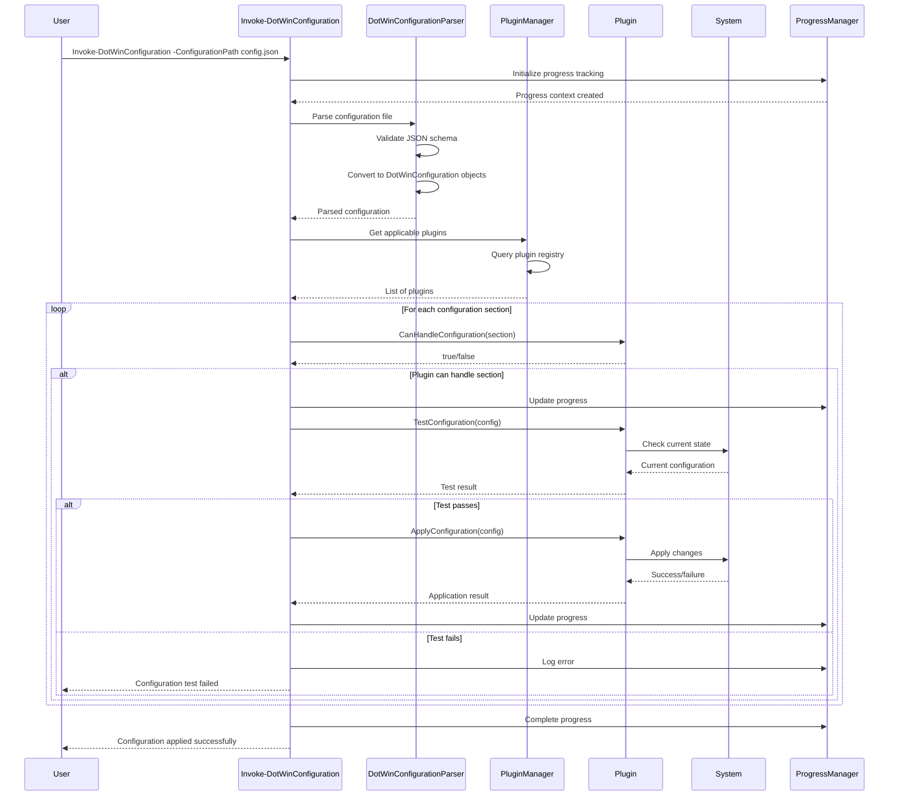
```mermaid
sequenceDiagram
    participant User
    participant IDC as Invoke-DotWinConfiguration
    participant DCP as DotWinConfigurationParser
    participant PM as PluginManager
    participant Plugin
    participant System
    participant Progress as ProgressManager

    User->>IDC: Invoke-DotWinConfiguration -ConfigurationPath config.json
    IDC->>Progress: Initialize progress tracking
    Progress-->>IDC: Progress context created
    
    IDC->>DCP: Parse configuration file
    DCP->>DCP: Validate JSON schema
    DCP->>DCP: Convert to DotWinConfiguration objects
    DCP-->>IDC: Parsed configuration
    
    IDC->>PM: Get applicable plugins
    PM->>PM: Query plugin registry
    PM-->>IDC: List of plugins
    
    loop For each configuration section
        IDC->>Plugin: CanHandleConfiguration(section)
        Plugin-->>IDC: true/false
        
        alt Plugin can handle section
            IDC->>Progress: Update progress
            IDC->>Plugin: TestConfiguration(config)
            Plugin->>System: Check current state
            System-->>Plugin: Current configuration
            Plugin-->>IDC: Test result

            alt Test passes
                IDC->>Plugin: ApplyConfiguration(config)
                Plugin->>System: Apply changes
                System-->>Plugin: Success/failure
                Plugin-->>IDC: Application result
                IDC->>Progress: Update progress
            else Test fails
                IDC->>Progress: Log error
                IDC-->>User: Configuration test failed
            end
        end
    end
    
    IDC->>Progress: Complete progress
    IDC-->>User: Configuration applied successfully
```

### Rich Configuration Integration

This diagram shows how rich configuration files integrate with the core system:

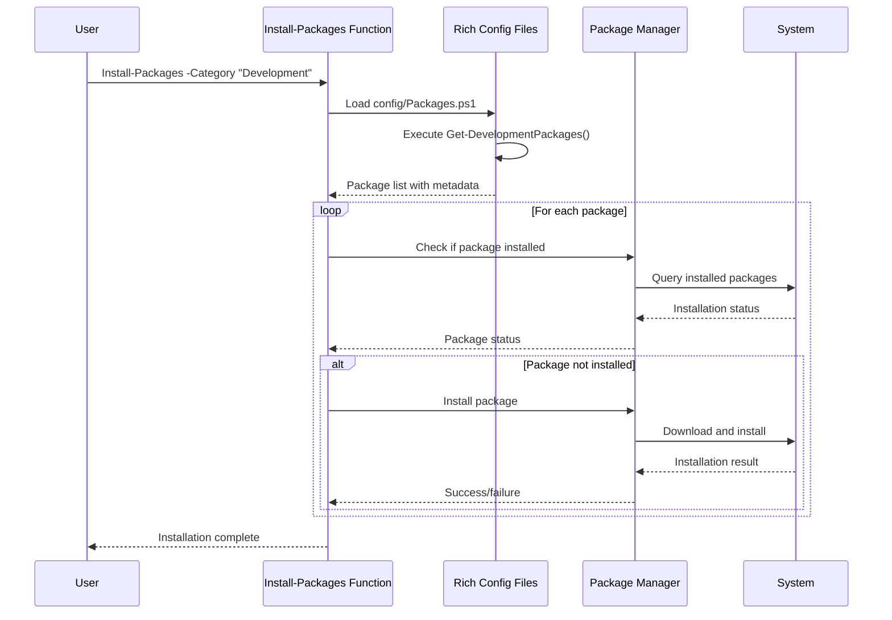
```mermaid
sequenceDiagram
    participant User
    participant IPF as Install-Packages Function
    participant RCF as Rich Config Files
    participant PM as Package Manager
    participant System

    User->>IPF: Install-Packages -Category "Development"
    IPF->>RCF: Load config/Packages.ps1
    RCF->>RCF: Execute Get-DevelopmentPackages()
    RCF-->>IPF: Package list with metadata
    
    loop For each package
        IPF->>PM: Check if package installed
        PM->>System: Query installed packages
        System-->>PM: Installation status
        PM-->>IPF: Package status

        alt Package not installed
            IPF->>PM: Install package
            PM->>System: Download and install
            System-->>PM: Installation result
            PM-->>IPF: Success/failure
        end
    end
    
    IPF-->>User: Installation complete
```

## System Profiling Flow

### Complete System Profile Generation

This diagram shows the flow for [`Get-DotWinSystemProfile`](../functions/Get-DotWinSystemProfile.ps1):

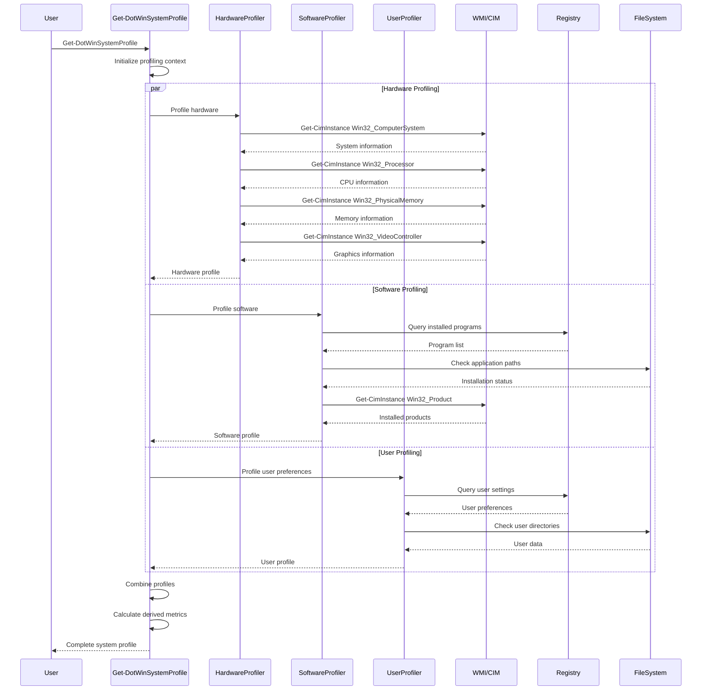
```mermaid
sequenceDiagram
    participant User
    participant GSP as Get-DotWinSystemProfile
    participant HP as HardwareProfiler
    participant SP as SoftwareProfiler
    participant UP as UserProfiler
    participant WMI as WMI/CIM
    participant Registry
    participant FileSystem

    User->>GSP: Get-DotWinSystemProfile
    GSP->>GSP: Initialize profiling context

    par Hardware Profiling
        GSP->>HP: Profile hardware
        HP->>WMI: Get-CimInstance Win32_ComputerSystem
        WMI-->>HP: System information
        HP->>WMI: Get-CimInstance Win32_Processor
        WMI-->>HP: CPU information
        HP->>WMI: Get-CimInstance Win32_PhysicalMemory
        WMI-->>HP: Memory information
        HP->>WMI: Get-CimInstance Win32_VideoController
        WMI-->>HP: Graphics information
        HP-->>GSP: Hardware profile
    and Software Profiling
        GSP->>SP: Profile software
        SP->>Registry: Query installed programs
        Registry-->>SP: Program list
        SP->>FileSystem: Check application paths
        FileSystem-->>SP: Installation status
        SP->>WMI: Get-CimInstance Win32_Product
        WMI-->>SP: Installed products
        SP-->>GSP: Software profile
    and User Profiling
        GSP->>UP: Profile user preferences
        UP->>Registry: Query user settings
        Registry-->>UP: User preferences
        UP->>FileSystem: Check user directories
        FileSystem-->>UP: User data
        UP-->>GSP: User profile
    end

    GSP->>GSP: Combine profiles
    GSP->>GSP: Calculate derived metrics
    GSP-->>User: Complete system profile
```

### Recommendation Generation

This diagram shows how recommendations are generated based on system profiles:

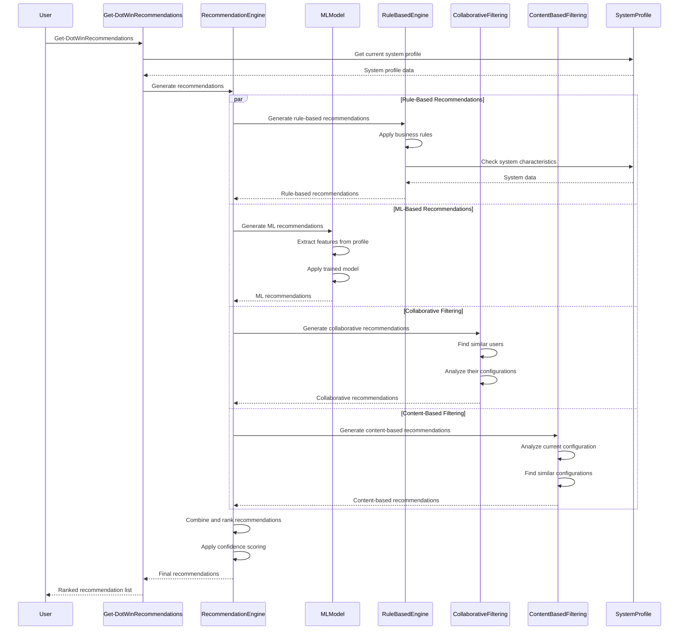
```mermaid
sequenceDiagram
    participant User
    participant GDR as Get-DotWinRecommendations
    participant RE as RecommendationEngine
    participant ML as MLModel
    participant RB as RuleBasedEngine
    participant CF as CollaborativeFiltering
    participant CB as ContentBasedFiltering
    participant Profile as SystemProfile

    User->>GDR: Get-DotWinRecommendations
    GDR->>Profile: Get current system profile
    Profile-->>GDR: System profile data

    GDR->>RE: Generate recommendations

    par Rule-Based Recommendations
        RE->>RB: Generate rule-based recommendations
        RB->>RB: Apply business rules
        RB->>Profile: Check system characteristics
        Profile-->>RB: System data
        RB-->>RE: Rule-based recommendations
    and ML-Based Recommendations
        RE->>ML: Generate ML recommendations
        ML->>ML: Extract features from profile
        ML->>ML: Apply trained model
        ML-->>RE: ML recommendations
    and Collaborative Filtering
        RE->>CF: Generate collaborative recommendations
        CF->>CF: Find similar users
        CF->>CF: Analyze their configurations
        CF-->>RE: Collaborative recommendations
    and Content-Based Filtering
        RE->>CB: Generate content-based recommendations
        CB->>CB: Analyze current configuration
        CB->>CB: Find similar configurations
        CB-->>RE: Content-based recommendations
    end
    
    RE->>RE: Combine and rank recommendations
    RE->>RE: Apply confidence scoring
    RE-->>GDR: Final recommendations
    GDR-->>User: Ranked recommendation list
```

## Package Management Flow

### Package Installation Process

This diagram shows the complete package installation flow:

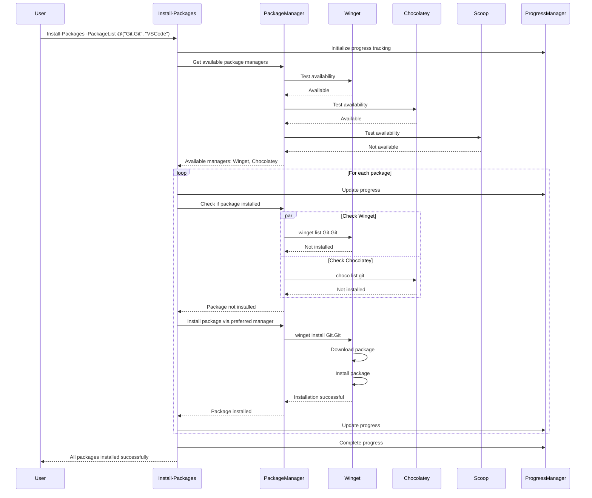
```mermaid
sequenceDiagram
    participant User
    participant IP as Install-Packages
    participant PM as PackageManager
    participant Winget
    participant Chocolatey
    participant Scoop
    participant Progress as ProgressManager

    User->>IP: Install-Packages -PackageList @("Git.Git", "VSCode")
    IP->>Progress: Initialize progress tracking
    IP->>PM: Get available package managers
    
    PM->>Winget: Test availability
    Winget-->>PM: Available
    PM->>Chocolatey: Test availability
    Chocolatey-->>PM: Available
    PM->>Scoop: Test availability
    Scoop-->>PM: Not available
    PM-->>IP: Available managers: Winget, Chocolatey
    
    loop For each package
        IP->>Progress: Update progress
        IP->>PM: Check if package installed
        
        par Check Winget
            PM->>Winget: winget list Git.Git
            Winget-->>PM: Not installed
        and Check Chocolatey
            PM->>Chocolatey: choco list git
            Chocolatey-->>PM: Not installed
        end
        
        PM-->>IP: Package not installed

        IP->>PM: Install package via preferred manager
        PM->>Winget: winget install Git.Git
        Winget->>Winget: Download package
        Winget->>Winget: Install package
        Winget-->>PM: Installation successful
        PM-->>IP: Package installed

        IP->>Progress: Update progress
    end

    IP->>Progress: Complete progress
    IP-->>User: All packages installed successfully
```

### Package Source Management

This diagram shows how package sources are managed:

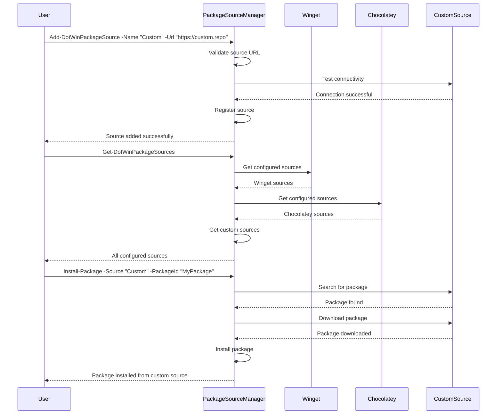
```mermaid
sequenceDiagram
    participant User
    participant PSM as PackageSourceManager
    participant Winget
    participant Chocolatey
    participant Custom as CustomSource

    User->>PSM: Add-DotWinPackageSource -Name "Custom" -Url "https://custom.repo"
    PSM->>PSM: Validate source URL
    PSM->>Custom: Test connectivity
    Custom-->>PSM: Connection successful
    PSM->>PSM: Register source
    PSM-->>User: Source added successfully

    User->>PSM: Get-DotWinPackageSources
    PSM->>Winget: Get configured sources
    Winget-->>PSM: Winget sources
    PSM->>Chocolatey: Get configured sources
    Chocolatey-->>PSM: Chocolatey sources
    PSM->>PSM: Get custom sources
    PSM-->>User: All configured sources

    User->>PSM: Install-Package -Source "Custom" -PackageId "MyPackage"
    PSM->>Custom: Search for package
    Custom-->>PSM: Package found
    PSM->>Custom: Download package
    Custom-->>PSM: Package downloaded
    PSM->>PSM: Install package
    PSM-->>User: Package installed from custom source
```

## Terminal Configuration Flow

### Terminal Profile Application

This diagram shows how terminal profiles are applied:

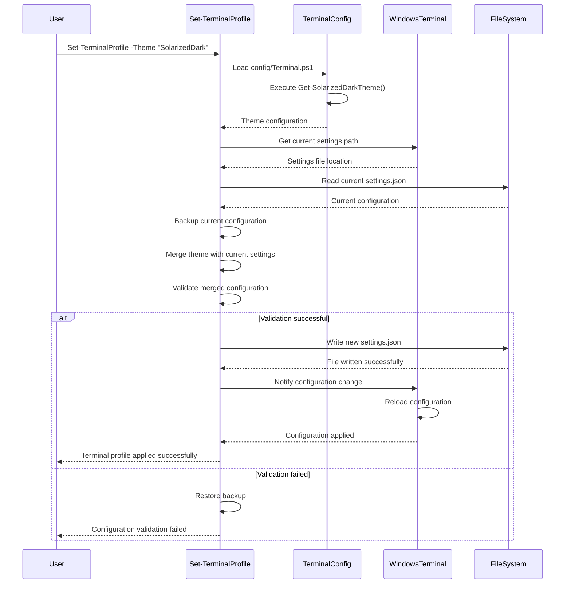
```mermaid
sequenceDiagram
    participant User
    participant STP as Set-TerminalProfile
    participant TC as TerminalConfig
    participant WT as WindowsTerminal
    participant FS as FileSystem

    User->>STP: Set-TerminalProfile -Theme "SolarizedDark"
    STP->>TC: Load config/Terminal.ps1
    TC->>TC: Execute Get-SolarizedDarkTheme()
    TC-->>STP: Theme configuration
    
    STP->>WT: Get current settings path
    WT-->>STP: Settings file location
    
    STP->>FS: Read current settings.json
    FS-->>STP: Current configuration
    
    STP->>STP: Backup current configuration
    STP->>STP: Merge theme with current settings
    STP->>STP: Validate merged configuration
    
    alt Validation successful
        STP->>FS: Write new settings.json
        FS-->>STP: File written successfully
        STP->>WT: Notify configuration change
        WT->>WT: Reload configuration
        WT-->>STP: Configuration applied
        STP-->>User: Terminal profile applied successfully
    else Validation failed
        STP->>STP: Restore backup
        STP-->>User: Configuration validation failed
    end
```

### Theme Customization Flow

This diagram shows how custom themes are created and applied:

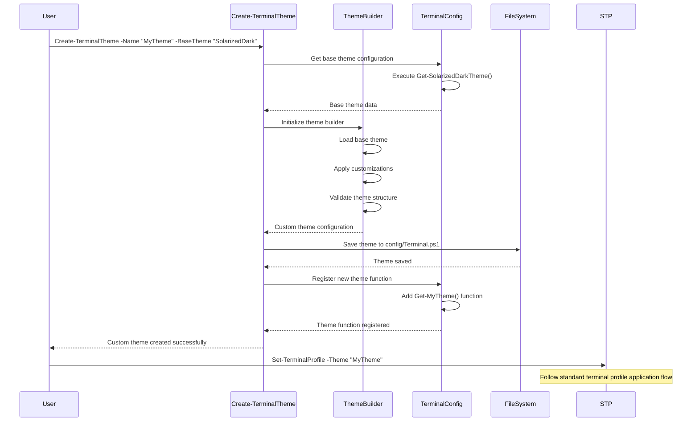
```mermaid
sequenceDiagram
    participant User
    participant CTT as Create-TerminalTheme
    participant TB as ThemeBuilder
    participant TC as TerminalConfig
    participant FS as FileSystem

    User->>CTT: Create-TerminalTheme -Name "MyTheme" -BaseTheme "SolarizedDark"
    CTT->>TC: Get base theme configuration
    TC->>TC: Execute Get-SolarizedDarkTheme()
    TC-->>CTT: Base theme data
    
    CTT->>TB: Initialize theme builder
    TB->>TB: Load base theme
    TB->>TB: Apply customizations
    TB->>TB: Validate theme structure
    TB-->>CTT: Custom theme configuration
    
    CTT->>FS: Save theme to config/Terminal.ps1
    FS-->>CTT: Theme saved
    
    CTT->>TC: Register new theme function
    TC->>TC: Add Get-MyTheme() function
    TC-->>CTT: Theme function registered
    
    CTT-->>User: Custom theme created successfully
    
    User->>STP: Set-TerminalProfile -Theme "MyTheme"
    Note over STP: Follow standard terminal profile application flow
```

## Plugin System Flow

### Plugin Loading and Registration

This diagram shows how plugins are loaded and registered:

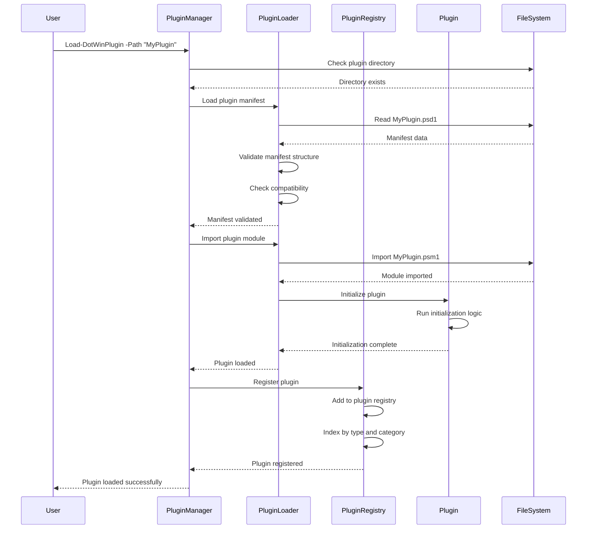
```mermaid
sequenceDiagram
    participant User
    participant PM as PluginManager
    participant PL as PluginLoader
    participant PR as PluginRegistry
    participant Plugin
    participant FS as FileSystem

    User->>PM: Load-DotWinPlugin -Path "MyPlugin"
    PM->>FS: Check plugin directory
    FS-->>PM: Directory exists
    
    PM->>PL: Load plugin manifest
    PL->>FS: Read MyPlugin.psd1
    FS-->>PL: Manifest data
    PL->>PL: Validate manifest structure
    PL->>PL: Check compatibility
    PL-->>PM: Manifest validated
    
    PM->>PL: Import plugin module
    PL->>FS: Import MyPlugin.psm1
    FS-->>PL: Module imported
    PL->>Plugin: Initialize plugin
    Plugin->>Plugin: Run initialization logic
    Plugin-->>PL: Initialization complete
    PL-->>PM: Plugin loaded
    
    PM->>PR: Register plugin
    PR->>PR: Add to plugin registry
    PR->>PR: Index by type and category
    PR-->>PM: Plugin registered
    
    PM-->>User: Plugin loaded successfully
```

### Plugin Configuration Application

This diagram shows how plugins apply configurations:

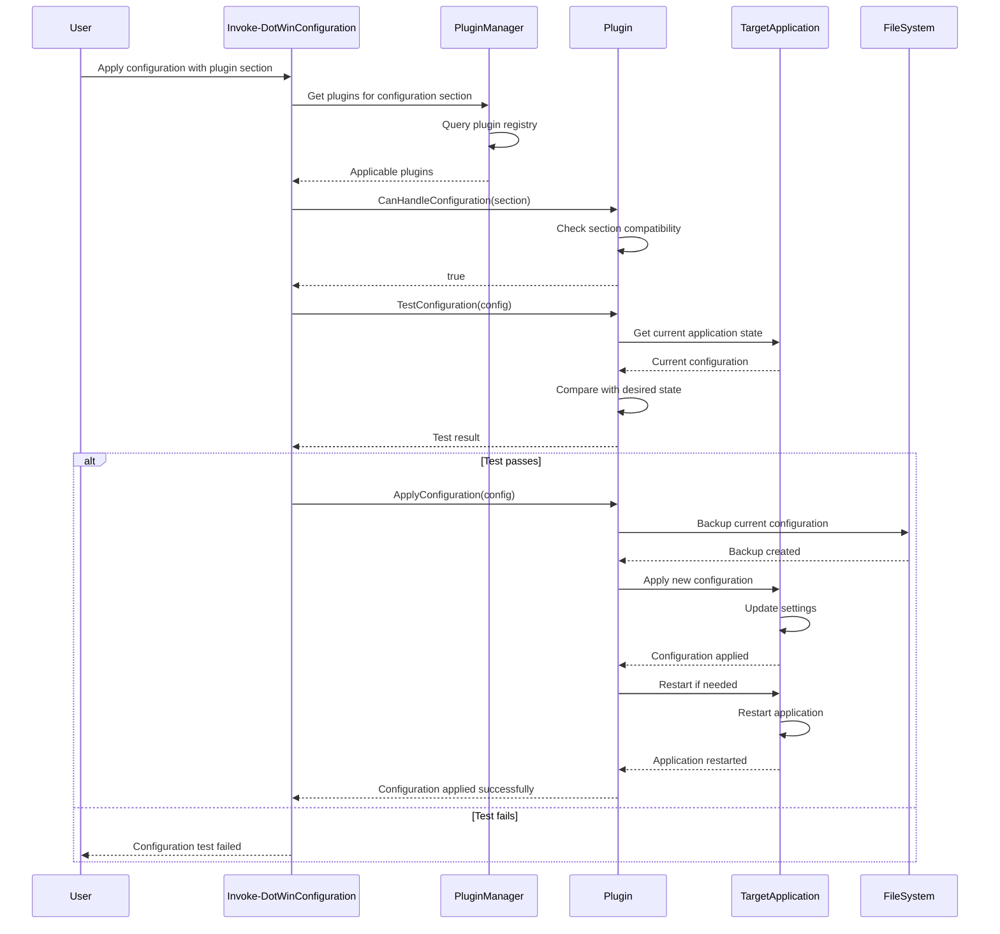
```mermaid
sequenceDiagram
    participant User
    participant IDC as Invoke-DotWinConfiguration
    participant PM as PluginManager
    participant Plugin
    participant App as TargetApplication
    participant FS as FileSystem

    User->>IDC: Apply configuration with plugin section
    IDC->>PM: Get plugins for configuration section
    PM->>PM: Query plugin registry
    PM-->>IDC: Applicable plugins
    
    IDC->>Plugin: CanHandleConfiguration(section)
    Plugin->>Plugin: Check section compatibility
    Plugin-->>IDC: true
    
    IDC->>Plugin: TestConfiguration(config)
    Plugin->>App: Get current application state
    App-->>Plugin: Current configuration
    Plugin->>Plugin: Compare with desired state
    Plugin-->>IDC: Test result
    
    alt Test passes
        IDC->>Plugin: ApplyConfiguration(config)
        Plugin->>FS: Backup current configuration
        FS-->>Plugin: Backup created
        
        Plugin->>App: Apply new configuration
        App->>App: Update settings
        App-->>Plugin: Configuration applied
        
        Plugin->>App: Restart if needed
        App->>App: Restart application
        App-->>Plugin: Application restarted
        
        Plugin-->>IDC: Configuration applied successfully
    else Test fails
        IDC-->>User: Configuration test failed
    end
```

## Error Handling and Recovery

### Configuration Rollback Flow

This diagram shows how configuration rollbacks are handled:

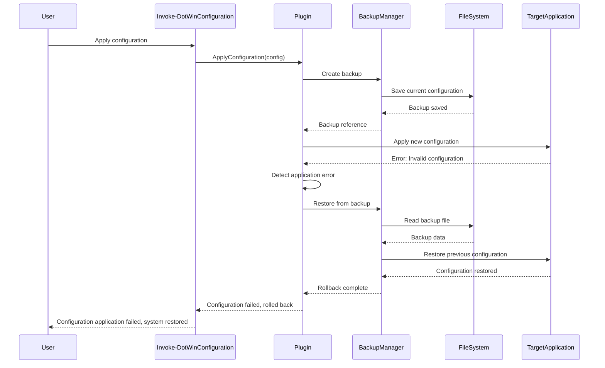
```mermaid
sequenceDiagram
    participant User
    participant IDC as Invoke-DotWinConfiguration
    participant Plugin
    participant Backup as BackupManager
    participant FS as FileSystem
    participant App as TargetApplication

    User->>IDC: Apply configuration
    IDC->>Plugin: ApplyConfiguration(config)
    Plugin->>Backup: Create backup
    Backup->>FS: Save current configuration
    FS-->>Backup: Backup saved
    Backup-->>Plugin: Backup reference

    Plugin->>App: Apply new configuration
    App-->>Plugin: Error: Invalid configuration

    Plugin->>Plugin: Detect application error
    Plugin->>Backup: Restore from backup
    Backup->>FS: Read backup file
    FS-->>Backup: Backup data
    Backup->>App: Restore previous configuration
    App-->>Backup: Configuration restored
    Backup-->>Plugin: Rollback complete

    Plugin-->>IDC: Configuration failed, rolled back
    IDC-->>User: Configuration application failed, system restored
```

### Progress Tracking and Cancellation

This diagram shows how progress is tracked and operations can be cancelled:

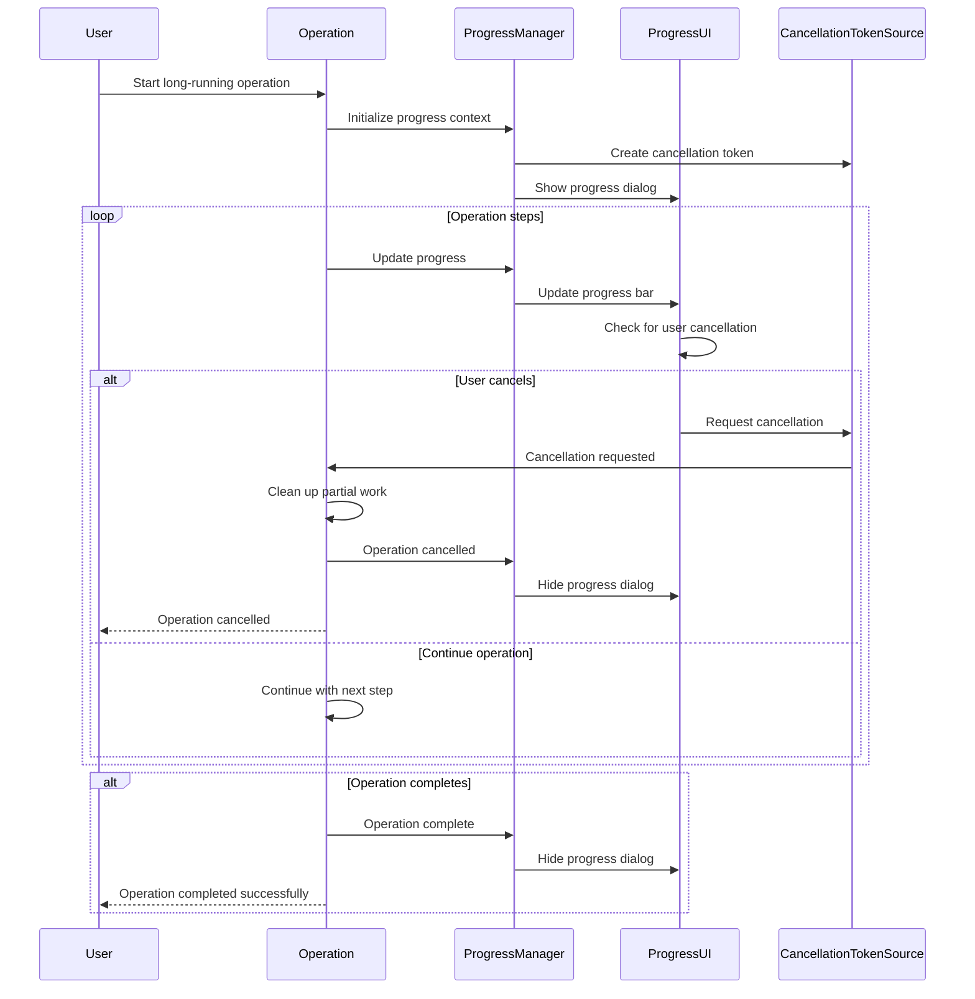
```mermaid
sequenceDiagram
    participant User
    participant Operation
    participant Progress as ProgressManager
    participant UI as ProgressUI
    participant CTS as CancellationTokenSource

    User->>Operation: Start long-running operation
    Operation->>Progress: Initialize progress context
    Progress->>CTS: Create cancellation token
    Progress->>UI: Show progress dialog

    loop Operation steps
        Operation->>Progress: Update progress
        Progress->>UI: Update progress bar
        UI->>UI: Check for user cancellation

        alt User cancels
            UI->>CTS: Request cancellation
            CTS->>Operation: Cancellation requested
            Operation->>Operation: Clean up partial work
            Operation->>Progress: Operation cancelled
            Progress->>UI: Hide progress dialog
            Operation-->>User: Operation cancelled
        else Continue operation
            Operation->>Operation: Continue with next step
        end
    end

    alt Operation completes
        Operation->>Progress: Operation complete
        Progress->>UI: Hide progress dialog
        Operation-->>User: Operation completed successfully
    end
```

## Performance Optimization Flow

### Parallel Package Installation

This diagram shows how packages are installed in parallel for better performance:

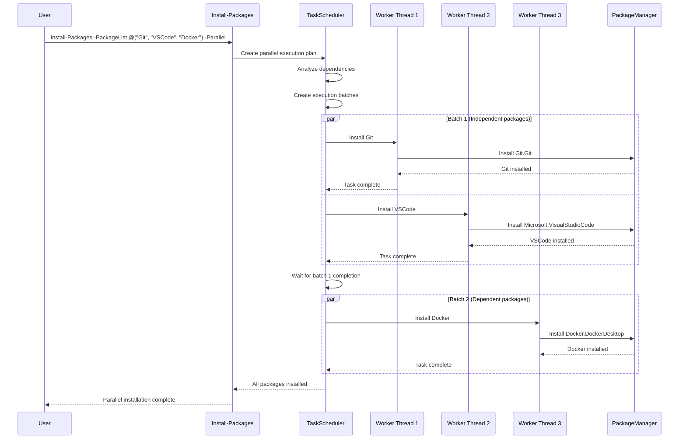
```mermaid
sequenceDiagram
    participant User
    participant IP as Install-Packages
    participant Scheduler as TaskScheduler
    participant Worker1 as Worker Thread 1
    participant Worker2 as Worker Thread 2
    participant Worker3 as Worker Thread 3
    participant PM as PackageManager

    User->>IP: Install-Packages -PackageList @("Git", "VSCode", "Docker") -Parallel
    IP->>Scheduler: Create parallel execution plan
    Scheduler->>Scheduler: Analyze dependencies
    Scheduler->>Scheduler: Create execution batches
    
    par Batch 1 (Independent packages)
        Scheduler->>Worker1: Install Git
        Worker1->>PM: Install Git.Git
        PM-->>Worker1: Git installed
        Worker1-->>Scheduler: Task complete
    and
        Scheduler->>Worker2: Install VSCode
        Worker2->>PM: Install Microsoft.VisualStudioCode
        PM-->>Worker2: VSCode installed
        Worker2-->>Scheduler: Task complete
    end
    
    Scheduler->>Scheduler: Wait for batch 1 completion
    
    par Batch 2 (Dependent packages)
        Scheduler->>Worker3: Install Docker
        Worker3->>PM: Install Docker.DockerDesktop
        PM-->>Worker3: Docker installed
        Worker3-->>Scheduler: Task complete
    end
    
    Scheduler-->>IP: All packages installed
    IP-->>User: Parallel installation complete
```

### Caching and Optimization

This diagram shows how caching improves performance:

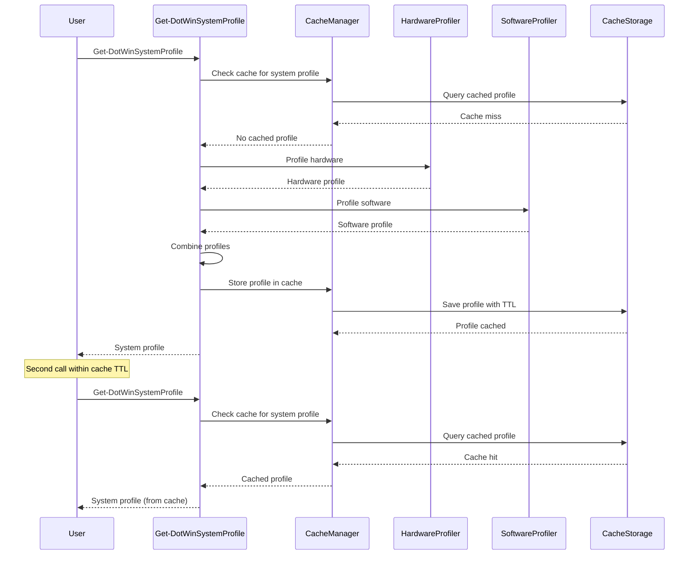
```mermaid
sequenceDiagram
    participant User
    participant GSP as Get-DotWinSystemProfile
    participant Cache as CacheManager
    participant HP as HardwareProfiler
    participant SP as SoftwareProfiler
    participant Storage as CacheStorage

    User->>GSP: Get-DotWinSystemProfile
    GSP->>Cache: Check cache for system profile
    Cache->>Storage: Query cached profile
    Storage-->>Cache: Cache miss
    Cache-->>GSP: No cached profile
    
    GSP->>HP: Profile hardware
    HP-->>GSP: Hardware profile
    GSP->>SP: Profile software
    SP-->>GSP: Software profile
    
    GSP->>GSP: Combine profiles
    GSP->>Cache: Store profile in cache
    Cache->>Storage: Save profile with TTL
    Storage-->>Cache: Profile cached
    
    GSP-->>User: System profile

    Note over User: Second call within cache TTL

    User->>GSP: Get-DotWinSystemProfile
    GSP->>Cache: Check cache for system profile
    Cache->>Storage: Query cached profile
    Storage-->>Cache: Cache hit
    Cache-->>GSP: Cached profile
    GSP-->>User: System profile (from cache)
```

## Integration Patterns

### External Tool Integration

This diagram shows how DotWin integrates with external tools:

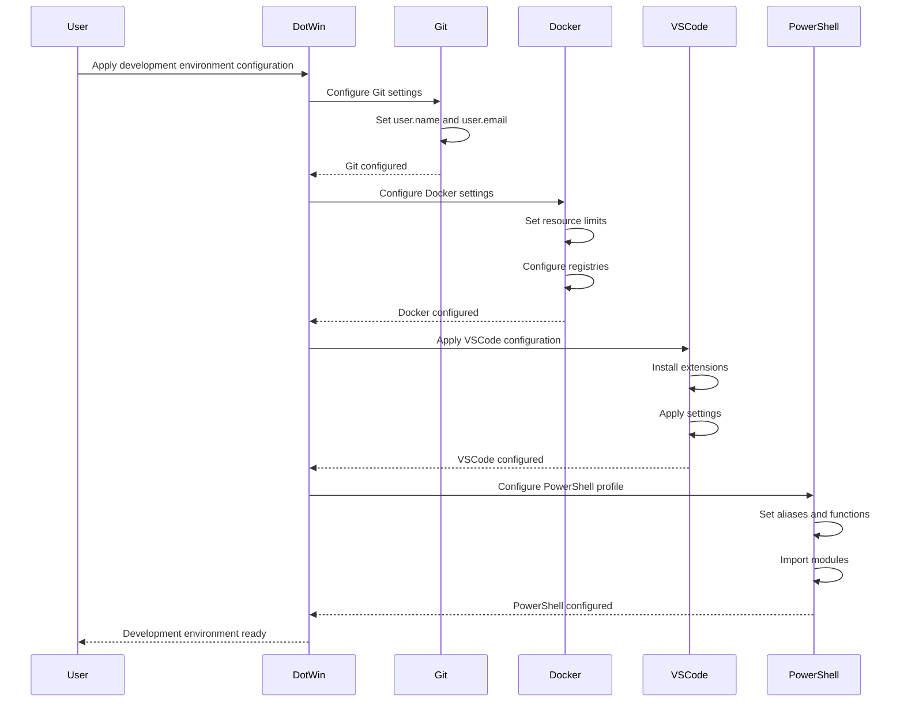
```mermaid
sequenceDiagram
    participant User
    participant DotWin
    participant Git
    participant Docker
    participant VSCode
    participant PowerShell

    User->>DotWin: Apply development environment configuration

    DotWin->>Git: Configure Git settings
    Git->>Git: Set user.name and user.email
    Git-->>DotWin: Git configured

    DotWin->>Docker: Configure Docker settings
    Docker->>Docker: Set resource limits
    Docker->>Docker: Configure registries
    Docker-->>DotWin: Docker configured

    DotWin->>VSCode: Apply VSCode configuration
    VSCode->>VSCode: Install extensions
    VSCode->>VSCode: Apply settings
    VSCode-->>DotWin: VSCode configured

    DotWin->>PowerShell: Configure PowerShell profile
    PowerShell->>PowerShell: Set aliases and functions
    PowerShell->>PowerShell: Import modules
    PowerShell-->>DotWin: PowerShell configured

    DotWin-->>User: Development environment ready
```

### Configuration Synchronization

This diagram shows how configurations are synchronized across systems:

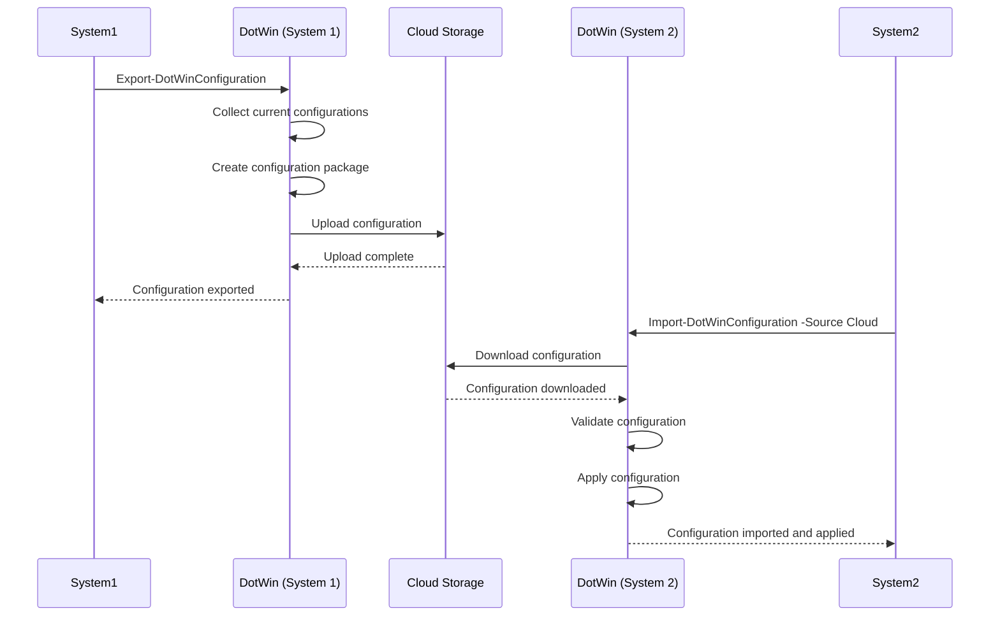
```mermaid
sequenceDiagram
    participant System1
    participant DotWin1 as DotWin (System 1)
    participant Cloud as Cloud Storage
    participant DotWin2 as DotWin (System 2)
    participant System2

    System1->>DotWin1: Export-DotWinConfiguration
    DotWin1->>DotWin1: Collect current configurations
    DotWin1->>DotWin1: Create configuration package
    DotWin1->>Cloud: Upload configuration
    Cloud-->>DotWin1: Upload complete
    DotWin1-->>System1: Configuration exported

    System2->>DotWin2: Import-DotWinConfiguration -Source Cloud
    DotWin2->>Cloud: Download configuration
    Cloud-->>DotWin2: Configuration downloaded
    DotWin2->>DotWin2: Validate configuration
    DotWin2->>DotWin2: Apply configuration
    DotWin2-->>System2: Configuration imported and applied
```

---

These sequence diagrams provide a comprehensive view of how DotWin's components interact during various operations. They serve as a reference for understanding the system's behavior and can be helpful for debugging, optimization, and further development.
