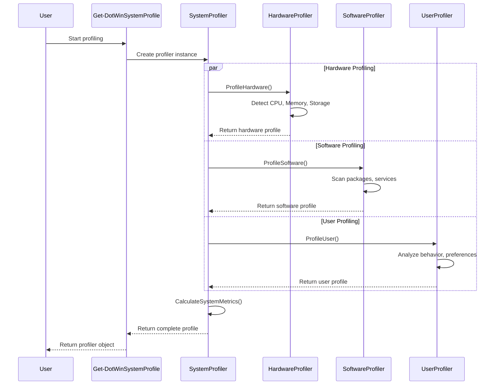
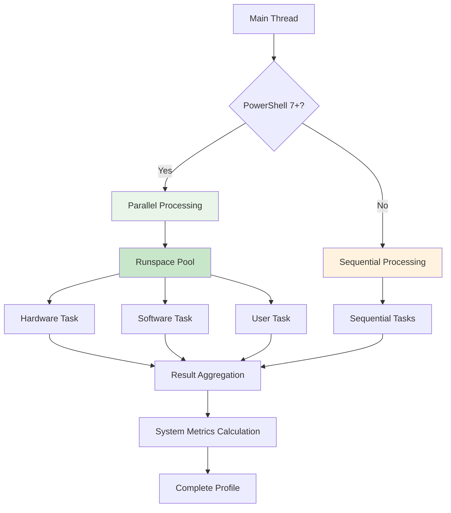
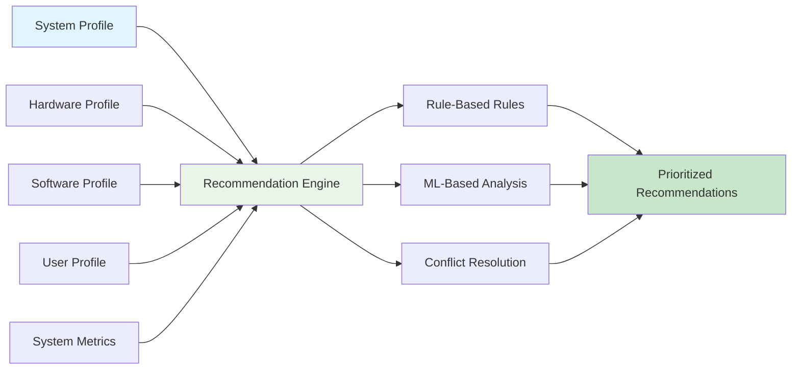

# System Profiling Guide

DotWin's system profiling capabilities provide deep insights into your Windows environment, enabling intelligent configuration recommendations and optimization strategies.

## Overview

The system profiling engine analyzes multiple aspects of your system:

- **Hardware Profile**: CPU, memory, storage, and peripheral detection
- **Software Profile**: Installed packages, running services, and usage patterns
- **User Profile**: Behavior analysis, preferences, and technical skill level
- **Performance Metrics**: System performance scoring and optimization potential

## Core Profiling Functions

### Get-DotWinSystemProfile

The main profiling function that orchestrates comprehensive system analysis:

```powershell
# Complete system profiling
$profile = Get-DotWinSystemProfile

# Selective profiling
$profile = Get-DotWinSystemProfile -IncludeHardware -IncludeSoftware -ExportPath "profile.json"

# Parallel profiling (PowerShell 7+)
$profile = Get-DotWinSystemProfile -UseParallel

# Force re-profiling
$profile = Get-DotWinSystemProfile -Force
```

### Profile Components

#### Hardware Profiling

```powershell
# Access hardware profile
$hardware = $profile.Hardware

# Get hardware category
$category = $hardware.GetHardwareCategory()
# Returns: "Workstation", "Gaming", "Server", "Laptop", "Budget"

# Hardware details
$hardware.Processor.Name
$hardware.Memory.TotalGB
$hardware.Storage.TotalCapacityGB
$hardware.Graphics.Name
```

#### Software Profiling

```powershell
# Access software profile
$software = $profile.Software

# Get user type based on installed software
$userType = $software.GetUserType()
# Returns: "Developer", "PowerUser", "BusinessUser", "Gamer", "BasicUser"

# Software inventory
$software.InstalledPackages
$software.RunningServices
$software.StartupPrograms
```

#### User Profiling

```powershell
# Access user profile
$user = $profile.User

# Get technical skill level
$techLevel = $user.GetTechnicalLevel()
# Returns: "Beginner", "Intermediate", "Advanced", "Expert"

# User behavior metrics
$user.CommandHistory
$user.PreferenceAnalysis
$user.WorkflowPatterns
```

## Profiling Architecture

### System Profiling Flow



### Parallel Processing Architecture



## Hardware Profiling Details

### Hardware Detection Classes

#### DotWinHardwareProfile

```powershell
class DotWinHardwareProfile {
    [DotWinProcessorInfo] $Processor
    [DotWinMemoryInfo] $Memory
    [DotWinStorageInfo] $Storage
    [DotWinGraphicsInfo] $Graphics
    [DotWinNetworkInfo] $Network
    [DotWinPeripheralInfo] $Peripherals

    [string] GetHardwareCategory()
    [hashtable] GetPerformanceMetrics()
    [bool] SupportsFeature([string] $feature)
}
```

#### Hardware Categories

| Category | Criteria | Typical Use Cases |
|----------|----------|-------------------|
| **Workstation** | High-end CPU, 16GB+ RAM, SSD | Development, Content Creation |
| **Gaming** | Dedicated GPU, 16GB+ RAM, Fast Storage | Gaming, Streaming |
| **Server** | Multi-core CPU, 32GB+ RAM, RAID | Server Applications |
| **Laptop** | Mobile CPU, Battery, Integrated Graphics | Portable Computing |
| **Budget** | Basic CPU, 8GB RAM, HDD | Basic Computing Tasks |

### Hardware Detection Examples

```powershell
# Detailed hardware analysis
$hardware = $profile.Hardware

# Processor information
Write-Host "CPU: $($hardware.Processor.Name)"
Write-Host "Cores: $($hardware.Processor.Cores)"
Write-Host "Threads: $($hardware.Processor.LogicalProcessors)"
Write-Host "Base Clock: $($hardware.Processor.BaseClockMHz) MHz"

# Memory information
Write-Host "Total RAM: $($hardware.Memory.TotalGB) GB"
Write-Host "Available: $($hardware.Memory.AvailableGB) GB"
Write-Host "Speed: $($hardware.Memory.SpeedMHz) MHz"

# Storage information
foreach ($drive in $hardware.Storage.Drives) {
    Write-Host "Drive $($drive.Letter): $($drive.SizeGB) GB ($($drive.Type))"
}

# Graphics information
Write-Host "GPU: $($hardware.Graphics.Name)"
Write-Host "VRAM: $($hardware.Graphics.MemoryGB) GB"
Write-Host "Driver: $($hardware.Graphics.DriverVersion)"
```

## Software Profiling Details

### Software Analysis Classes

#### DotWinSoftwareProfile

```powershell
class DotWinSoftwareProfile {
    [array] $InstalledPackages
    [array] $RunningServices
    [array] $StartupPrograms
    [hashtable] $PackageManagers
    [hashtable] $DevelopmentTools
    [hashtable] $ProductivitySuite

    [string] GetUserType()
    [array] GetDevelopmentStack()
    [hashtable] GetUsagePatterns()
}
```

#### User Type Detection

| User Type | Detection Criteria | Typical Software |
|-----------|-------------------|------------------|
| **Developer** | IDEs, Git, Compilers, Docker | VS Code, Git, Node.js, Python |
| **PowerUser** | Advanced tools, Command line | PowerShell, Sysinternals, 7-Zip |
| **BusinessUser** | Office suite, Communication | Office 365, Teams, Outlook |
| **Gamer** | Game platforms, Streaming | Steam, Discord, OBS |
| **BasicUser** | Browser, Media players | Chrome, VLC, Basic utilities |

### Software Detection Examples

```powershell
# Software inventory analysis
$software = $profile.Software

# Package manager detection
Write-Host "Package Managers:"
foreach ($pm in $software.PackageManagers.Keys) {
    Write-Host "  $pm: $($software.PackageManagers[$pm].Version)"
}

# Development tools
if ($software.DevelopmentTools.Count -gt 0) {
    Write-Host "Development Tools:"
    foreach ($tool in $software.DevelopmentTools.Keys) {
        Write-Host "  $tool: $($software.DevelopmentTools[$tool])"
    }
}

# Usage patterns
$patterns = $software.GetUsagePatterns()
Write-Host "Most used applications:"
$patterns.MostUsed | ForEach-Object { Write-Host "  $_" }
```

## User Profiling Details

### User Behavior Analysis

#### DotWinUserProfile

```powershell
class DotWinUserProfile {
    [hashtable] $CommandHistory
    [hashtable] $PreferenceAnalysis
    [array] $WorkflowPatterns
    [string] $TechnicalLevel
    [hashtable] $CustomizationLevel

    [string] GetTechnicalLevel()
    [array] GetPreferredTools()
    [hashtable] GetWorkflowAnalysis()
}
```

#### Technical Level Detection

| Level | Criteria | Characteristics |
|-------|----------|----------------|
| **Expert** | Advanced tools, Custom configs | PowerShell profiles, Git workflows |
| **Advanced** | Command line usage, Automation | Scripting, Advanced software |
| **Intermediate** | Some technical tools | Basic scripting, Configuration |
| **Beginner** | GUI-focused, Basic tools | Standard applications, Minimal customization |

### User Analysis Examples

```powershell
# User behavior analysis
$user = $profile.User

# Technical skill assessment
Write-Host "Technical Level: $($user.GetTechnicalLevel())"

# Command history analysis
if ($user.CommandHistory.PowerShell.Count -gt 0) {
    Write-Host "PowerShell Usage: $($user.CommandHistory.PowerShell.Count) commands"
    Write-Host "Most used commands:"
    $user.CommandHistory.PowerShell.MostUsed | ForEach-Object { Write-Host "  $_" }
}

# Workflow patterns
Write-Host "Detected Workflows:"
foreach ($workflow in $user.WorkflowPatterns) {
    Write-Host "  $($workflow.Name): $($workflow.Frequency)"
}
```

## System Metrics Calculation

### Performance Metrics

#### DotWinSystemMetrics

```powershell
class DotWinSystemMetrics {
    [double] $PerformanceScore      # 0-100
    [double] $OptimizationPotential # 0-100
    [double] $SecurityScore         # 0-100
    [double] $DeveloperFriendliness # 0-100
    [hashtable] $ComponentScores
    [array] $BottleneckAnalysis
}
```

### Metrics Calculation Examples

```powershell
# System performance metrics
$metrics = $profile.SystemMetrics

Write-Host "=== SYSTEM METRICS ==="
Write-Host "Performance Score: $($metrics.PerformanceScore)/100"
Write-Host "Optimization Potential: $($metrics.OptimizationPotential)%"
Write-Host "Security Score: $($metrics.SecurityScore)/100"
Write-Host "Developer Friendliness: $($metrics.DeveloperFriendliness)/100"

# Component breakdown
Write-Host "`nComponent Scores:"
foreach ($component in $metrics.ComponentScores.Keys) {
    Write-Host "  $component: $($metrics.ComponentScores[$component])/100"
}

# Bottleneck analysis
if ($metrics.BottleneckAnalysis.Count -gt 0) {
    Write-Host "`nDetected Bottlenecks:"
    foreach ($bottleneck in $metrics.BottleneckAnalysis) {
        Write-Host "  $($bottleneck.Component): $($bottleneck.Impact)"
    }
}
```

## Advanced Profiling Features

### Parallel Processing

For PowerShell 7+ users, DotWin supports parallel profiling:

```powershell
# Enable parallel processing
$profile = Get-DotWinSystemProfile -UseParallel

# Monitor parallel execution
$profile = Get-DotWinSystemProfile -UseParallel -Verbose
```

#### Parallel Processing Benefits

| Aspect | Sequential | Parallel | Improvement |
|--------|------------|----------|-------------|
| **Hardware Profiling** | 5-8 seconds | 2-3 seconds | 60-70% faster |
| **Software Scanning** | 10-15 seconds | 4-6 seconds | 60-70% faster |
| **User Analysis** | 3-5 seconds | 1-2 seconds | 60-70% faster |
| **Total Time** | 18-28 seconds | 7-11 seconds | 60-70% faster |

### Profile Caching

DotWin intelligently caches profile data to improve performance:

```powershell
# Check cache status
$cacheInfo = Get-DotWinProfileCache

# Force cache refresh
$profile = Get-DotWinSystemProfile -Force

# Clear profile cache
Clear-DotWinProfileCache
```

### Profile Export and Import

```powershell
# Export profile for analysis
$profile = Get-DotWinSystemProfile -ExportPath "system-profile.json"

# Import existing profile
$profile = Import-DotWinSystemProfile -Path "system-profile.json"

# Export to different formats
$profile.ExportToJson() | Out-File "profile.json"
$profile.ExportToXml() | Out-File "profile.xml"
$profile.ExportToCsv() | Out-File "profile.csv"
```

## Integration with Recommendations

### Profile-Based Recommendations

The system profile directly feeds into the recommendation engine:



### Recommendation Examples

```powershell
# Get profile-based recommendations
$profile = Get-DotWinSystemProfile
$recommendations = Get-DotWinRecommendations -SystemProfile $profile

# Hardware-specific recommendations
$hardwareRecs = $recommendations | Where-Object { $_.Category -eq "Hardware" }

# Software recommendations based on user type
$softwareRecs = $recommendations | Where-Object {
    $_.Category -eq "Software" -and
    $_.Metadata.UserType -eq $profile.Software.GetUserType()
}

# Performance recommendations based on bottlenecks
$perfRecs = $recommendations | Where-Object {
    $_.Category -eq "Performance" -and
    $_.Priority -eq "High"
}
```

## Profiling Best Practices

### 1. Regular Profiling

```powershell
# Schedule monthly profiling
$profile = Get-DotWinSystemProfile -UseParallel
$profile | Export-Clixml "profiles\profile-$(Get-Date -Format 'yyyy-MM').xml"
```

### 2. Profile Comparison

```powershell
# Compare profiles over time
$oldProfile = Import-Clixml "profiles\profile-2024-05.xml"
$newProfile = Get-DotWinSystemProfile

Compare-DotWinProfiles -Reference $oldProfile -Difference $newProfile
```

### 3. Targeted Profiling

```powershell
# Profile specific aspects
$hardwareOnly = Get-DotWinSystemProfile -IncludeHardware -IncludeSoftware:$false -IncludeUser:$false
$softwareOnly = Get-DotWinSystemProfile -IncludeHardware:$false -IncludeSoftware -IncludeUser:$false
```

### 4. Performance Monitoring

```powershell
# Monitor profiling performance
Measure-Command { Get-DotWinSystemProfile -UseParallel }

# Profile with detailed timing
$profile = Get-DotWinSystemProfile -UseParallel -Verbose
```

## Troubleshooting Profiling Issues

### Common Issues

#### Slow Profiling Performance

```powershell
# Use parallel processing
$profile = Get-DotWinSystemProfile -UseParallel

# Profile specific components only
$profile = Get-DotWinSystemProfile -IncludeHardware -IncludeSoftware:$false
```

#### Incomplete Hardware Detection

```powershell
# Check WMI/CIM availability
Get-CimInstance Win32_ComputerSystem
Get-CimInstance Win32_Processor

# Run with elevated privileges
Start-Process PowerShell -Verb RunAs -ArgumentList "-Command", "Get-DotWinSystemProfile"
```

#### Software Inventory Issues

```powershell
# Check package manager availability
winget list
choco list
scoop list

# Verify registry access
Test-Path "HKLM:\SOFTWARE\Microsoft\Windows\CurrentVersion\Uninstall"
```

### Debug Mode

```powershell
# Enable debug logging
$profile = Get-DotWinSystemProfile -Debug

# View profiling logs
Get-DotWinLog -Level Debug -Source "SystemProfiler"

# Export debug information
Export-DotWinDebugInfo -OutputPath "debug-info.zip"
```

## API Reference

### Core Classes

- **`DotWinSystemProfiler`** - Main profiling orchestrator
- **`DotWinHardwareProfile`** - Hardware detection and analysis
- **`DotWinSoftwareProfile`** - Software inventory and analysis
- **`DotWinUserProfile`** - User behavior and preference analysis
- **`DotWinSystemMetrics`** - Performance metrics calculation

### Key Methods

- **`ProfileHardware()`** - Perform hardware profiling
- **`ProfileSoftware()`** - Perform software profiling
- **`ProfileUser()`** - Perform user profiling
- **`CalculateSystemMetrics()`** - Calculate performance metrics
- **`ExportToJson()`** - Export profile to JSON format

### Configuration Options

- **`UseParallel`** - Enable parallel processing (PowerShell 7+)
- **`Force`** - Force re-profiling, ignore cache
- **`ExportPath`** - Automatically export profile to file
- **`IncludeHardware/Software/User`** - Selective profiling

---

System profiling is the foundation of DotWin's intelligent configuration management. By understanding your system deeply, DotWin can provide personalized recommendations and optimal configurations for your specific environment.
